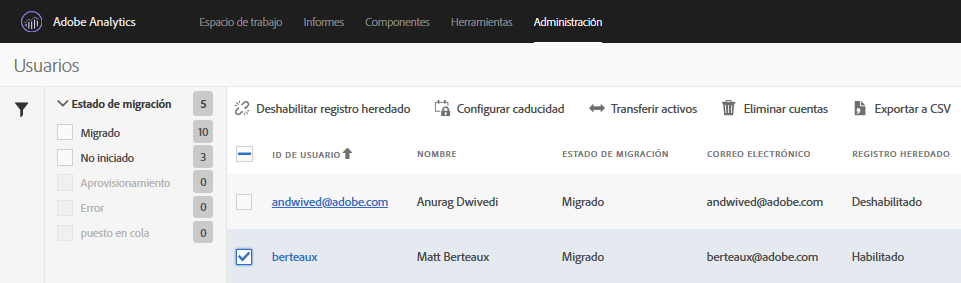

# Desactivación de inicios de sesión heredados {#disable-legacy-logins}

Aprenda a desactivar los inicios de sesión heredados para usuarios de Analytics.

Una vez que los usuarios hayan migrado del sistema de administración de usuarios de Analytics heredado a Admin Console de Adobe, puede desactivar los inicios de sesión heredados. Una vez hecho, si un usuario intenta usar el inicio de sesión heredado, se lo redirigirá al inicio de sesión de Experience Cloud.

1. Abra la herramienta de migración en **[!UICONTROL Analytics]** &gt; **[!UICONTROL Administración]** &gt; **[!UICONTROL Migración de ID de usuario]**.
1. En la sección [!DNL User Information], busque el dominio que contiene los usuarios con los que desea trabajar y, a continuación, haga clic en **[!UICONTROL Seleccionar usuarios]**.
1. Seleccione los usuarios con los inicios de sesión heredados que desea desactivar.

   

   Los usuarios elegibles tendrán un estado de *`Migrated`* en la columna Estado de la migración. No puede desactivar el inicio de sesión heredado de un usuario hasta que se haya migrado.
1. Haga clic en **[!UICONTROL Desactivar inicio de sesión heredado]** y, a continuación, haga clic en **[!UICONTROL Listo]**.

   Desactivar inicio de sesión heredado indica cuál de sus usuarios puede continuar utilizando el nombre de usuario y contraseña de [!DNL my.omniture.com] heredados.

   No puede desactivar los inicios de sesión heredados de un usuario que aún está por migrar. Una vez desactivado, el usuario deberá usar su Experience Cloud ID para iniciar sesión en Analytics y poder acceder.

