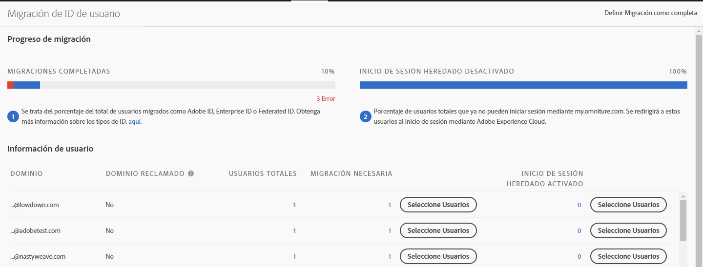

# Migración de cuentas de usuarios de Analytics para Adobe ID {#migrate-analytics-user-accounts-for-adobe-ids}

Migre usuarios del sistema de administración de usuarios de Analytics heredado a Admin Console.

## Migración de cuentas de usuarios de Analytics para Adobe ID {#task-f3355f3b14a340feae58cfa04c0ba1c9}

Migre usuarios del sistema de administración de usuarios de Analytics heredado a Admin Console.

> [!NOTE] Si un administrador que no ha iniciado sesión mediante Experience Cloud intenta acceder a la herramienta de migración de ID de usuario, se redirigirá a la página de inicio de sesión de Experience Cloud.

**Para migrar usuarios de Analytics:**

1. Navegue a **[!UICONTROL Analytics]** &gt; **[!UICONTROL Administración]** &gt; **[!UICONTROL Migración de ID de usuario]**.

   

   La página Migración de ID de usuario tiene dos secciones: *Progreso de migración* e *Información de usuario*.

   **Progreso de migración**

<table id="table_F9F1CFF762C745E198CB075A02BA2DDA"> 
 <thead> 
  <tr> 
   <th colname="col1" class="entry"> Fase </th> 
   <th colname="col2" class="entry"> Descripción </th> 
  </tr>
 </thead>
 <tbody> 
  <tr> 
   <td colname="col1"> 
Migraciones completadas 
 </td> 
   <td colname="col2"> 
Los usuarios han aceptado la invitación. 
 </td> 
  </tr> 
  <tr> 
   <td colname="col1"> 
Inicio de sesión heredado desactivado 
 </td> 
   <td colname="col2"> 
El inicio de sesión heredado que utiliza un ID de empresa se ha desactivado. Ahora, los usuarios accederán a Experience Cloud mediante el Adobe ID o Enterprise ID. Cuando todos los usuarios hayan llegado a esta fase, habrá completado la migración. 
 
En la migración, el inicio de sesión heredado está desactivado. Los usuarios son redirigidos a  experiencecloud.adobe.com y deben iniciar sesión con el Adobe ID o Enterprise ID. 
 
Para obtener más información, consulte <a href="/help/admin/user-management2/user-migration/c-migration-tool/t-disable-legacy-login.md">Desactivación de inicios de sesión heredados</a>. 
 </td> 
  </tr> 
 </tbody> 
</table>

**Información de usuario**

Información de usuario muestra a los usuarios de la organización separados por nombre de dominio.

<table id="table_3822E27AF81E4A188562FEB5131548A5"> 
 <thead> 
  <tr> 
   <th colname="col1" class="entry"> Elemento </th> 
   <th colname="col2" class="entry"> Descripción </th> 
  </tr>
 </thead>
 <tbody> 
  <tr> 
   <td colname="col1"> 
Dominio 
 </td> 
   <td colname="col2"> 
Los dominios son específicos de los ID de correo electrónico de la base de usuarios de Analytics actual. Un dominio solo lo puede reivindicar una única organización, y son los administradores del sistema los únicos que pueden hacerlo. Para obtener más información, consulte <a href="https://helpx.adobe.com/enterprise/help/request-access-to-claimed-domain.html">Solicitar acceso a un dominio reivindicado</a>. 
 </td> 
  </tr> 
  <tr> 
   <td colname="col1"> 
Dominio reclamado 
 </td> 
   <td colname="col2"> 
Si desea migrar usuarios como Enterprise ID o Federated ID, debe ser administrador del sistema y reclamar primero un dominio disponible mediante Admin Console. Obtenga más información <a href="https://helpx.adobe.com/enterprise/help/identity.html">aquí</a>. 
 
Si no desea reclamar dominios para Enterprise ID o Federated ID, omita este paso y migre a los usuarios como Adobe ID. Obtenga más información sobre tipos de ID <a href="https://helpx.adobe.com/enterprise/help/identity.html">aquí</a>. 
 </td> 
  </tr> 
 </tbody> 
</table>

1. Busque el dominio que contiene los ID de usuario que desea migrar y a continuación, en **[!UICONTROL Requiere migración]**, haga clic en **[!UICONTROL Seleccionar usuarios]**.
1. En la página [!DNL Users], seleccione aquellos que desea migrar y, a continuación, haga clic en **[!UICONTROL Migrar]**.

   Al hacer clic en **[!UICONTROL Migrar]**, los usuarios reciben una invitación (migración iniciada) que deben aceptar. Esta acción mueve el ID de usuario a Migración completada. Entonces puede desactivar su acceso heredado a [!DNL my.omniture.com].

   

1. Especifique el tipo de ID con el que desea migrar a los usuarios ([Adobe ID o Enterprise ID](https://helpx.adobe.com/enterprise/help/identity.html)).

   Después de migrar los usuarios, el estado de la columna Estado de la migración pasa de *`Not Initiated`* a *`Migrated`*.

   Si se muestra *`Failed`*, pase el ratón sobre el icono para ver una descripción de la causa del error de migración.
