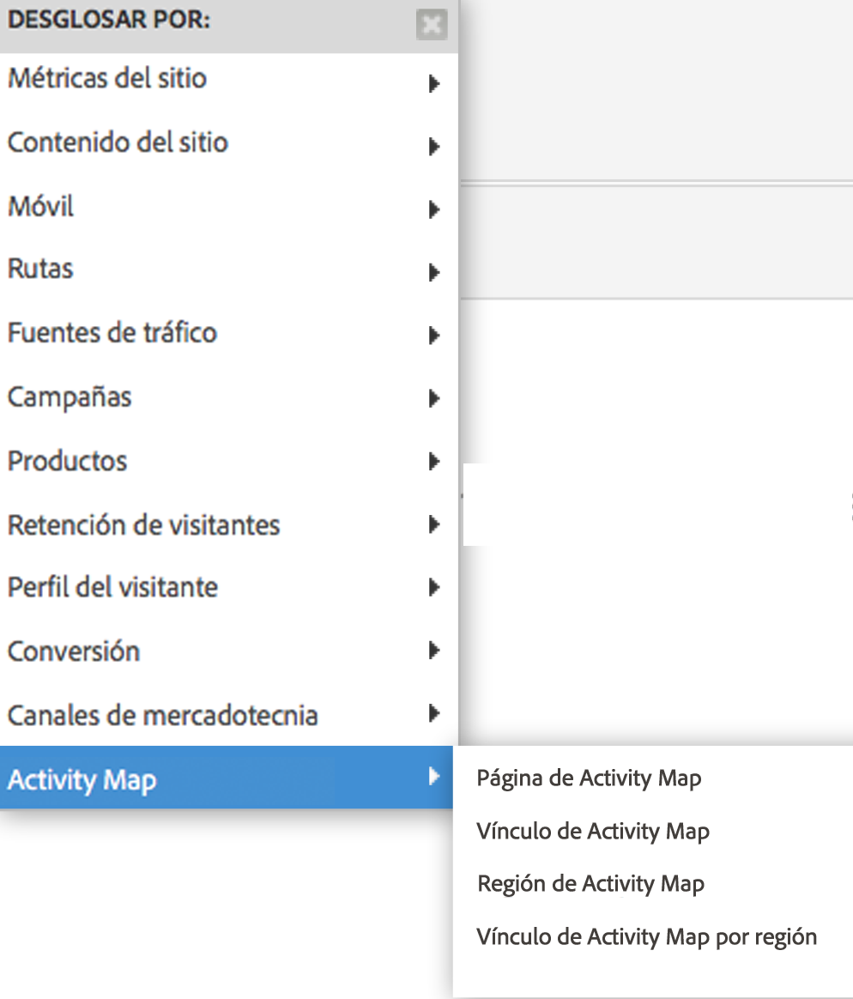

# Habilitar Activity Map {#enable-activity-map}

Explica los pasos que el administrador de Analytics debe llevar a cabo para habilitar la recopilación de vínculos de Activity Map y la descarga de los usuarios.

## Paso 1. Actualizar el código de AppMeasurement (Javascript) a v1.6 (o posterior) {#section_5D1586289DF2489289B1B6C1C80C300D}

El módulo Activity Map forma parte del archivo AppMeasurement.js (se encuentra al principio del archivo). La biblioteca AppMeasurement no cargará el módulo Activity Map cuando se creen instancias de este.

Los datos de Activity Map no se pueden recopilar si no actualiza a esta versión (o posterior) de AppMeasurement.

1. Descargue el código más reciente de AppMeasurement (AppMeasurement_Javascript-1.6.zip) en **[!UICONTROL Analytics]** > **[!UICONTROL Administración]** > **[!UICONTROL Todos los administradores]** > **[!UICONTROL Administrador de códigos]** e [impleméntelo](https://experienceleague.adobe.com/docs/analytics/implementation/js/overview.html?lang=es).

   Hemos incluido [código de implementación de muestra](/help/analyze/activity-map/activitymap-getting-started/activitymap-getting-started-admins/activitymap-sample-implementation-code.md) para facilitar la visualización de los cambios que se han hecho en el código al incluir el módulo Activity Map.

1. Validar la implementación:

   1. Cuando se hace clic en un elemento activo, los datos se guardan en una cookie llamada s_sq.
   1. Los datos de Activity Map se pueden ver en la cadena de consulta de la llamada de seguimiento. Por ejemplo:

      ```
      …&c.&a.&Activity Map.&link=My%20Link&region=My%20Region&page=My%20Page&.Activity Map&.a&.c&...
      ```

1. Desglose este informe por **[!UICONTROL Vínculo de Activity Map por región]** para ver el vínculo o la región de esa página:  {width=&quot;400px&quot;}

## Paso 2. Habilitar los informes de Activity Map {#section_D14F15D2FC0346FCAD8B3B87E6DD33D4}

Primero hay que habilitar los informes de Activity Map en el nivel de grupo de informes.

1. Inicie sesión en Adobe Analytics y vaya a **[!UICONTROL Analytics]** > **[!UICONTROL Administrador]** > **[!UICONTROL Grupos de informes]** > Selecionar un grupo de informes > **[!UICONTROL Editar configuración]** > **[!UICONTROL Activity Map]** > **[!UICONTROL Informes de Activity Map]**.
1. Activity Map recopila los datos sobre vínculos en informes de Activity Map. Para que se realice la activación, primero debe activar las variables haciendo clic en **[!UICONTROL Habilitar los informes de Activity Map]**.

   En este paso se añaden todas las dimensiones de Analytics que se necesitan para recopilar datos.

1. Cuando pase una hora más o menos, consulte el [informe Página de Activity Map](/help/analyze/activity-map/activitymap-reporting-analytics.md), que muestra todas las páginas donde los usuarios han hecho clic en un vínculo.

## Paso 3. Añadir usuarios al grupo de acceso de Activity Map {#section_4C7A47BB7DEF4AFFBC276392467F9675}

1. Haga clic en **[!UICONTROL Agregar usuarios al grupo]**.

   Esto le llevará a la página de administración de grupos de Admin Console.

1. [Añada usuarios a este grupo](https://experienceleague.adobe.com/docs/analytics/admin/user-product-management/user-groups/groups.html) y haga clic en **[!UICONTROL Guardar grupo]**.

1. De este modo, sus usuarios administradores podrán descargar Activity Map desde **[!UICONTROL Adobe Analytics]** > **[!UICONTROL Herramientas]** > **[!UICONTROL Activity Map]**.

>[!NOTE]
>
>Si desea que los usuarios que no son administradores descarguen Activity Map, cree un nuevo grupo de usuarios que proporcione permisos para “Herramientas” e “Instalación heredada de ClickMap”. Este nivel de permiso combinado con el acceso a Activity Map proporciona permisos para descargar y utilizar la herramienta.
