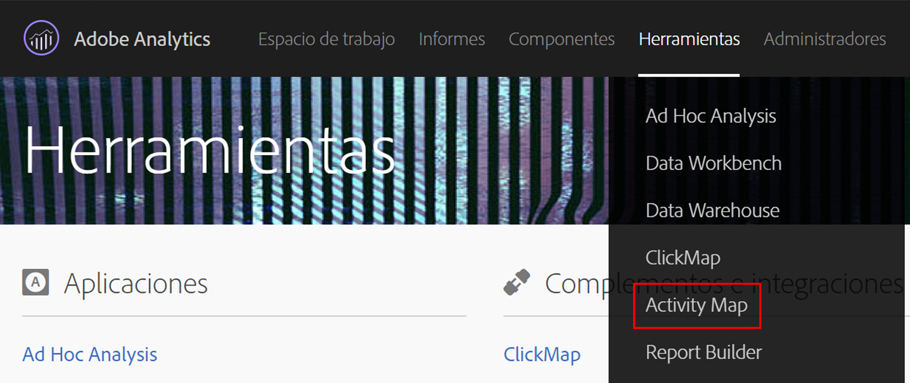
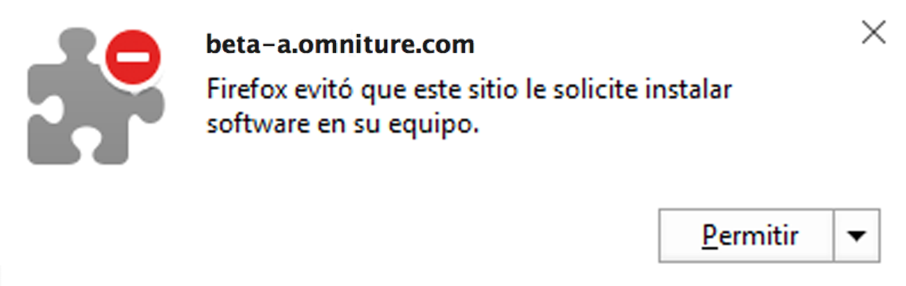
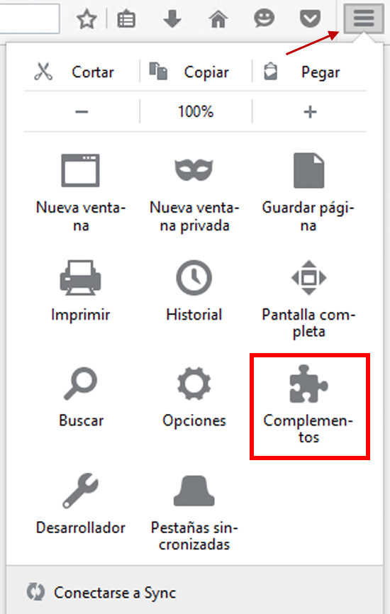

# Install Activity Map browser plug-ins{#install-activity-map-browser-plug-ins}

El proceso de instalación varía en función del explorador que se use.

Los complementos del explorador de Activity Map:

* se insertan manualmente como etiqueta de página de Analytics;
* se inician con un botón o elemento de menú que hay en la barra de herramientas del explorador;
* solo son compatibles con las últimas versiones de estos exploradores de escritorio: Internet Explorer, Firefox, Chrome y Safari;
* admiten la característica **[!UICONTROL Recordar mi información de inicio de sesión];**
* **pueden** insertar la barra de herramientas de Activity Map en las páginas web que no contienen código de página de Analytics; muestran un mensaje de error si la página no contiene código de página de Analytics;
* exigen llevar a cabo un proceso de instalación de complementos de explorador.

## Install Activity Map plug-in on Chrome {#section_6907253D5D5E4422967E6439207A013F}

1. Go to **[!UICONTROL Adobe Analytics]** &gt; **[!UICONTROL Tools]** &gt; **[!UICONTROL Activity Map]**.  

1. Haga clic en **[!UICONTROL Descargar Activity Map]**.
1. Haga clic en **[!UICONTROL Instalar el complemento de Activity Map]**.
1. Responda **[!UICONTROL Sí]cuando la advertencia de seguridad pregunte si quiere descargar el complemento del explorador de Activity Map.**
1. Cuando finalice la descarga, busque la ubicación del archivo .zip y extraiga el contenido.
1. Return to Chrome's address bar and enter `chrome://extensions`.
1. Active la casilla Modo de desarrollador.
1. Haga clic en el botón Cargar extensión descomprimida y seleccione la carpeta descomprimida en la ventana emergente.
1. If you see an Adobe Analytics icon  {width="70px"} added to your tool bar, your download was successful. You can now [launch Activity Map](launch-Activity Map.md#concept_2392036DB1AF4B05BEA3E9F4EE9B46B8) from your page.

## Install Activity Map plug-in on Firefox {#section_1F69D3D22DB34D6992747B1A62C1D2DA}

1. Go to **[!UICONTROL Analytics]** &gt; **[!UICONTROL Activity Map]**.

1. Haga clic en **[!UICONTROL Descargar Activity Map]**.
1. Haga clic en **[!UICONTROL Instalar el complemento de Activity Map]**.
1. Haga clic en **[!UICONTROL Permitir]** cuando aparezca este mensaje: 

1. Haga clic en **[!UICONTROL Instalar ahora]**.
1. Haga clic en el icono **[!UICONTROL Abrir menú]** en la parte superior derecha y seleccione **[!UICONTROL Complementos]**. {width = "250 px"}

1. Activity Map debe aparecer como uno de los complementos de Firefox.
1. Si ve un icono de Adobe Analytics  You can now [launch Activity Map](launch-Activity Map.md#concept_2392036DB1AF4B05BEA3E9F4EE9B46B8) from your page.

## Install Activity Map plug-in on Internet Explorer {#section_1A33705D7F784C4A88C9026ADC860FB8}

1. Go to **[!UICONTROL Analytics]** &gt; **[!UICONTROL Activity Map]**.

1. Haga clic en **[!UICONTROL Descargar Activity Map]**.
1. Haga clic en **[!UICONTROL Instalar el complemento de Activity Map]**.
1. Haga clic en **[!UICONTROL Ejecutar]para iniciar la instalación de Activity Map.**
1. Haga clic en **[!UICONTROL Sí]en la ventana emergente para permitir al programa hacer cambios en el equipo.**
1. Siga las instrucciones del asistente de instalación.
1. Si Activity Map se ha instalado correctamente, verá una notificación en Internet Explorer que indica que la barra de herramientas de Activity Map está lista para su uso. Habilítela para empezar a usar la aplicación. You can now [launch Activity Map](launch-Activity Map.md#concept_2392036DB1AF4B05BEA3E9F4EE9B46B8) from your page.

## Install Activity Map plug-in on Safari {#section_4F306BDDFBC04D4CA48B7C37B0AACC48}

1. Go to **[!UICONTROL Analytics]** &gt; **[!UICONTROL Activity Map]**.

1. Navigate to <https://safari-extensions.apple.com/>.
1. Search for "activity" or "activitymap" and click through the Adobe Activity Map installation.  
1. If you see an Adobe Analytics icon  {width="70px"} added to your tool bar, your download was successful. You can now [launch Activity Map](launch-Activity Map.md#concept_2392036DB1AF4B05BEA3E9F4EE9B46B8) from your page.