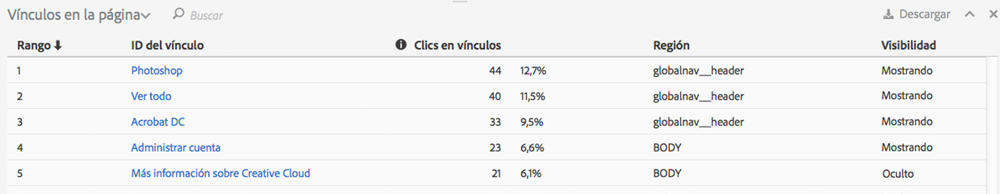
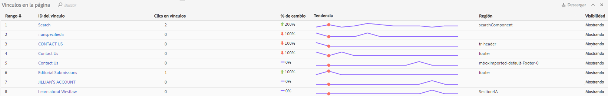

# Informe de vínculos

El informe de vínculos recoge los vínculos encontrados en la página actual. No informa acerca de todos los vínculos que se recopilaron para esa página.

El informe Vínculos en la página ofrece una vista tabular de los vínculos. Algunas veces, puede interesarle ver los clics en vínculos (u otras métricas) clasificados en una sola vista. Esto permite comparar mejor un vínculo con otro. Cree el informe Vínculos en la página incluyendo una lista clasificada de todos los vínculos de la página (por ID de vínculo), la información de clic (número y porcentaje) y la región de la página. Haga clic en el botón del informe Vínculos en la página que hay en la barra de herramientas Activity Map.

El informe **[!UICONTROL Vínculos en la página]** se abre debajo de la ventana del explorador en el tablero Activity Map.

## Modo estándar {#section_C8D2A1C07A2A4E3A8F84AC9240603FA7}

En el modo Estándar, el informe “Vínculos en la página” muestra datos sobre vínculos de un día o de varios días agregados en el intervalo de fechas completo. Sobre cada vínculo, se muestra la información siguiente:

<table id="table_3DE41B2CFA644B70AF802A3123CE51D9"> 
 <thead> 
  <tr> 
   <th colname="col1" class="entry"> Columna </th> 
   <th colname="col2" class="entry"> Descripción </th> 
  </tr> 
 </thead>
 <tbody> 
  <tr> 
   <td colname="col1"> Clasificación </td> 
   <td colname="col2"> Clasificación en la página. En el modo Estándar, el valor de clasificación sigue siendo el mismo independientemente de la columna donde se haga clic. </td> 
  </tr> 
  <tr> 
   <td colname="col1"> ID del vínculo </td> 
   <td colname="col2">El ID principal del vínculo (para obtener más información sobre cómo se define el ID principal con la <a href="/help/analyze/activity-map/activitymap-link-tracking/activitymap-link-tracking-methodology.md">Nueva metodología de seguimiento de vínculos</a>) </td> 
  </tr> 
  <tr> 
   <td colname="col1"> Clics </td> 
   <td colname="col2"> El número de clics brutos correspondientes a un vínculo determinado y el porcentaje de clics totales hechos en la página. Si el usuario elige otra métrica en la barra de herramientas, el informe Vínculos recogerá datos acerca de esta métrica. </td> 
  </tr> 
  <tr> 
   <td colname="col1"> Región </td> 
   <td colname="col2"> Representa la región de la página donde se sitúa el vínculo. </td> 
  </tr> 
  <tr> 
   <td colname="col1"> Visibilidad </td> 
   <td colname="col2">Indica el estado de visibilidad del vínculo. Existen dos valores: 
    <ul id="ul_BABCC0F64145407C9D439150A6898E6D">
     <li id="li_9AF0479BDCEB4A44A37292FAABFA83A5"><b>Oculto</b>: el vínculo está en la página pero el usuario final no lo ve (como un submenú de un menú de navegación que solo se ve cuando el usuario coloca el ratón encima del menú principal). </li>
     <li id="li_C6FA4EC27EDD4341AB9821E2B4BC9E60"><b>Visible</b>: el vínculo se muestra en la página. Sin embargo, es posible que aparezca debajo del pliegue y que el usuario tenga que desplazarse por la página para verlo. </li>
    </ul>
Nota: Si un vínculo está como “Oculto”, no aparecerá ninguna de sus superposiciones. 
</td> 
  </tr> 
 </tbody> 
</table>

**Filtrar datos**

Cuando quiera centrarse en un vínculo determinado, puede buscar un término relacionado en el campo **[!UICONTROL Filtrar datos]**. Solo los vínculos que coincidan con la búsqueda tendrán superposiciones. Sin filtro, se mostrarán las superposiciones especificadas en la [Configuración de Activity Map](/help/analyze/activity-map/activitymap-overlay-settings.md).

## Modo Activo {#section_AC1967217B5A4532ACB01D33636F6770}

En el modo Activo, el informe Vínculos en la página muestra datos de tendencias de varios minutos.

<table id="table_61D1FB0F02894055A1AB394DE4FE4742"> 
 <thead> 
  <tr> 
   <th colname="col1" class="entry"> Columna </th> 
   <th colname="col2" class="entry"> Descripción </th> 
  </tr> 
 </thead>
 <tbody> 
  <tr> 
   <td colname="col1"> Clasificación </td> 
   <td colname="col2"> Clasificación en la página. En el caso de las superposiciones de degradado o de burbuja, el valor de clasificación sigue siendo el mismo independientemente de la columna donde se haga clic. En el caso de la superposición de ganadores y perdedores, el valor de clasificación cambia según los vínculos que más hayan ganado o perdido. </td> 
  </tr> 
  <tr> 
   <td colname="col1"> ID del vínculo </td> 
   <td colname="col2">El ID principal del vínculo. Para obtener más información sobre cómo se define el ID principal en el nuevo <a href="/help/analyze/activity-map/activitymap-link-tracking/activitymap-link-tracking-methodology.md">método de seguimiento de vínculos</a>. </td>
  </tr> 
  <tr> 
   <td colname="col1"> Clics en vínculos </td> 
   <td colname="col2"> Clics totales en el período de tiempo seleccionado. </td> 
  </tr> 
  <tr> 
   <td colname="col1"> % de cambio </td> 
   <td colname="col2"> % de cambio entre las métricas de los vínculos del período actual y las métricas de los vínculos del período anterior. El % de cambio negativo está de color rojo y el positivo, de color verde. </td> 
  </tr> 
  <tr> 
   <td colname="col1"> Tendencia </td> 
   <td colname="col2"> Un gráfico de líneas de todos los períodos recopilados. El período seleccionado está señalado con un marcador verde. El período sobre el que está colocado el ratón está señalado con un marcador rojo. </td> 
  </tr> 
  <tr> 
   <td colname="col1"> Región </td> 
   <td colname="col2"> Representa la región de la página donde se sitúa el vínculo. </td> 
  </tr> 
  <tr> 
   <td colname="col1"> Visibilidad </td> 
   <td colname="col2">Indica el estado de visibilidad del vínculo. Existen dos valores: 
    <ul id="ul_B10C55ED4D3C4CF99506DC467E2E7CFB">
     <li id="li_EA646722A51041CC9E62C56DEF92C81F">Oculto: el vínculo está en la página pero no es visible (por ejemplo, un vínculo que aparece cuando la página se ha cargado). </li>
     <li id="li_F9543614C2894003AC9984A7404E2785">Visible: el vínculo se muestra en la página. Sin embargo, es posible que aparezca debajo del pliegue y que haya que desplazarse por la página para verlo. </li>
    </ul></td> 
  </tr> 
 </tbody> 
</table>

## Ordenación y filtrado {#section_4B8E8233C21247CAA70DAEC2156548AD}

Algunas veces, solo queremos analizar los resultados de una región concreta de la página (por ejemplo, el panel izquierdo) para decidir cómo organizar el contenido de esta zona de la página web.

Por ello, hemos creado una funcionalidad de ordenación y filtrado para los vínculos en el informe Vínculos en la página. El filtrado está disponible a través del campo de filtro. El término de búsqueda se aplica a las columnas ID del vínculo y Región del vínculo. La ordenación está disponible al hacer clic en las llamadas (Clasificación, ID del vínculo, Clics, Cambios en el tiempo, Región, Visibilidad) y puede ser ascendente o descendente. Las superposiciones desaparecen del sitio web cuando los vínculos se filtran para que no salgan en el informe Vínculos en la página.
