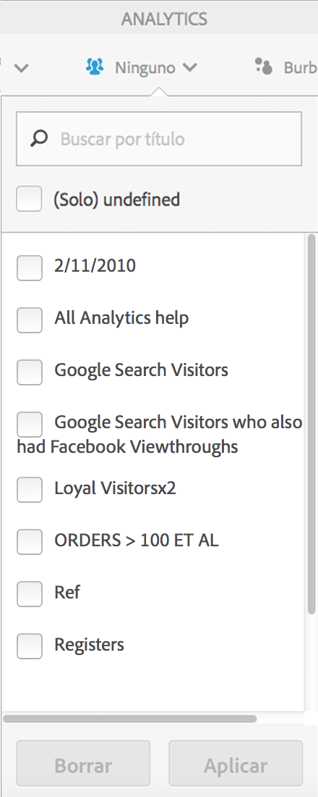
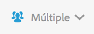

# Segmentación de clientes

Permite aplicar un filtro de varios segmentos en Activity Map.

>[!NOTE]
>
>El control de segmentos solo está disponible en el modo Estándar porque la plataforma Adobe Analytics no admite segmentar datos en tiempo real.

You can select one or several of the segments from the **[!UICONTROL Segments]**drop-down menu shown below. Los segmentos que se ven son los mismos que tiene o que se han compartido con usted a través de Reports &amp; Analytics en el grupo de informes seleccionado.

Cuando la selección de segmentos ha cambiado y después de cerrar el selector de segmentos, se inicia un nuevo proceso de recuperación de datos de Analytics en relación con todas las métricas que se muestran en la aplicación. Los segmentos seleccionados se recuerdan cuando se navega de una página a otra.

Cuando se selecciona más de un segmento, en la etiqueta de selección de segmentos (en estado contraído) aparece “Múltiple”. La lista completa de segmentos seleccionados se verá al hacer clic en el control.

Los segmentos seleccionados se aplicarán a todos los informes de Analytics que se presenten en Activity Map, es decir, en las superposiciones y en los informes **[!UICONTROL Vínculos en la página]** y **Detalles de página[!UICONTROL .]**
