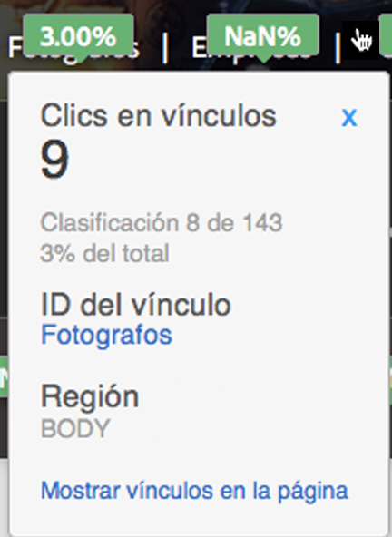

# Detalles de superposición

Los detalles de superposición se ven cuando se coloca el ratón encima de una superposición de vínculo.

En los detalles de superposición se ven los valores siguientes, que se registran para ese vínculo:

* Métrica
* Valor sin formato
* Clasificación
* Valor de porcentaje
* ID del vínculo
* Región
* Mostrar en el informe Vínculos en la página

