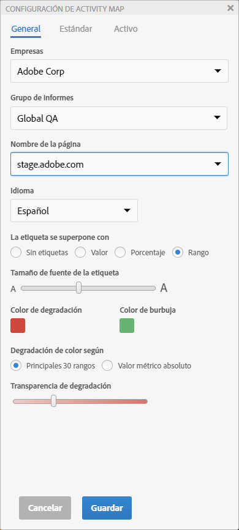
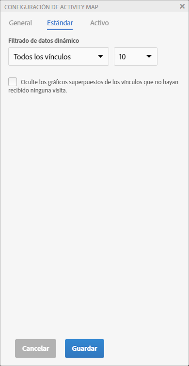
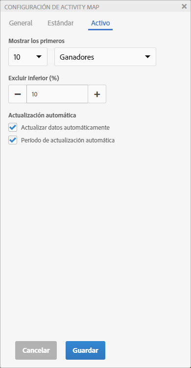

# Definición de la configuración de Activity Map

En el panel Configuración de Activity Map se pueden modificar la configuración y las propiedades de todos los tipos de visualizaciones de superposición.

Para acceder al panel Configuración de Activity Map, haga clic en el icono del engranaje que hay en la barra de herramientas de Activity Map.

## Configuración general {#section_697A12F099494D699A4BF498598178C5}

| Configuración | Descripción |
| --- | --- |
| **[!UICONTROL Compañías]** | Seleccione la empresa de inicio de sesión correspondiente. |
| **[!UICONTROL Grupo de informes]** | Ahora, la lista de los grupos de informes a la que puede acceder no solo incluye los grupos que aparecen en la etiqueta Sitio web. Ahora puede sustituir el grupo de informes seleccionado (correspondiente a una de las etiquetas de la página) por otro grupo de informes. No hace falta que este nuevo grupo de informes esté vinculado a una etiqueta de la página. Si cambia el grupo de informes seleccionado en Configuración de Activity Map, el proceso de guardado hará que todos los informes afectados de Analytics se actualicen. **Importante**:  [!UICONTROL Los grupos de ] informes virtuales solo son compatibles con el modo Estándar, no con el Activo . Si está en el [!UICONTROL modo Activo] para un grupo de informes estándar, pero selecciona un [!UICONTROL grupo de informes virtuales] en este cuadro de diálogo, una vez que haga clic **[!UICONTROL Aceptar]** aquí, se mostrará el modo Estándar. Además, el control de calendario se reinicia para que coincida con el tipo de calendario del grupo de informes (gregoriano, minorista, personalizado...). |
| **[!UICONTROL Nombre de la página]** | Página a la que se aplican estas configuraciones. |
| **[!UICONTROL Idioma]** | La selección corresponde a los idiomas ofrecidos en Adobe Analytics. |
| **[!UICONTROL La etiqueta se superpone con]** | <ul><li>**[!UICONTROL Sin etiquetas]**: solo aplicable para la superposición de degradado. En este caso, el color de la superposición transmite una idea de la clasificación del vínculo</li><li>**[!UICONTROL Valor]**: el total bruto de la métrica que corresponde a ese vínculo</li><li>**[!UICONTROL Porcentaje]**: porcentaje de la métrica para este vínculo en la métrica total de la página.</li><li>**[!UICONTROL Rango]**: clasificación de este vínculo en relación con todos los vínculos que hay en la página representada.</li></ul> |
| **[!UICONTROL Tamaño de fuente de la etiqueta]** | Permite aumentar o reducir el tamaño de la fuente de la etiqueta de la superposición con un regulador para mejorar la legibilidad. |
| **[!UICONTROL Color de degradado/burbuja]** | Para mostrar clasificaciones de vínculos de superposición para visualizaciones de superposición Degradación o Burbujas , seleccione entre una gama de colores . |
| **[!UICONTROL Degradación de color según]** | <ul><li>**[!UICONTROL Principales 30 rangos]**: la intensidad del color se normaliza para los 30 primeros valores.</li><li>**[!UICONTROL Valor métrico absoluto]**: la intensidad del color es una función del valor absoluto de la métrica.</li></ul> |
| **[!UICONTROL Transparencia de degradación]** | Seleccione el nivel de transparencia para las superposiciones de degradado. Esta configuración no afecta a las superposiciones [!UICONTROL Bubble] . |

## Configuración estándar {#section_24DB95376E1A448494ECF3F57743FC19}

Esta configuración se aplica a la superposición del modo estándar.

| Configuración | Descripción |
| --- | --- |
| **[!UICONTROL Filtrado dinámico de datos]** | Este menú desplegable le permite mostrar las superposiciones de<ul><li>(predeterminado) Todos los vínculos de la página</li><li>El número superior (más alto) o inferior (más bajo) de vínculos clasificados en la página, donde # puede ser una elección de 1, 10, 50 o 100.</li></ul> |
| **[!UICONTROL Oculte los gráficos superpuestos de los vínculos que no hayan recibido ninguna visita]**. | Casilla de verificación que activa la visibilidad de las superposiciones en vínculos que no tienen datos.<ul><li>(predeterminado) Si la casilla está marcada, no se muestra ninguna superposición cuando un vínculo no tiene datos de vínculo de Activity Map.</li><li>Si la casilla de verificación está desactivada, si un vínculo no tiene datos de vínculo de Activity Map, se muestra una superposición y tiene una etiqueta de &quot;-&quot;, lo que significa N/D (no aplicable). |

## Configuración en directo {#section_D30F6E62FB5D404090B588F396A460AF}

Esta configuración se aplica a la superposición del modo Activo.

| Configuración | Descripción |
|---|---|
| **[!UICONTROL Mostrar los primeros]** | Para mostrar los **[!UICONTROL Ganadores]** o **[!UICONTROL Perdedores]** (o ambos) como superposiciones, seleccione el número de vínculos. |
| **[!UICONTROL Excluir inferior (%)]** | Seleccione esta opción para eliminar los vínculos ganadores y perdedores con datos dispersos. Filtre el porcentaje inferior de cambios de vínculo para ver solo los vínculos que tengan datos suficientes para mostrar ganancias o pérdidas significativas. El porcentaje se calcula basándose en el número de vínculos que haya en la página. Por ejemplo, si se filtra el 10% inferior de una lista de 200 vínculos, se filtrarían los 20 vínculos inferiores. |
| **[!UICONTROL Actualizar datos automáticamente]** | Permite decidir si los datos de Analytics que se muestran en la interfaz se actualizan automáticamente o no al calcular un nuevo periodo. |
| **[!UICONTROL Período de actualización automática]** | Cuando se activa esta opción, la página web se actualiza con cada recuperación de datos nuevos para que los vínculos de la página se puedan sincronizar mejor con los datos recopilados. |
