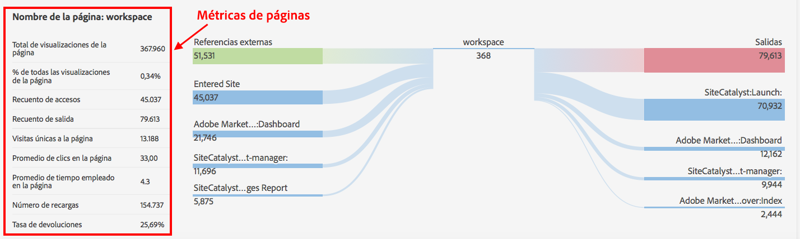

# Detalles de página

La ficha Detalles de página muestra el informe de página en forma de tabla y el informe de flujo de página como una pajarita (o mariposa).

## Informe de página {#section_2335A9EFE57B4A7687B397DF2098CC6B}

Este panel muestra las métricas de tráfico relacionadas con la página web visitada. Si va a una página web que no tiene implementada la etiqueta de página de Analytics, el panel no se verá.

## Informe del flujo de página {#section_D6EDE78CF7124758BF846E57ADABA234}

A la izquierda se ven las páginas anteriores y los referentes (externos), que se pueden expandir alternativamente para mostrar las primeras cuatro entradas de cada categoría.

A la derecha se ven las primeras cuatro páginas siguientes y el número de salidas.

Si se ha hecho el seguimiento de una URL en relación con las páginas internas mostradas en esta sección, la página se verá como vínculo. Por lo tanto, puede hacer clic en esa página y seguir con las páginas que tengan mayor afinidad. Este informe permite explorar de forma interactiva las propiedades web desde la perspectiva del análisis web.

El informe del flujo de página solo está disponible en el modo Estándar.

| **Flujo de página** | **Descripción** |
|---|---|
| Referentes externos | URL de otros sitios que hacen referencia a la página actual. |
| Páginas anteriores | Nombra la página interna del grupo de informes anterior a la página actual. |
| Páginas siguientes | La página visitada después de abandonar la página actual. |
| Salidas del sitio | Número de visitantes que abandonaron el sitio por completo después de ver la página. |

