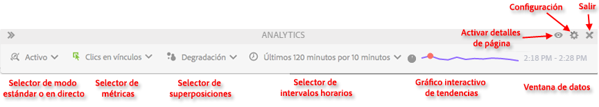

# Análisis de páginas en tiempo real (modo Activo)

El análisis de página en tiempo real (modo Activo) permite obtener resultados con una granularidad por minutos en tiempo real.

Ahora, el Activity Map muestra datos analíticos en incrementos de 1 a 15 minutos para supervisar la popularidad de los vínculos en función de las microtendencias de determinadas páginas. Esto es especialmente importante para las empresas editoriales a la hora de realizar un seguimiento y responder al aumento o la reducción del interés por las historias, así como para supervisar el flujo del tráfico en tiempo real.

Como propietario del contenido del sitio, una de sus responsabilidades es saber cuándo promocionar y eliminar contenido para que la experiencia sea relevante constantemente. Los datos en tiempo real son el fundamento de esta responsabilidad. Si sabe cuáles son los vínculos y el contenido que lideran las tendencias en cada momento, puede actuar rápidamente y con seguridad para mantener a los lectores y clientes interesados en su marca.

<!-- 

Describe what you can do with the feature: - what is the data shown? why do I see trend lines everywhere? how do I choose a period in the trend? what do the overlays represent in live mode? how do you compute the gainers and losers overlays? what is the auto update mode?

 -->

Si desea comprobar en qué elemento se hace clic principalmente en el modo Activo:

1. Seleccione el período de tiempo en la línea de tendencia **[!UICONTROL Live Mode]** de la barra de herramientas que desee analizar.
1. Haga clic en el icono &quot;Ojo&quot; de la barra de herramientas para acceder a la Tabla de informes de vínculos.
1. Ordene la tabla mediante el vínculo .

## Latencia de datos como resultado de la configuración de A4T

Una vez que la [integración de A4T](https://docs.adobe.com/content/help/es-ES/target/using/integrate/a4t/a4t.html) esté habilitada en Adobe Target, experimentará otros 5-10 minutos de latencia en Adobe Analytics. Este aumento de la latencia permite almacenar los datos de Analytics y Target en la misma visita, lo que le permite desplegar las pruebas por página y por sección de sitio.

Este aumento se ve reflejado en todos los servicios y herramientas de Adobe Analytics, incluido el flujo en directo y los informes en tiempo real, y se aplica a estos escenarios:

* Para el flujo en directo, los informes en tiempo real, las solicitudes de la API y todos los datos actuales para las variables de tráfico, solo se retrasan las visitas con un ID de datos suplementario.
* Para los datos actuales en las métricas de conversión, los datos finalizados y las fuentes de datos, todas las visitas se retrasan de 5 a 7 minutos más.

Tenga en cuenta que el aumento de la latencia se da después de implementar el [Servicio de identidad](https://docs.adobe.com/content/help/es-ES/id-service/using/home.html), incluso aunque no haya implementado correctamente esta integración.

Más información [aquí](/help/analyze/activity-map/activitymap-standard-live.md).