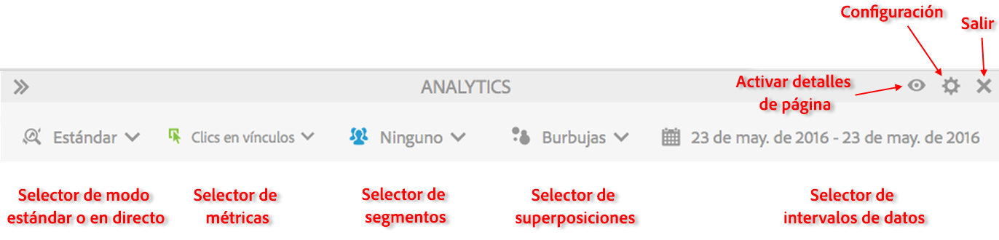

# Modo Estándar y modo Activo

Activity Map dispone de dos modos básicos para crear informes complementarios de la actividad de la página.

* En el modo Estándar, el [informe Vínculos en la página](/help/analyze/activity-map/activitymap-links-report.md) muestra datos sobre vínculos de un día o de varios días agregados en el intervalo de fechas completo.
* El modo Activo muestra las tendencias de actividad en tiempo real.

Se puede alternar entre los dos modos haciendo clic en el botón Modo de la barra de herramientas.

## Modo estándar {#section_0C755F30B7EC4A13A62AB9A391AF51E6}

En el **modo Estándar**, se puede seleccionar el rango de fechas en la barra de herramientas, como vemos a continuación.

En este modo, las métricas de comercio que no tienen la &quot;Participación&quot; habilitada se asignan de forma lineal. Por ejemplo, un usuario hace clic en un vínculo &quot;iPod mini&quot; en la página Inicio y luego navega por tres páginas más. En la cuarta página, compra un iPod mini por 200 USD. El vínculo &quot;iPod mini&quot; recibirá 200 USD de ingresos de participación y 50 USD (200 USD/4) de ingresos (asignados de forma lineal).

P: ¿Qué ocurre si una página incluye vínculos con el mismo nombre en varias regiones? ¿Los vínculos reciben crédito de forma independiente porque tienen diferentes regiones pero el mismo nombre de vínculo en una página?

R: Depende de cómo sume los datos del vínculo. En Activity Map, miramos el ID y la región del vínculo de una página determinada. Así, la asignación de datos debería ser para la combinación &quot;ID|Región del vínculo&quot;. En este caso, como la región es diferente, el vínculo|región sería distinto y, por tanto, todos los ingresos asignados para el primer vínculo|región diferirán de los asignados para el segundo vínculo. Sin embargo, en la IU de Adobe Analytics, puede consultar únicamente el informe de ID del vínculo (en lugar del informe de vínculo|región) para una página determinada (página desglosada por vínculos). En este caso, los ingresos de ambas regiones se sumarían.

## Modo Activo  {#section_D619B77D89A840F0B1C2DEA2715A516A}

En el **modo Activo**, los datos de Analytics se muestran en incrementos de 1 a 15 minutos en forma de tendencias. Este modo sirve para analizar y supervisar las tendencias a corto plazo de la página web.

El modo Activo responde a las necesidades de las organizaciones editoriales. Estas organizaciones tienen que supervisar las microtendencias de la popularidad de los vínculos en unas pocas páginas clave. La capacidad de distinguir rápidamente qué vínculos tienen un bajo rendimiento o reciben muchas visitas es esencial para la actividad editorial.

>[!IMPORTANT]
>
>Los grupos de informes virtuales solo son compatibles con el modo Estándar, no con el Activo.

