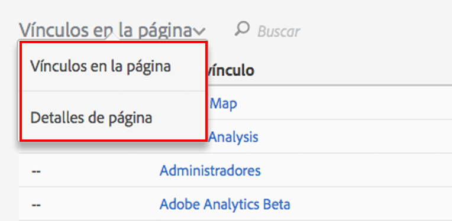

# Interfaz de usuario de Activity Map

La interfaz de usuario de Activity Map consta de dos partes:

* La ventana superior, que tiene la página web, y las superposiciones y la barra de herramientas insertadas.
* Un panel inferior para los informes.

## Top panel {#section_2DA8ACD35D4C4ACBA32C13EFB5317E7C}

En la parte superior, se ven la página web con la [barra de herramientas insertada](/help/analyze/activity-map/activitymap-standard-live.md) y las [superposiciones de vínculos](/help/analyze/activity-map/activitymap-gainerslosers.md). Sobre los vínculos se muestran clasificaciones de burbujas que indican el número total de clics.

Al colocar el ratón sobre cada superposición de vínculo se ven más detalles de los vínculos:

## Bottom reports panel {#section_21B129D69B7A4F918E975E8E66DB02EE}

Al final de la página, se encuentran los informes [Vínculos en la página](/help/analyze/activity-map/activitymap-links-report.md) y [Detalles de página](/help/analyze/activity-map/activitymap-page-flow.md), que contienen un resumen de las estadísticas de la página web actual, así como información del flujo de página.

El informe Vínculos en la página muestra una hoja de cálculo con los vínculos que hay en la página actual e incluye información adicional sobre los clics. El informe Detalles de página presenta datos de análisis relacionados con las páginas que se visitaron antes y después de llegar a la página mostrada actualmente.

