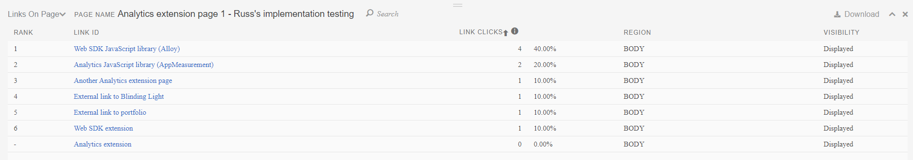

# Interfaz de extensión de Activity Map

La interfaz de extensión de Activity Map consta de dos partes:

* Panel superior que permite configurar la extensión y los informes
* Superposición que muestra los vínculos más populares
* Panel inferior que muestra las métricas de los vínculos más populares

## Panel superior

El panel superior contiene los controles básicos de la superposición de Activity Map.

Ofrece la siguiente configuración:

* **Vista estándar/en vivo**: Alterna entre la vista estándar y la vista en vivo.
   * Vista estándar: muestra la superposición en función de los datos históricos.
   * Vista en vivo: Muestra la superposición en función de los datos activos. El selector de fecha cambia a un menú desplegable que permite cambiar la granularidad de los datos activos.
* **Selector de métrica**: permite cambiar la métrica de la que informa la superposición. Solo están disponibles [!UICONTROL Clics en vínculos] si ha seleccionado Vista en vivo.
* **Selector de segmento**: le permite seleccionar un [segmento](/help/components/segmentation/seg-overview.md) y ver un subconjunto de datos dentro de la superposición. Los segmentos no están disponibles en la vista en vivo.
* **Tipo de visualización de superposición**: permite cambiar la forma en que la superposición visualiza la clasificación de los vínculos.
   * **[!UICONTROL Burbuja]**: los vínculos principales reciben una burbuja verde que muestra su clasificación numérica durante el período de informe. Puede cambiar el color de la burbuja en [Configuración](settings.md).
   * **[!UICONTROL Degradado]**: los vínculos principales aparecen sombreados en rojo transparente. Los enlaces más populares son el rojo más oscuro. Puede cambiar el color del degradado en [Configuración](settings.md).
   * **[!UICONTROL Desactivado]**: Deshabilitar superposiciones de vínculos.
* **Selector de fecha**: permite cambiar el período de informe.

El encabezado de este panel contiene la siguiente configuración:

* **Expandir/contraer panel superior**: cambia el panel superior para mostrar la configuración horizontal o verticalmente (icono de flecha doble).
* **[!UICONTROL Alternar detalles de página]**: muestra u oculta el panel inferior (icono en forma de ojo).
* **[!UICONTROL Mostrar configuración]**: abre un menú para opciones que puedes cambiar (icono de engranaje):
   * **[!UICONTROL Configuración]**: abre [Configuración](settings.md) de la extensión.
   * **[!UICONTROL Ayuda]**: Abre la documentación en Experience League (esta página).
   * **[!UICONTROL Comunidad de Adobe]**: Abre la [comunidad de Experience League](https://experienceleaguecommunities.adobe.com/?profile.language=es).
   * **[!UICONTROL Acerca de]**: muestra la versión de la extensión.
   * **[!UICONTROL Cerrar sesión]**: cierra la sesión de la extensión y requiere que vuelva a iniciar sesión.
* **[!UICONTROL Salir de Activity Map]**: Cierra todas las superposiciones de la extensión (icono X).

## Superposición de página

La superposición de página incluye el contenido del sitio con una superposición que muestra la ubicación de los vínculos en los que se hizo clic más frecuentemente durante el período de informe. Puede configurar estas superposiciones de vínculos para que aparezcan como burbujas o degradados en el **[!UICONTROL tipo de visualización de superposición]** del panel superior.

Si hace clic en una burbuja o degradado, puede ver los detalles de ese vínculo en particular.

## Panel inferior

El panel inferior muestra una vista agregada de los vínculos mostrados en la superposición.

* **Tipo de informe**: cambie el panel inferior para mostrar el informe **[!UICONTROL Vínculos en la página]** o el informe **[!UICONTROL Detalles de la página]**.
* **[!UICONTROL Nombre de página]**: El nombre actual de dimensión [Página](/help/components/dimensions/page.md).
* **[!UICONTROL Buscar]**: filtre el informe para que solo se muestren los nombres de los vínculos que coincidan con el texto escrito.
* **[!UICONTROL Descargar]**: Exporta el informe a CSV. Puede incluir el informe [!UICONTROL Vínculos en la página], el informe [!UICONTROL Página] y el informe [!UICONTROL Flujo de página] en el mismo archivo de descarga.
* **[!UICONTROL Cambiar la posición de acoplamiento del informe]**: cambia la posición de este panel para que aparezca en la parte inferior o superior de la ventana del explorador.
* **[!UICONTROL Cerrar el informe]**: Cierra este panel. Puede volver a abrir el panel con el botón **[!UICONTROL Alternar detalles de página]** del panel superior (el icono del ojo).

El informe **[!UICONTROL Vínculos en la página]** muestra un informe básico de área de trabajo con la siguiente configuración:

* La dimensión [vínculo de Activity Map](/help/components/dimensions/activity-map-link.md)
* La métrica [Ocurrencias](/help/components/metrics/occurrences.md) (etiquetada como **[!UICONTROL clics en vínculos]**)
* El valor actual de [Page](/help/components/dimensions/page.md) aplicado como segmento

El informe **[!UICONTROL Detalles de página]** muestra una visualización de [flujo](/help/analyze/analysis-workspace/visualizations/c-flow/flow.md) con la dimensión [Página](/help/components/dimensions/page.md), centrada en la página actual. Las siguientes métricas de la página actual se muestran a la izquierda:

* Total de [vistas de página](/help/components/metrics/page-views.md)
* [!UICONTROL % de todas las vistas de página]
* [Entrada](/help/components/metrics/entries.md) recuento
* [Salir](/help/components/metrics/exits.md) recuento
* [Visitas de página única](/help/components/metrics/single-page-visits.md)
* [!UICONTROL Clics promedios en la página]
* Tiempo promedio [empleado en la página](/help/components/metrics/time-spent.md)
* Número de [recargas](/help/components/metrics/reloads.md)
* [Porcentaje de rebote](/help/components/metrics/bounce-rate.md)
* [!UICONTROL Clics en vínculos]

