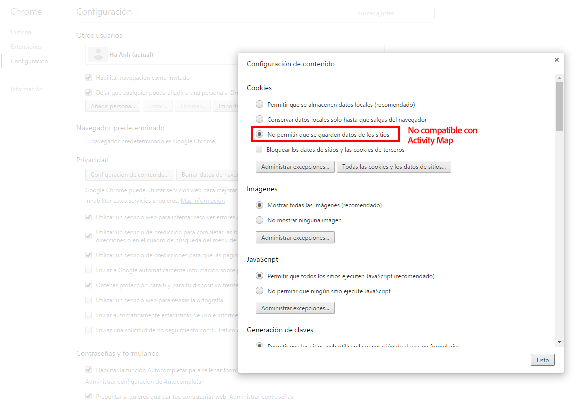
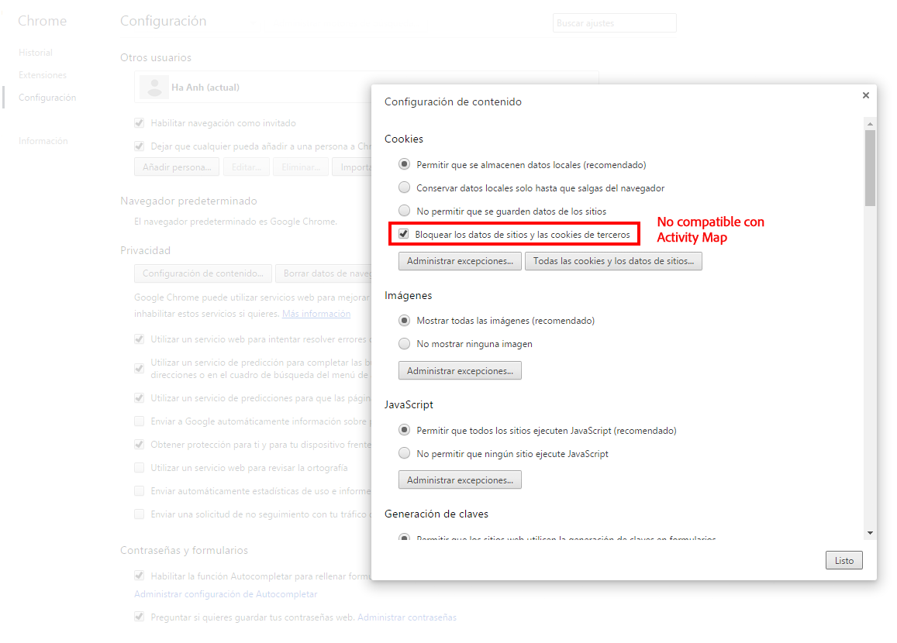
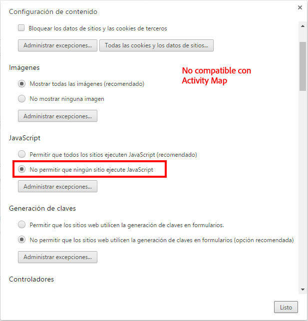
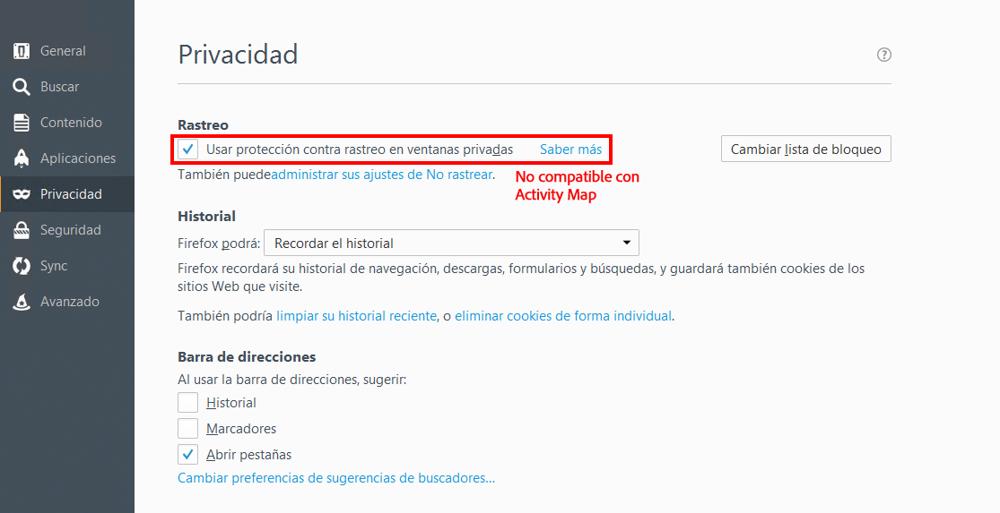
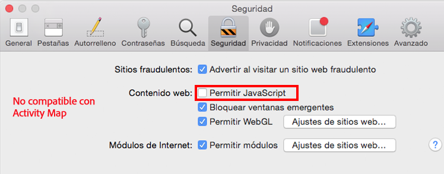
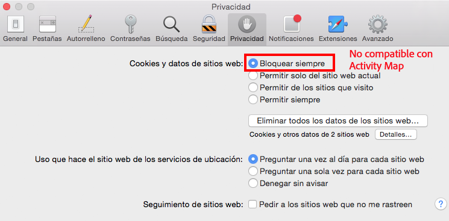
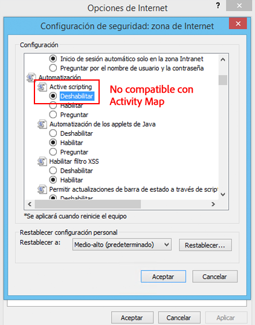

# Solución de problemas con las extensiones del navegador

Muestra los parámetros de explorador que no son compatibles con el uso de Activity Map. Estos ajustes deben deshabilitarse.

## Chrome

## Firefox

## Safari

## Internet Explorer

