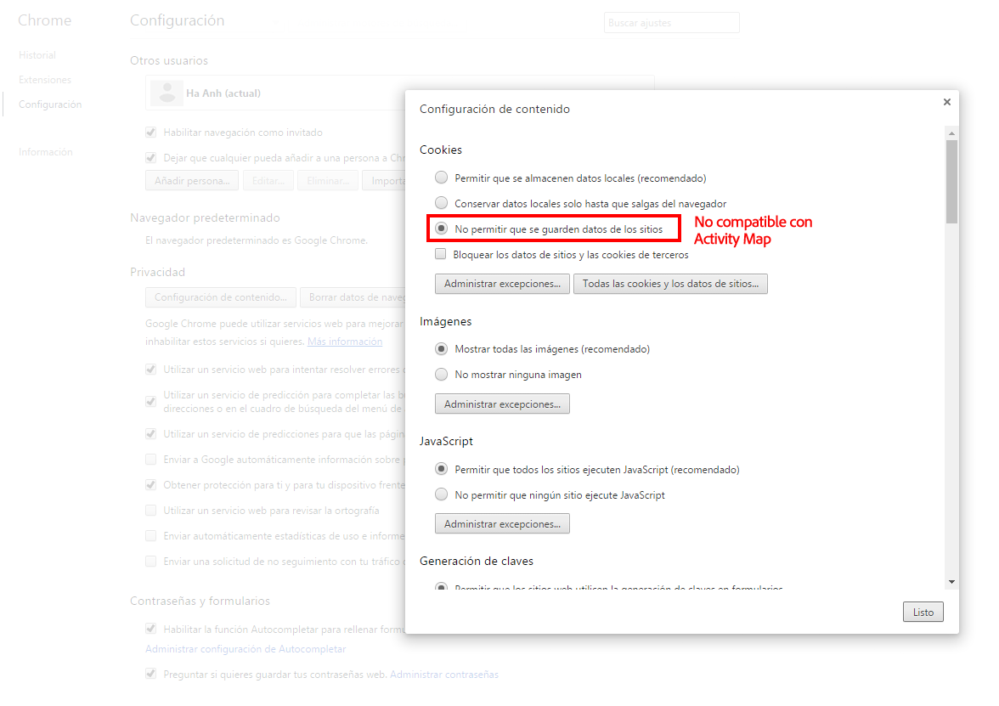

# Solucionar problemas de recopilación de datos de Activity Map

Si no ve datos para dimensiones de Activity Map, utilice esta página para determinar por qué.

## Confirmar la recopilación de datos con el depurador

En primer lugar, asegúrese de que AppMeasurement recopila correctamente los datos de Activity Map.

1. Descargue e instale la [extensión de Adobe Experience Cloud Debugger para Chrome](https://experienceleague.adobe.com/es/docs/experience-platform/debugger/home).
2. Vaya a la página web y, a continuación, haga clic en un vínculo.
3. Cuando se cargue la página siguiente, abra el depurador. Compruebe que ve variables de datos de contexto de Activity Map colocadas entre `activitymap.` y `.activitymap`:

## Posibles motivos por los que no hay datos de Activity Map

Compruebe cada una de las siguientes opciones para asegurarse de que los componentes de Activity Map están presentes:

* **Versión de AppMeasurement**: Activity Map es compatible con v1.6 y versiones posteriores. Muchos problemas de casos extremos se resuelven al actualizar a la última versión estable de AppMeasurement.
* **módulo Activity Map**: Compruebe si el módulo `AppMeasurement_Module_Activity_Map` está presente en el archivo `AppMeasurement.js`. Si su implementación utiliza Adobe Experience Platform para recopilar datos, asegúrese de que la opción **[!UICONTROL Habilitar ClickMap]** esté seleccionada al configurar la extensión de Analytics en **[!UICONTROL Seguimiento de vínculos]**.
* **La cookie `s_sq`**: Activity Map depende de la cookie `s_sq` para la recopilación de datos.
   * Asegúrese de que la variable `cookieDomainPeriods` esté configurada correctamente, especialmente para dominios regionales como `*.co.uk` o `*.co.jp`.
   * Asegúrese de que la variable `linkInternalFilters` esté configurada con los valores deseados. Si un vínculo en el que se hizo clic no coincide con los filtros internos, Activity Map lo considera un vínculo de salida y no recopila datos.
* **Superposición de Activity Map en ejecución**: AppMeasurement no realiza el seguimiento de los datos de clics de la página web cuando la superposición de Activity Map está habilitada.

Muestra los parámetros de explorador que no son compatibles con el uso de Activity Map. Adobe recomienda desactivar esta configuración.

## Chrome

## Firefox

## Safari

## Internet Explorer

**Validación**

Llamadas interactivas mediante la pestaña Red de Developer Console:

1. Cargue el script de lanzamiento de desarrollo en el sitio.
1. Al hacer clic en Elementos, busque &quot;/ee&quot; en la pestaña Red.

Adobe Experience Platform Debugger:

1. Descargue e instale [Adobe Experience Platform Debugger](https://chromewebstore.google.com/detail/adobe-experience-platform/bfnnokhpnncpkdmbokanobigaccjkpob).
1. Vaya a [!UICONTROL Registros] > [!UICONTROL Edge] > [!UICONTROL Conectarse a Edge].

* **La llamada de interacción no se está activando en la ficha Red**: La recopilación de datos de clic en una llamada a recopilar, filtre con `"/ee"` o `"collect?"`.
* **No hay visualización de carga útil para la llamada a cobro revertido**: la llamada a cobro revertido está diseñada de tal manera que el seguimiento no afecta la navegación a otros sitios, por lo que la característica de descarga de documentos es aplicable para las llamadas a cobro revertido. Esta característica no afectará la recopilación de datos, pero si necesita validarla en la página, agregue `target="_blank"` al elemento correspondiente. El vínculo se abre en una nueva pestaña.
