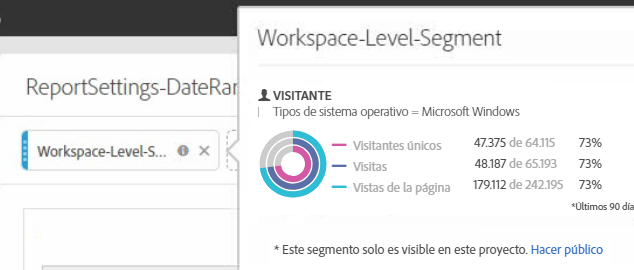
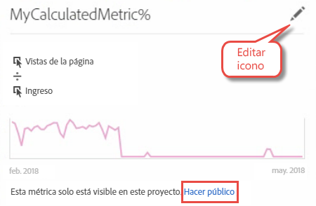

# Preguntas frecuentes del Conversor de proyectos

>[!IMPORTANT]
>
>Adobe Ad Hoc Analysis quedará obsoleto el 1 de marzo de 2021. [Más información](https://adobe.ly/discoverworkspace)

## Preguntas frecuentes del Conversor de proyectos {#topic_8231595303AD403E9322645A63632D57}

* [Problemas de conversión habituales](/help/analyze/ad-hoc-analysis/c-aha-project-converter/aha2aw-converter-faq.md#section_39C922A58B2E49C9877B363042801361)
* [Preguntas frecuentes sobre conversión](/help/analyze/ad-hoc-analysis/c-aha-project-converter/aha2aw-converter-faq.md#section_1E53FE373AF045978F939916124E194E)

## Problemas de conversión habituales {#section_39C922A58B2E49C9877B363042801361}

| Problema | Descripción |
| --- | --- |
| Granularidad de minutos con desgloses o en columnas | Cuando la granularidad de minutos tiene desgloses aplicados o si la granularidad de minutos está presente en las columnas, el proyecto no se puede convertir a Analysis Workspace.  Una solución consiste en eliminar el desglose por granularidad de minutos, quitarlo de las columnas y, a continuación, convertir el proyecto. Después, puede aplicar desgloses en granularidad de minutos en Analysis Workspace. |
| Métrica calculada interna utilizada junto con un segmento de columna | Si utiliza una métrica calculada interna junto con un segmento de columna, el proyecto no se puede convertir a Analysis Workspace. Para solucionar este problema, elimine las métricas calculadas internas del proyecto antes de la conversión y, a continuación, vuelva a agregarlas en Analysis Workspace. |

## Preguntas frecuentes sobre conversión {#section_1E53FE373AF045978F939916124E194E}

<table id="table_48CC119236C94835A6A512E989BE4200"> 
 <thead> 
  <tr> 
   <th colname="col1" class="entry"> Pregunta </th> 
   <th colname="col2" class="entry"> Respuesta </th> 
  </tr>
 </thead>
 <tbody> 
  <tr> 
   <td colname="col1"> 
<b>P: ¿Hay alguna función de Ad Hoc Analysis no compatible con Analysis Workspace?</b> 
 </td> 
   <td colname="col2"> 
R: El informe de análisis del sitio no es compatible con Analysis Workspace. También existen algunas pequeñas diferencias entre otras visualizaciones de Ad Hoc Analysis y Workspace. Consulte las preguntas siguientes para obtener más información. 
 </td> 
  </tr> 
  <tr> 
   <td colname="col1"> 
<b>P: ¿Cómo se convierte la configuración de la tabla?</b> 
 </td> 
   <td colname="col2"> 
    <ul id="ul_A645A004FB094A1593439A6607FE9A6B"> 
     <li id="li_033CA771F08A4BC3B0BC52CDCCA03FF4"><b>Número de filas mostradas</b>: Workspace está configurado para mostrar solo 10 filas (personalizable hasta 400 filas a la vez) mientras que Ad Hoc mostrará hasta 50 000 filas por página. Observe que los datos siguen en Workspace, pero configurados de forma predeterminada en 10 filas. </li> 
     <li id="li_A8B8890149334032A56D8D1C0F8691EA"><b>Búsqueda avanzada:</b> las opciones de búsqueda múltiple simultánea no son compatibles, pero una sola opción de búsqueda (como Todas las palabras, La frase exacta, Cualquier palabra o Ninguna de las palabras) se convertirá a Analysis Workspace. </li> 
    </ul> </td> 
  </tr> 
  <tr> 
   <td colname="col1"> 
<b>P: ¿Cómo se convierten los gráficos y diagramas?</b> 
 </td> 
   <td colname="col2"> 
R: Recuerde que los gráficos y diagramas se denominan “visualizaciones” en Workspace. 
 
    <ul id="ul_597F5AB826EF434295D0CABD0313CAD5"> 
     <li id="li_AFB2805418034721A9519D999128C0A8"><b>Configuración</b>: los ajustes de visualización “Cantidad de elementos” o “Cantidad de barras” no son compatibles con Workspace. </li> 
     <li id="li_D5C7EA8815344EDB8585CBB8E1AF583E"><b>Gráfico circular</b>: exportado como visualización de <a href="https://docs.adobe.com/content/help/es-ES/analytics/analyze/analysis-workspace/visualizations/donut.html"  >Donut</a>. Esta visualización en Workspace está limitada a 19 secciones. </li> 
     <li id="li_91659FBFD77C4B3393D78447D658B7B4"><b>Gráfico de burbujas</b>: exportado como visualización de<a href="https://docs.adobe.com/content/help/es-ES/analytics/analyze/analysis-workspace/visualizations/scatterplot.html"  > Diagrama de puntos</a>. De forma predeterminada, el diagrama de puntos dibuja la primera métrica en el eje x y la segunda en el eje y. Si solo hay una métrica, el gráfico de burbujas se convertirá en visualizaciones de Línea. </li> 
     <li id="li_FA05085FFB1747EBAF63616AC2B8D59C"><b>Histograma</b>: admite una lógica de bloques diferente en Workspace frente a Ad Hoc Analysis. Así, se convierte en una visualización de <a href="https://docs.adobe.com/content/help/es-ES/analytics/analyze/analysis-workspace/visualizations/bar.html"  >barras</a>. </li> 
     <li id="li_959499D20796459CA0F6BBC8F0A8D808"><b>Diagrama de puntos</b>: en proyectos exportados en Analysis Workspace, el eje y se establece como primera columna, el eje x como segunda y el diámetro como tercera. </li> 
     <li id="li_14E06D7A5106405A89A07B44FFD9A92D"><b>Tablas de visitas en el orden previsto</b>: para mostrar las tablas de abandono o continuación, haga clic con el botón derecho en el punto de comprobación y seleccione una opción de desglose. </li> 
     <li id="li_240F43C386F04111A7632A8FCA37832C"><b>Intervalos de fechas de nivel de informe de visitas en el orden previsto</b>: no se han aplicado los intervalos de fechas de informe personalizado a las visualizaciones de visitas en el orden previsto. </li> 
     <li id="li_1FF5B3FD9E424E7190AF03FD4DD9D654"><b>Informe de flujo</b>: el flujo se moverá a un panel separado para conservar la segmentación y los intervalos de fechas. Las instancias de repetición se pueden incluir o excluir en Configuración de flujo. </li> 
     <li id="li_BE8F8F6EC2EA49E18EF52539BC1700E0"><b>Canal de conversión</b>: se convertirá en una tabla de formato libre porque no es compatible con Analysis Workspace. La visualización de visitas en el orden previsto es una sustitución recomendada para el canal de conversión, pero se comportará de forma ligeramente diferente. </li> 
    </ul> </td> 
  </tr> 
  <tr> 
   <td colname="col1"> 
<b>P: ¿Cómo se convierten los segmentos?</b> 
 </td> 
   <td colname="col2"> 
    <ul id="ul_15D5B17461E2402DB07DF8B0A10AAC37"> 
     <li id="li_CF9C3D235A664B15B21D9F89DC5EF7D3">Los segmentos son internos en el proyecto convertido (no son públicos). Puede elegir hacerlos públicos, como se muestra a continuación: 
 
 </li> 
     <li id="li_AE61DAEC5C0047349DD192EFEEDB0BF9">Los segmentos del nivel de espacio de trabajo de Ad Hoc Analysis se aplican al nivel de proyecto/espacio de trabajo en Workspace. </li> 
     <li id="li_B1559E2C18724FE189AF87D0BEF16811">Los segmentos del nivel de informe de Ad Hoc Analysis se aplican al nivel de columna de tabla en Workspace. </li> 
     <li id="li_0E6DF6D44EA448A4A212BA2BB8E342CF">Los segmentos de tabla de Ad Hoc Analysis se aplican al nivel de columna de tabla en Workspace. </li> 
    </ul> 
Puede editar segmentos en el <a href="https://docs.adobe.com/content/help/es-ES/analytics/components/segmentation/seg-home.html"  >Generador de segmentos</a>. 
 </td> 
  </tr> 
  <tr> 
   <td colname="col1"> 
<b>P: ¿Cómo se convierten los intervalos de fechas?</b> 
 </td> 
   <td colname="col2"> 
    <ul id="ul_A24AB597F3CE4847AF00D49A9A72A395"> 
     <li id="li_24FD18AF64114445939C4FBC03F2D406">Los intervalos de fechas de “Último día X” en Ad Hoc Analysis <i>excluyen</i> hoy, mientras que Analysis Workspace <i>sí lo incluye</i>. Así, es posible que los intervalos de fechas como “últimos 90 días” no coincidan exactamente entre herramientas. En su lugar, aplique los intervalos 'Últimos X <b>días completos</b> en Analysis Workspace. </li> 
     <li id="li_AA4390470C494748B4B12030B1226720">El intervalo de fechas del nivel de espacio de trabajo de Ad Hoc Analysis se aplica al nivel de proyecto/espacio de trabajo en Workspace. </li> 
     <li id="li_B8F0CDD413154856A315D087FEC4D418">El intervalo de fechas del nivel de informe de Ad Hoc Analysis se aplica al nivel de columna de tabla en Workspace. </li> 
    </ul> 
Puede editar sus intervalos de fechas personalizados en Analytics &gt; Componentes &gt; Intervalos de fechas. 
 </td> 
  </tr> 
  <tr> 
   <td colname="col1"> 
<b>P: ¿Cómo se convierten las métricas?</b> 
 </td> 
   <td colname="col2"> 
    <ul id="ul_ADA380D5D09B4223AAE4853D4C64F679"> 
     <li id="li_010572F793F54680ABE64117DAB7E800">Las métricas calculadas son internas en el proyecto exportado (no son públicas). Puede elegir hacerlas públicas haciendo clic con el botón derecho en la métrica y haciendo clic en Hacer público. 
 
 </li> 
     <li id="li_930546EC8FEB432C8810FAF93556FC9A">Todos los tipos de métricas calculadas son compatibles con la exportación. </li> 
     <li id="li_DFF7C6F8BB2344928D49194DA0F6EC38"><b>Tipos de asignación</b>: aunque Analysis Workspace no muestra el tipo de asignación de una métrica calculada de forma explícita, la exportación crea y ajusta el tipo de asignación que estaba presente en Ad Hoc Analysis. </li> 
    </ul> 
Puede editar el tipo de asignación en el <a href="https://docs.adobe.com/content/help/es-ES/analytics/components/calculated-metrics/cm-overview.html"  >Creador de métricas calculadas</a> haciendo clic en el icono de edición (lápiz). 
 </td> 
  </tr> 
  <tr> 
   <td colname="col1"> 
<b>P: ¿Cómo se aplica la configuración de datos global de Ad Hoc a los proyectos convertidos?</b> 
 </td> 
   <td colname="col2"> 
La configuración de datos global podría hacer que el mismo proyecto exportado dos veces se comportara de forma diferente: 
 
    <ul id="ul_E3827883DD8045FAAB359D7E85E3EEFA"> 
     <li id="li_1056CA4813C44638BEB070228AE6914C"><b>Contar instancias repetidas.</b> Sea cual sea la configuración aplicada en el momento de la exportación, esta se aplica al proyecto exportado en Analysis Workspace. </li> 
     <li id="li_D5405E2862CF434CA82AA9DE000F4BBC"><b>Fuentes de datos.</b> En Analysis Workspace, se muestran todos los datos de análisis, incluidas las fuentes de datos. </li> 
    </ul> </td> 
  </tr> 
  <tr> 
   <td colname="col1"> 
<b>P: Si mi proyecto de Ad Hoc Analysis está programado, ¿se convertirá la programación a Analysis Workspace?</b> 
 </td> 
   <td colname="col2"> 
No, las programaciones no se convierten. En Analysis Workspace, abra el proyecto que desea programar y vaya a Compartir &gt; Enviar archivo del programa para configurar un programa nuevo. Asegúrese de cancelar el proyecto programado en Ad Hoc Analysis. 
 </td> 
  </tr> 
 </tbody> 
</table>

