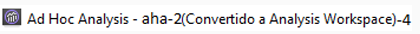
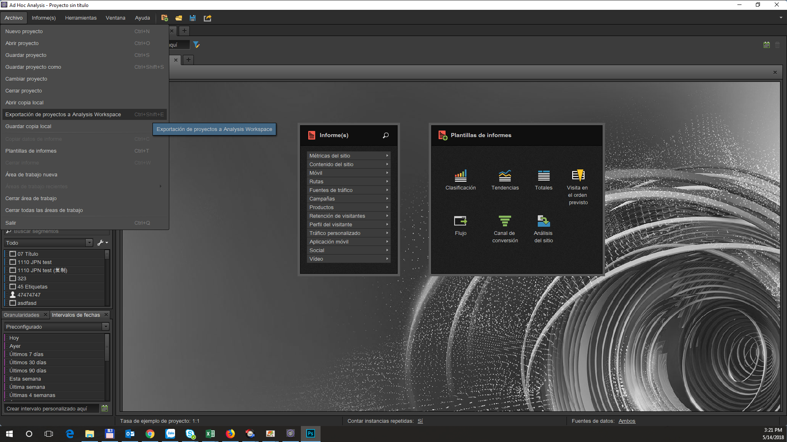
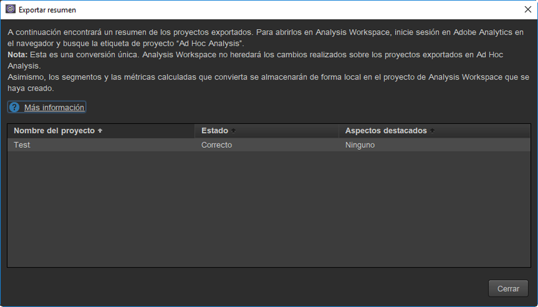
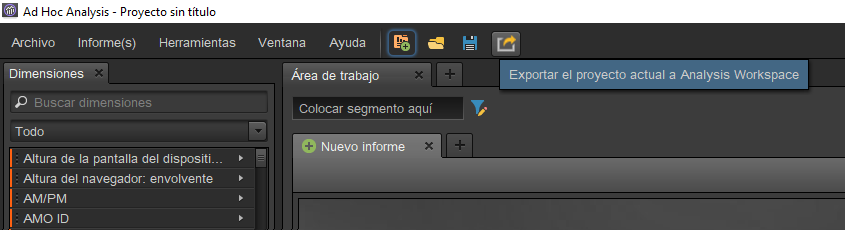

# Convertir sus proyectos en Ad Hoc Analysis

## Convertir sus proyectos en Ad Hoc Analysis {#topic_5A55F73488704C5D8E42CDD04B5984DE}

Antes de convertir sus proyectos, recuerde lo siguiente:

* Para convertir proyectos, debe iniciar sesión en Ad Hoc Analysis como administrador o como no administrador con permiso para utilizar Analysis Workspace.
* Ya que esta es una conversión única, cualquier cambio realizado en los proyectos Ad Hoc convertidos no se reflejará en Analysis Workspace. Sin embargo, tiene la opción de volver a convertir un proyecto.
* Cualquier proyecto convertido de Ad Hoc Analysis seguirá existiendo en Ad Hoc, con un paréntesis en el título que indica que se ha convertido y cuántas veces. Ejemplo:

   

Tiene dos opciones con respecto a la conversión de proyectos de Ad Hoc Analysis:

* Seleccionar los proyectos que va a convertir de una lista.
* Convertir solo el proyecto abierto actualmente.

**Seleccionar proyectos de una lista**

1. En Ad Hoc Analysis, haga clic en **[!UICONTROL Archivo]** > **[!UICONTROL Convertir proyectos a Analysis Workspace]**.

   

1. En el cuadro de diálogo **[!UICONTROL Convertir proyectos a Analysis Workspace]**, seleccione el proyecto que quiere convertir o pulse + para seleccionar toda la lista.

   

1. Haga clic en **[!UICONTROL Convertir]**.
1. Ahora, un [!UICONTROL resumen de conversión] enumera todos los proyectos que se han convertido, junto con una columna de estado que indica si se ha convertido o no correctamente, junto con el código de error. Contacte con el servicio de atención al cliente de Adobe y proporcione el “`Error-Id: <Error-Code>`” para obtener más detalles.

   

**Convertir proyecto actual**

1. En Ad Hoc Analysis, abra un proyecto que desee convertir.
1. Haga clic en **[!UICONTROL Convertir proyecto actual a Analysis Workspace.]** 

1. Ahora, un [!UICONTROL resumen de conversión] enumera todos los proyectos que se han convertido, junto con una columna de estado que indica si se ha convertido o no correctamente, junto con el código de error. Contacte con el servicio de atención al cliente de Adobe y proporcione el “`Error-Id: <Error-Code>`” para obtener más detalles.
