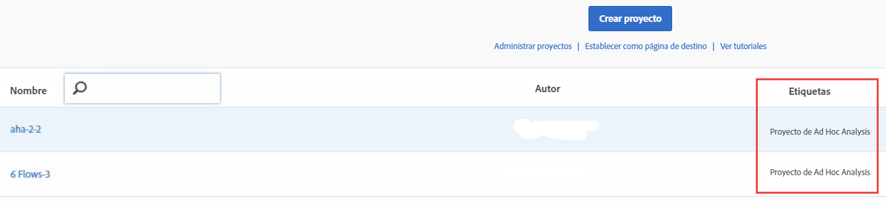

# Ver proyectos convertidos en Analysis Workspace

>[!IMPORTANT]
>
>El Adobe está llevando a Ad Hoc Analysis al final de su vida útil el 1 de marzo de 2021. [Más información](https://adobe.ly/discoverworkspace)

Antes de ver sus proyectos en Workspace, consulte las [Preguntas frecuentes](/help/analyze/ad-hoc-analysis/c-aha-project-converter/aha2aw-converter-faq.md#topic_8231595303AD403E9322645A63632D57) y revise las [diferencias en terminología](/help/analyze/ad-hoc-analysis/c-aha-project-converter/aha2aw-converter-faq.md#topic_8231595303AD403E9322645A63632D57) entre Ad Hoc Analysis y Workspace.

1. Desplácese a **[!UICONTROL Análisis]** > **[!UICONTROL Espacio de trabajo]**. Recuerde que los proyectos convertidos desde Ad Hoc Analysis se etiquetan como “Proyecto de Ad Hoc Analysis”.

   

1. Para ver el proyecto haga clic en su nombre.
1. Si lo desea, haga cambios adicionales en el proyecto. Recuerde que los cambios no se verán reflejados en Ad Hoc Analysis.

