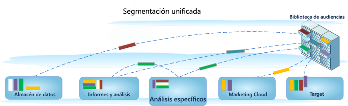

# Generar segmentos

>[!IMPORTANT]
>
>El Adobe está llevando a Ad Hoc Analysis al final de su vida útil el 1 de marzo de 2021. [Más información](https://adobe.ly/discoverworkspace)

Ad Hoc Analysis se integra con el entorno de segmentación Analytics, lo cual le permite crear, compartir, gestionar y aplicar segmentos del visitante en todos los productos de Adobe. Ad Hoc Analysis proporciona una interfaz basada en Java para el Generador de segmentos y el Administrador de segmentos idéntica a las herramientas basadas en la web utilizadas para otras funcionalidades de Analytics donde se concuerdan las llamadas de servidor y proporciona las mismas funciones y funcionalidades que una consola basada en Java.

Ad Hoc Analysis incluye funciones conocidas para la generación de segmentos, además de nuevas actualizaciones de funciones como el [Administrador de segmentos](https://docs.adobe.com/content/help/es-ES/analytics/components/segmentation/segmentation-workflow/seg-manage.html) utilizado para configurar el [flujo de trabajo](https://docs.adobe.com/content/help/en/analytics/components/segmentation/segmentation-workflow/seg-workflow.html) de administración de segmentos. Como siempre, puede crear y guardar segmentos en el [Generador de segmentos](/help/components/segmentation/segmentation-workflow/seg-build.md) o [generar segmentos desde un informe de Visitas en el orden previsto](https://docs.adobe.com/content/help/en/analytics/analyze/analysis-workspace/visualizations/fallout/compare-segments-fallout.html) desde la consola de Ad Hoc Analysis y, a continuación, guardar los segmentos nuevos o ampliados en la biblioteca de audiencias para el acceso general y la aplicación.  

## Segmentación unificada en Ad Hoc Analysis {#section_5FA03A06DE054448AD519CE30C39E294}

Si desea más información e instrucciones sobre la generación y administración de segmentos en el entorno de Segmentación unificada, incluidas las funciones de Ad Hoc Analysis, consulte la documentación de [Segmentación unificada](/help/components/segmentation/segmentation-workflow/seg-build.md).

* [Nuevas características](/help/analyze/ad-hoc-analysis/c-content-ref.md#section_BD58629D1A9346BF879E229FA6BEC7A2)
* [¿Qué ha pasado con los segmentos que ya existían? ](/help/analyze/ad-hoc-analysis/c-content-ref.md#section_76CF47142D1A4FB6A0718AD9073049FE)
* [¿Qué ha pasado con las carpetas de segmentos que ya existían? ](/help/analyze/ad-hoc-analysis/c-content-ref.md#section_FB04DCF775694E69B761DCA53F301C30)
* [¿Puedo gestionar todos mis segmentos de Analytics en el Administrador de segmentos?](/help/analyze/ad-hoc-analysis/c-content-ref.md#section_AF5EDD72C74A4739BD40C4AF125CE489)
* [¿Qué es el contenedor de visitas? ¿En qué se diferencia de un contenedor de vista de página?](/help/analyze/ad-hoc-analysis/c-content-ref.md#section_65BBE60A836C4001938830DDA15DC256)
* [¿Qué derechos y privilegios necesito para utilizar, crear y administrar segmentos? ](/help/analyze/ad-hoc-analysis/c-content-ref.md#section_648DFA3A882146C485A84ED014EEC707)
* [¿Qué debo hacer con los segmentos duplicados que tienen...?](/help/analyze/ad-hoc-analysis/c-content-ref.md#section_E2C3A1B4B4274D1B86CAA9C0359D049C)
* [¿Cómo recomienda Adobe que limpie los segmentos?](/help/analyze/ad-hoc-analysis/c-content-ref.md#section_3AC2D265F9084557A24C6FB39DC6EE49)
* [¿Por qué no puedo eliminar este segmento?](/help/analyze/ad-hoc-analysis/c-content-ref.md#section_0FEB6711031A4ABCA915CDA745ECF38D)
* [Más información acerca de lo que ocurre con los segmentos que ya existen](/help/analyze/ad-hoc-analysis/c-content-ref.md#section_83ACAB256F394DCD8B424D8920BDD853)

## Funciones {#section_BD58629D1A9346BF879E229FA6BEC7A2}

* Los [segmentos](https://docs.adobe.com/content/help/es-ES/analytics/components/segmentation/seg-home.html) son universales para todos los grupos de informes. Anteriormente, los segmentos eran específicos de cada grupo de informes.
* El nuevo [Administrador de segmentos](https://docs.adobe.com/content/help/es-ES/analytics/components/segmentation/segmentation-workflow/seg-manage.html) le permite configurar [flujos de trabajo](https://docs.adobe.com/content/help/en/analytics/components/segmentation/segmentation-workflow/seg-workflow.html) con funciones de uso compartido, etiquetado, verificación y aprobación de segmentos.
* Se ha actualizado el [Generador de segmentos](/help/components/segmentation/segmentation-workflow/seg-build.md) para simplificar la creación de segmentos.
* Ahora puede [etiquetar segmentos](https://docs.adobe.com/content/help/en/analytics/components/segmentation/segmentation-workflow/seg-tag.html) para organizar y buscar más tarde en lugar de utilizar carpetas. Antes, utilizaba las carpetas (en [!DNL ad hoc analysis]) para organizar los segmentos.
* Ahora puede crear [Segmentos secuenciales](https://docs.adobe.com/content/help/en/analytics/components/segmentation/segmentation-workflow/seg-sequential-build.html) fuera de Ad Hoc Analysis.

   >[!NOTE]
   >
   >En Ad Hoc Analysis, no puede añadir rangos de fecha a los segmentos. Esta función está disponible en Analysis Workspace. También puede usar las secuencias Solo antes o Solo después en Ad Hoc Analysis.

## ¿Qué ha pasado con los segmentos que ya existían? {#section_76CF47142D1A4FB6A0718AD9073049FE}

Los segmentos existentes seguirán funcionando como hasta antes de la introducción de la segmentación de Analytics. Todos los informes a los que se hayan aplicado dichos segmentos funcionarán correctamente.

La mayoría de los anteriores segmentos predefinidos y de grupo se migrarán como plantillas de segmento al Generador de segmentos. Las plantillas de segmentos se utilizan para generar rápidamente segmentos personalizados con audiencias comunes. Las plantillas de segmentos no pueden aplicarse a un informe directamente, pero pueden guardarse de manera muy sencilla en un segmento personalizado.

## ¿Qué ha pasado con las carpetas de segmentos que ya existían?  {#section_FB04DCF775694E69B761DCA53F301C30}

En lugar de carpetas (Ad Hoc Analysis), el Administrador de segmentos utiliza [etiquetas](https://docs.adobe.com/content/help/en/analytics/components/segmentation/segmentation-workflow/seg-tag.html). Los nombres de sus carpetas se convierten automáticamente en etiquetas, que se aplican a los segmentos respectivos.

## ¿Puedo administrar todos los segmentos de análisis en el Administrador de segmentos?  {#section_AF5EDD72C74A4739BD40C4AF125CE489}

Dentro del administrador de segmentos de Ad Hoc Analysis solo puede ver los segmentos que le pertenecen (los segmentos que haya creado) y los segmentos que se han compartido específicamente con usted.

## ¿Qué es el contenedor de visitas? ¿En qué se diferencia de un contenedor de vistas de página?  {#section_65BBE60A836C4001938830DDA15DC256}

El contenedor de vista de página se llama ahora “contenedor de visita individual” para indicar que el contenedor segmenta todos los tipos de datos, no solo vistas de página. Por ejemplo, las llamadas de seguimiento de vínculo y las llamadas de [!DNL trackAction] de los SDK móviles se incluyen o excluyen del contenedor de visitas.

Tenga en cuenta que no se ha modificado la manera de funcionar del contenedor; simplemente se le ha cambiado el nombre.

## ¿Qué derechos y privilegios necesito para utilizar, crear y administrar segmentos?  {#section_648DFA3A882146C485A84ED014EEC707}

Todos los usuarios pueden crear y editar segmentos personales. Estos segmentos se pueden compartir directamente con cualquier otro usuario de Analytics.

Los administradores pueden editar cualquier segmento, [compartir segmentos](https://docs.adobe.com/content/help/en/analytics/components/segmentation/segmentation-workflow/t-seg-share.html) con grupos y [establecer derechos](https://docs.adobe.com/content/help/es-ES/analytics/components/segmentation/segment-reference/seg-rights.html) de acceso a segmentos para la organización.

## ¿Qué debería hacer con los segmentos duplicados que tienen el mismo nombre pero que pueden tener definiciones distintas?  {#section_E2C3A1B4B4274D1B86CAA9C0359D049C}

Ya que los segmentos funcionan en varios grupos de informes, es posible que detecte que tiene varios segmentos con el mismo nombre. Le recomendamos que siga uno de los procedimientos siguientes

* Cambie el nombre de los segmentos que tienen el mismo nombre pero tienen definiciones distintas, o
* Elimine los segmentos que ya no son necesarios.

## ¿Cómo recomienda Adobe que limpie los segmentos?  {#section_3AC2D265F9084557A24C6FB39DC6EE49}

* Etiquete todos los segmentos con la etiqueta heredada.
* Revise los segmentos que tiene.
* Añádalos a la biblioteca de segmentos cuando sea pertinente.
* Apruebe los segmentos canónicos.
* Etiquete los segmentos siguiendo las  recomendaciones.

## ¿Por qué no puedo eliminar este segmento?  {#section_0FEB6711031A4ABCA915CDA745ECF38D}

Si el segmento se [publicó en Experience Cloud](https://docs.adobe.com/content/help/es-ES/core-services/interface/audiences/t-publish-audience-segment.html), no es posible eliminarlo ni editarlo. Pero sí copiarlo y editar esa versión copiada.

## Más acerca de lo que ocurre con sus segmentos existentes  {#section_83ACAB256F394DCD8B424D8920BDD853}

<table id="table_0AE814A64D2A48ABB28402C4303F420E"> 
 <thead> 
  <tr> 
   <th colname="col1" class="entry"> Categoría del segmento </th> 
   <th colname="col2" class="entry"> ¿Qué les sucede a estos segmentos? </th> 
  </tr> 
 </thead>
 <tbody> 
  <tr> 
   <td colname="col1"> Segmentos favoritos (Ad Hoc Analysis) </td> 
   <td colname="col2">Estos segmentos de Ad Hoc Analysis se muestran como segmentos regulares en Adobe Analytics. 
No se deben confundir con la función Favoritos del Administrador de segmentos, que le permite marcar segmentos como favoritos. 
 </td> 
  </tr> 
  <tr> 
   <td colname="col1">Segmentos preconfigurados: 
    <ul id="ul_BBF3C3F4D41A40AF98DA9DA6D299AD03"> 
     <li id="li_B65A004BDF8743FDABCD3332AEB8A010">Visitas a una sola página </li> 
     <li id="li_908CF5F964154C9D9EBBAC2A900DCB49">Visitas desde dispositivos móviles </li> 
     <li id="li_4A715F49AA374463B501D731261A3A4C">Visitas de búsqueda natural </li> 
     <li id="li_67CE51237EC34FD4B33942BA14584EBF">Visitas de búsqueda de pago </li> 
     <li id="li_C3820743178A4E9F9E5E5B5C47401DF2">Visitas con cookie de ID de visitante </li> 
    </ul> </td> 
   <td colname="col2"> 
Estos segmentos se migrarán como  plantillas de segmentos al Generador de segmentos. 
 
Los informes existentes que tengan estos segmentos aplicados seguirán funcionando correctamente. 
 </td> 
  </tr> 
  <tr> 
   <td colname="col1">Segmentos de Experience Cloud (Suite): 
    <ul id="ul_6968AFF6DEDA4BC8A7885B07CC1F57DF"> 
     <li id="li_073D9496F0C64AEB855855D01E65C1BA">No compradores </li> 
     <li id="li_8958FD4272A14E16A9AA08216E8BC573">Compradores </li> 
     <li id="li_1436D7C9651D4AC38E10662DEDDD2B95">Visitas por primera vez </li> 
     <li id="li_69F42B4F6107407792B0014804A8AF7B">Visitas provenientes de sitios sociales </li> 
     <li id="li_29CA111186BE475C943E9F8450BDE8C8">Visitas de más de 10 minutos* </li> 
     <li id="li_1FEF207959DC4D2E9FC925DD43177AA0">Visitas con más de 5 visitas previas* </li> 
     <li id="li_219AB1D4FD7E469C9076A23D2CCC7C2C">Visitas provenientes de Facebook* </li> 
    </ul> </td> 
   <td colname="col2"> 
 La mayoría de estos segmentos (excepto los marcados con un asterisco *) se migrarán como  plantillas de segmentos al Generador de segmentos. Además, se han agregado varias plantillas de segmentos nuevas. 
 
Los informes existentes que tengan estos segmentos aplicados seguirán funcionando correctamente. 
 </td> 
  </tr> 
  <tr> 
   <td colname="col1">Segmentos de Administrador 
(también conocidos como segmentos "globales") 
 </td> 
   <td colname="col2"> 
 Los segmentos de <b>Administrador</b> se migrarán en la nueva interfaz de segmentos y se mostrarán como segmentos compartidos para todos. 
 
El propietario de estos segmentos se establece como administrador con la cuenta de inicio de sesión más antigua de la lista de usuarios administradores de la empresa; no obstante, todos los administradores pueden eliminar, editar y compartir estos segmentos. 
 
Ya no está disponible la interfaz de administración de segmentos en Admin Console donde los administradores creaban y gestionaban estos segmentos globales. Los administradores ahora deben utilizar el nuevo Generador de segmentos para crear segmentos y compartirlos con los grupos o individuos adecuados o con todos. 
 </td> 
  </tr> 
 </tbody> 
</table>

