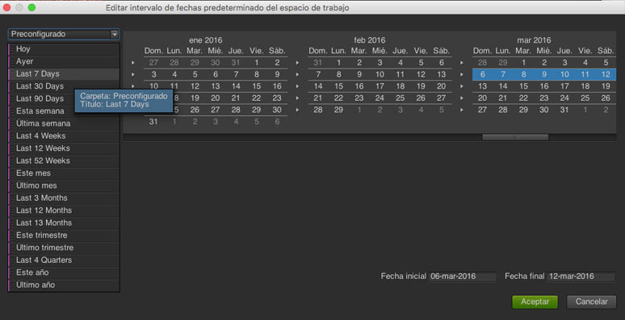

# Fechas e intervalos de fechas

>[!IMPORTANT]
>
>El Adobe está llevando a Ad Hoc Analysis al final de su vida útil el 1 de marzo de 2021. [Más información](https://adobe.ly/discoverworkspace)

En el calendario, se pueden indicar fechas e intervalos de fechas o seleccionar ajustes preestablecidos. Se pueden realizar selecciones de calendario en los niveles de proyecto, espacio de trabajo e informe. El intervalo de fechas del proyecto se toma como fecha predeterminada. Sin embargo, el intervalo de fechas del espacio de trabajo tiene prioridad sobre el intervalo de fechas del proyecto. Asimismo, el intervalo de fechas del informe tiene prioridad sobre la configuración de fechas de los espacios de trabajo y los proyectos. No se puede seleccionar un intervalo de fechas que exceda el intervalo de disponibilidad de datos.

## Fechas e intervalos de fechas {#concept_AB32765013F449908B5964AB622C75FF}

En el calendario, se pueden indicar fechas e intervalos de fechas o seleccionar ajustes preestablecidos. Se pueden realizar selecciones de calendario en los niveles de proyecto, espacio de trabajo e informe. El intervalo de fechas del proyecto se toma como fecha predeterminada. Sin embargo, el intervalo de fechas del espacio de trabajo tiene prioridad sobre el intervalo de fechas del proyecto. Asimismo, el intervalo de fechas del informe tiene prioridad sobre la configuración de fechas de los espacios de trabajo y los proyectos. No se puede seleccionar un intervalo de fechas que exceda el intervalo de disponibilidad de datos.

 Cuando la opción **[!UICONTROL Borrar fecha]** está habilitada, quiere decir que se indicó un intervalo de fecha en el nivel del informe.

También es posible arrastrar fechas (y dimensiones temporales) dentro del informe o del [!UICONTROL Generador de tablas]. Se pueden seleccionar fechas, semanas, meses o años concretos, o bien fechas móviles. Si usa el calendario personalizado en los Reports and Analytics de marketing, un grupo de informes heredará esa configuración y actualizará el informe como corresponda.

Al seleccionar un rango de fecha cuando cree un proyecto, si usa Preconfigurado a la izquierda, establecerá una fecha movible, mientras que si usa el calendario a la izquierda, esto no ocurrirá. Una forma fácil de saber si la fecha se puede mover es el mensaje “Este rango de fecha se puede mover” al lado del botón **[!UICONTROL Aceptar]**.

>[!NOTE]
>
>Si necesita ayuda para ejecutar informes preexistentes, comuníquese con su administrador de cuenta.

## Fracciones de datos preexistentes {#concept_53AA34DB3CE647608CAF4B41D6EAF45E}

Durante el segundo semestre de 2010, Adobe inició la migración de grupos de informes a una plataforma de datos unificada para mejorar el procesamiento y el almacenamiento. Los datos existentes antes de la migración se consideran datos preexistentes (o del historial) que están restringidos por límites del calendario trimestral o anual.

<!-- 

c_legacy_data.xml

 -->

**Para acceder a fracciones de datos del historial**

1. [Cree](/help/analyze/ad-hoc-analysis/c-getting-started.md) o abra un proyecto.
1. Abra el [calendario](/help/analyze/ad-hoc-analysis/c-dates.md) y, a continuación, seleccione **[!UICONTROL Trimestre]** o **[!UICONTROL Año]**.

>[!NOTE]
>
> Las fracciones de datos históricos están dentro de una restricción trimestral y anual. No se pueden ver datos que sobrepasen los límites entre las fracciones preexistentes y la nueva plataforma de procesamiento. Intervalos de fechas que abarcan ambos resultados en un error. Asimismo, solo se aplican los intervalos de fecha al calendario gregoriano, no al calendario personalizado.

