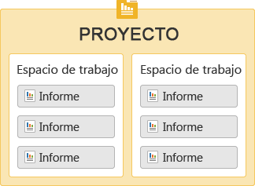
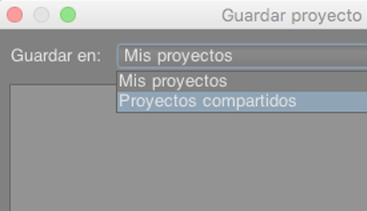

# Introduccción a Ad Hoc Analysis {#concept_48936BA28FAE42DB81F1B2CD4726EB17}

>[!IMPORTANT]
>
>El Adobe está llevando a Ad Hoc Analysis al final de su vida útil el 1 de marzo de 2021. [Más información](https://adobe.ly/discoverworkspace)

Puede realizar análisis instantáneos y avanzados sobre la actividad de un sitio web. Se pueden ver varios informes a la vez y aplicar segmentos a lo largo de varias dimensiones. Los datos se pueden analizar desde perspectivas micro y macro para ver cómo repercuten en las métricas de negocio importantes.

Estas características permiten responder a preguntas sobre el tráfico del sitio, las zonas demográficas del visitante, los ingresos y el movimiento del producto. Luego puede filtrar, clasificar y segmentar los datos con el fin de encontrar respuestas a preguntas precisas. Los resultados se devuelven prácticamente en forma instantánea, lo que le permite analizar rápidamente los efectos de una combinación de factores.

<table id="table_C9C0444687FC418580F996E1D2ADB61A"> 
 <thead> 
  <tr> 
   <th colname="col1" class="entry"> Tareas introductorias </th> 
   <th colname="col2" class="entry"> Descripción </th> 
  </tr> 
 </thead>
 <tbody> 
  <tr> 
   <td colname="col1"> 
1. Iniciar sesión en Adobe Analytics. 
 </td> 
   <td colname="col2"> 
Vaya a <a href="https://experiencecloud.adobe.com"  >marketing.adobe.com</a> e inicie sesión con sus credenciales de Adobe Analytics. 
 </td> 
  </tr> 
  <tr> 
   <td colname="col1"> 
2. Iniciar Ad Hoc Analysis. 
 </td> 
   <td colname="col2">Haga clic en Adobe Analytics &gt; Herramientas &gt; Ad Hoc Analysis y luego haga clic en el botón Iniciar Ad Hoc Analysis. 
 
Nota: Si no ve el botón <b>Iniciar Ad Hoc Analysis</b> en esta página, asegúrese de que el administrador lo haya agregado al grupo <i>Usuarios con licencias de Ad Hoc Analysis</i> en las herramientas de administración. 
 
 </td> 
  </tr> 
  <tr> 
   <td colname="col1"> 
3. Crear un proyecto. 
 </td> 
   <td colname="col2"> 
En la página de inicio, seleccione un grupo de informes y haga clic en Crear proyecto. 
 
Consulte <a href="/help/analyze/ad-hoc-analysis/c-getting-started.md"   >Proyectos y espacios de trabajo</a>. 
 </td> 
  </tr> 
  <tr> 
   <td colname="col1"> 
4. Abrir un informe. 
 </td> 
   <td colname="col2"> 
Busque un informe con el menú de informes estándar de Cloud. También puede elegir una plantilla. 
 
Consulte <a href="/help/analyze/ad-hoc-analysis/c-getting-started.md"   > Plantillas de informe</a>. 
 </td> 
  </tr> 
  <tr> 
   <td colname="col1"> 
5. Configurar el informe. 
 </td> 
   <td colname="col2"> 
Para configurar el informe deberá realizar diversas tareas: 
 
    <ul id="ul_0D2E8C614F2A4899A376BCEECEA374C6"> 
     <li id="li_FA925D52A8FD4DFAB0C88B797B24E72B"> Crear segmentos para profundizar en los datos. </li> 
     <li id="li_5E91632551D2473BA8BD0637CDC1A9F6"> Agregar métricas, dimensiones y segmentos al <a href="/help/analyze/ad-hoc-analysis/c-tablebuilder.md"   > Generador de tablas</a> </li> 
     <li id="li_019316C9A94B4A8C8A77D07C04E50278">Configuración de <a href="/help/analyze/ad-hoc-analysis/c-dates.md"   >intervalos de fechas</a> </li> 
     <li id="li_2B33B325D5EE420AB412B73AD1D231C5"> <a href="/help/analyze/ad-hoc-analysis/c-schedule.md"   > Programar</a> el envío de informes </li> 
    </ul> 
Busque en este sistema de ayuda para encontrar la ayuda que necesita. 
 </td> 
  </tr> 
 </tbody> 
</table>

## Recomendaciones de sistemas {#concept_6691331B45174290BD9B839806A9B52D}

Aunque los informes deberían funcionar correctamente con los navegadores web más usuales, se verán y funcionarán mejor en sistemas que se ajusten a las siguientes recomendaciones.

<!-- 

c_sys_reqs.xml

 -->

>[!NOTE]
>
>Desde julio de 2018, Ad Hoc Analysis solo admite Java 8 o versiones posteriores. Adobe no admite la ejecución de Ad Hoc Analysis en Java 7 o versiones posteriores.

* Tarjeta de vídeo compatible con OpenGL 2.0
* Cookies: obligatorio
* Sistema operativo: Windows y Mac OS.
* Macromedia Flash Player: versión 6 o posterior
* Resolución del monitor: 800 x 600 (se recomienda 1024 x 768)
* Profundidad de color: 16 bits o superior
* JavaScript: habilitado
* Versión de Java: Java 1.7 o versiones posteriores (consulte la nota anterior)

   Si no tiene instalada la versión correcta de Java, se instalará automáticamente. Si tiene instalada una versión incompatible de Java, Ad Hoc Analysis descargará las actualizaciones y le pedirá que las instale.

## Instrucciones de actualización de Java {#section_E4C0C6492FF24636A0FF71A59331111D}

Los archivos .jar de Adobe están firmados con un cifrado de 256 bits seguro que no es compatible con versiones de Java inferiores a 1.7.0_76. Este certificado de 256 bits nos permite ofrecerle una mayor seguridad.

Si todavía tiene Java 7 instalado, debe actualizar primero a la versión de mantenimiento de julio de 2018. A continuación se muestra cómo:

* Si puede instalar programas en su ordenador:

   1. Vaya a https://www.java.com.
   1. Click **[!UICONTROL Java Download]**.
   1. Click **[!UICONTROL Agree and Start Download]**.
   1. Instale la última versión de Java específica para su sistema operativo.

* Si **no** puede instalar programas en su ordenador:

   1. Consulte con su departamento informático para poder instalar la última versión de Java.

## Iniciar Ad Hoc Analysis {#concept_B1CE3C1E6D1A4311B9835BEB69812E55}

<!-- 

c_login.xml

 -->

Puede iniciar sesión desde [!DNL Experience Cloud] o desde una dirección URL. Si inicia sesión desde Reports and Analytics, su sesión ya se habrá iniciado automáticamente. Iniciar sesión con una URL solamente es necesario si accede a la dirección URL de Ad Hoc Analysis desde otra ubicación, por ejemplo, un vínculo o un menú Favoritos.

## Inicio de sesión desde Experience Cloud {#task_128ED319F3AE49ED886EA3DFA8D0987F}

Instrucciones sobre cómo iniciar sesión desde [!DNL Experience Cloud].

<!-- 

t_login_suite.xml

 -->

1. En un navegador, vaya a [!DNL marketing.adobe.com].
1. Escriba el nombre de la empresa, el nombre de usuario y la contraseña. A continuación, haga clic en **[!UICONTROL Iniciar sesión]**.
1. Haga clic en **[!UICONTROL Adobe Analytics]** > **[!UICONTROL Herramientas]** > **[!UICONTROL Ad Hoc Analysis]**.

   Si no ve el botón **Iniciar Ad Hoc Analysis** en esta página, asegúrese de que el administrador lo haya agregado al grupo *Usuarios con licencias de Ad Hoc Analysis* en las herramientas de administración.
1. Haga clic en **[!UICONTROL Iniciar Ad Hoc Analysis]**.
1. Guarde el archivo [!DNL discover.jnlp] localmente.

   Puede ejecutar este archivo que guardó cada vez que desee iniciar Ad Hoc Analysis.

## Proyectos y espacio de trabajo {#concept_FAE346335B0347A192C6C806C775D72B}

Los proyectos definen el conjunto de datos que se importa, lo que incluye un grupo de informes y un intervalo de fechas. Los proyectos constan de un número indeterminado de informes, junto con todas sus métricas, configuraciones, dimensiones y segmentos. Puede comenzar un proyecto nuevo, cargar un proyecto guardado o cargar el proyecto que guarda automáticamente.

<!-- 

c_projects.xml

 -->

Los informes se agrupan en un *espacio de trabajo*. Un proyecto puede contener varios espacios de trabajo, y un espacio de trabajo puede contener varios informes. La mejor forma de entender la relación entre estos artículos es verla como una relación anidada:

Se puede abrir solamente un proyecto por vez. Sin embargo, en un proyecto se pueden abrir varios espacios de trabajo. En cada espacio de trabajo, se pueden tener varios informes abiertos.

El intervalo de fechas predeterminado para un nuevo proyecto es [!UICONTROL Últimos 90 días].

## Inicio de proyectos {#task_918A4539134E4E62B00486DCB8D3D403}

Instrucciones sobre cómo iniciar un proyecto.

<!-- 

t_project_start.xml

 -->

1. Inicie sesión.
1. Abra un proyecto guardado o haga clic en **[!UICONTROL Crear proyecto]**.
1. Busque un informe o elija una plantilla.

## Apertura de espacios de trabajo guardados recientemente {#task_DE4A54180BC24E9DAEC98E2171DC6B40}

Instrucciones sobre cómo abrir espacios de trabajo guardados recientemente.

<!-- 

t_recent_workspace.xml

 -->

1. Haga clic en **[!UICONTROL Archivo]** > **[!UICONTROL Espacio de trabajo reciente]**.

   Puede abrir un máximo de cinco espacios de trabajo recientes. Estos espacios de trabajo dejan de estar disponibles al cerrar la sesión.

## Proyectos compartidos {#task_5911780D90164F3A8A677C8BC719750D}

Los proyectos compartidos estarán disponibles para todos los usuarios de Ad Hoc Analysis de la empresa.

<!-- 

t_share_projects.xml

 -->

1. Vaya a **[!UICONTROL Archivo]** > **[!UICONTROL Guardar como]**.
1. Seleccione **[!UICONTROL Proyectos compartidos]** en el menú desplegable **[!UICONTROL Guardar en:]**.

   

1. Haga clic en **[!UICONTROL Guardar]** para guardar el proyecto.

   Los proyectos compartidos se pueden abrir a través de **[!UICONTROL Archivo]** > **[!UICONTROL Abrir]** > **[!UICONTROL Proyectos compartidos]**.

   >[!NOTE]
   >
   >Puede eliminar sus proyectos compartidos en el mismo cuadro de diálogo de proyectos compartidos seleccionando uno o más proyectos.

## Cambio de nombre de un espacio de trabajo {#task_0DB177DD6DB54B7F9FE60A0B3FC7CFC3}

Instrucciones sobre cómo cambiar el nombre de espacio de trabajo.

<!-- 

t_rename_workspace.xml

 -->

1. Haga clic con el botón derecho en el nombre del espacio de trabajo.
1. Elija **[!UICONTROL Cambiar nombre de espacio de trabajo]**.
1. Escriba un nombre y haga clic en **[!UICONTROL Aceptar]**.

## Abrir un proyecto local {#task_1B3EF63A80C74776B24B99D80EAC74AC}

Instrucciones sobre cómo abrir una copia local de un proyecto.

<!-- 

t_open_local_project.xml

 -->

1. Haga clic en **[!UICONTROL Archivo]** > **[!UICONTROL Abrir copia local]**.
1. Vaya al archivo local [!DNL .dproj] y, a continuación, haga clic en **[!UICONTROL Abrir]**.

## Plantillas de informe {#concept_370F674C5B4C45368731AA801C5A45F8}

Las plantillas son puntos de partida que se pueden refinar para obtener el análisis deseado. Una plantilla puede ser un lienzo vacío, por ejemplo un informe de clasificación o de visitas en el orden previsto. O puede ser un informe que parte de métricas y dimensiones predeterminadas.

<!-- 

c_templates.xml

 -->

Las plantillas se pueden usar al crear un proyecto (**[!UICONTROL Archivo]** > **[!UICONTROL Nuevo proyecto]**) o al agregar un espacio de trabajo o informe.

| Plantilla | Descripción |
|--- |--- |
| Clasificación | Presenta un lienzo vacío en el cual se puede construir una tabla. Por ejemplo, los informes de páginas clasifican las páginas del sitio según el tráfico, y la tabla de detalles muestra los porcentajes y las cantidades correspondientes a diversas métricas, por ejemplo, las vistas de páginas y los ingresos. |
| Tendencias | Permiten examinar las tendencias que siguen las conversiones y los eventos de acuerdo con una granularidad temporal seleccionada (hora, día, semana, mes, trimestre o año) durante un período de informe. |
| Totales | Un informe de nivel ejecutivo que muestra cifras totales. Contiene datos de totales de ingresos, vistas de página y pedidos. |
| Abandono | Permite construir un canal a través del sitio web para ver las tasas de conversión y abandono de la secuencia entre determinados puntos de comprobación. Por ejemplo, se puede hacer un seguimiento de dónde los visitantes abandonan la secuencia prevista a lo largo del proceso de compra. |
| Flujo | Muestra las rutas más comunes que siguen los usuarios entre páginas, secciones del sitio y servidores. |
| Canal de conversión | Muestra porcentajes de conversión entre determinados eventos de métricas. Estos informes se pueden usar para comprender con cuántas pulsaciones se generan ventas y la cantidad de unidades vendidas. |
| Análisis del sitio | Una herramienta de seguimiento de ruta tridimensional que muestra cuántos visitantes pasan por determinadas páginas y eventos. |
| Grupo de enfoque virtual | Selecciona una visita al azar y muestra una gran cantidad de información sobre esa visita. Puede usar el informe para crear grupos de enfoque entre la población de visitantes. |

## Abrir un informe {#task_0AC455CDA198497AA546622FB05F300D}

Puede abrir un informe o una plantilla en el momento de crear un proyecto o desde un proyecto ya creado. Las plantillas sirven para configurar un informe desde cero.

<!-- 

t_reports_opening.xml

 -->

Puede abrir un informe de las siguientes maneras:

* En la página [!UICONTROL Nuevo informe], busque un informe o elija una plantilla.
* En el menú, haga clic en **[!UICONTROL Informes]** y seleccione un informe o una plantilla de informe.
* Para ejecutar un informe desde una dimensión, haga clic con el botón derecho en el nombre de la dimensión y seleccione **[!UICONTROL Ejecutar informe]** > **`report name`**.
