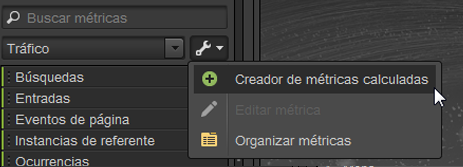
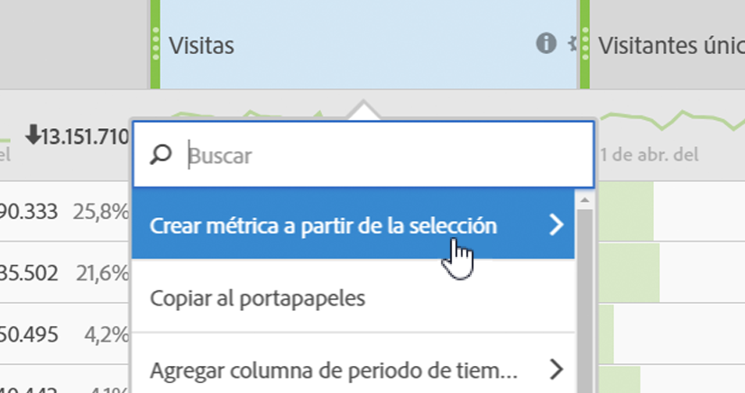

# Métricas

Las métricas constituyen información cuantitativa sobre la actividad del visitante, tales como vistas, pulsaciones, recargas, tiempo promedio empleado, fechas, unidades, pedidos, ingresos, etc. Las métricas y los datos asociados se exhiben en las columnas de los informes.

## Métricas {#concept_46A67930CFDB4A078225C5B189688AF3}

Las métricas constituyen información cuantitativa sobre la actividad del visitante, tales como vistas, pulsaciones, recargas, tiempo promedio empleado, fechas, unidades, pedidos, ingresos, etc. Las métricas y los datos asociados se exhiben en las columnas de los informes.

Las métricas estándar incluyen:

* **Tráfico**: muestra datos sobre el volumen de visitantes.
* **Conversión**: muestran datos sobre los eventos de éxito en el sitio web. Los eventos de éxito pueden incluir compras, descargas o cualquier otra acción que desee que realicen los usuarios en su sitio web.
* **Calculadas**: métricas personalizables creadas mediante la combinación de otras métricas. Por ejemplo: puede crear una métrica que para obtener los ingresos netos reste de los ingresos el coste de la palabra clave y el coste de las mercancías. Luego dicho valor se puede dividir por el número total de pedidos para obtener los ingresos netos promedio por pedido.

Consulte las [Definiciones de métricas](https://marketing.adobe.com/resources/help/en_US/reference/metrics.html) en la *Referencia de análisis* para obtener información sobre cómo se usan las métricas en [!DNL Experience Cloud].

Permite usar la herramienta [!UICONTROL Organizar métricas] para crear nuevas carpetas para las métricas y, a continuación, agrupar métricas de cualquier manera. El organizador permite copiar métricas existentes en las carpetas personalizadas con la función de arrastrar y soltar.

Puede crear carpetas, darles un nombre y organizar las métricas en su interior como quiera, pero no puede cambiar las carpetas predeterminadas, salvo las carpetas Favoritos y Métricas calculadas.

## Organización de métricas {#task_17C844A9387042EAA9983E1E554846B1}

Instrucciones sobre cómo organizar métricas y crear carpetas de métricas.

<!-- 

t_organize_metrics.xml

 -->

1. Dentro del panel de la herramienta [!UICONTROL Medidas], haga clic en **[!UICONTROL Más acciones]**. (  

   )
1. Click **[!UICONTROL Organize Metrics]**.
1. Click **[!UICONTROL New]** to create a folder.
1. Seleccione métricas de otras carpetas y, a continuación, arrastre la selección a la nueva carpeta.
1. Haga clic en **[!UICONTROL Aceptar]**.

   >[!NOTE]
   >
   >Al eliminar una carpeta, todas las métricas de la carpeta se eliminan del proyecto seleccionado actualmente.

## Adición de métricas a un informe {#task_747DD1718B3F4776B83A115D0BE8754C}

Instrucciones sobre cómo agregar métricas a un informe.

<!-- 

t_add_metrics_dsc.xml

 -->

1. En el panel de herramientas [!UICONTROL Métricas], ubique la métrica.

   Puede ubicarla en el campo de búsqueda o explorando en las carpetas de métricas.

1. Arrastre la métrica a la tabla del informe o al [!UICONTROL Generador de tablas].

   Le recomendamos que antes especifique métricas predeterminadas en [!UICONTROL Configuración], para no tener que agregar métricas a un informe de forma reiterada.

   Consulte [Ficha Clasificación: definiciones](../../analyze/ad-hoc-analysis/c-global-settings.md#reference_FB9BADD7E3DA42C1BB2A02A6E9D5C1CF).

## Creador de métricas calculadas {#concept_F8E213CE786A43FB93847C5BA883A29C}

El Creador de métricas calculadas en Ad Hoc Analysis ahora se suma a las métricas calculadas unificadas de Analytics. Su interfaz de usuario es parecida a la del Creador de métricas calculadas en Analytics.

<!-- 

c_calc_metric_builder.xml

 -->

Para obtener más información sobre cómo se crean y administran las métricas calculadas, consulte la [Guía de métricas calculadas](https://marketing.adobe.com/resources/help/en_US/analytics/calcmetrics/).

A continuación se muestran los pasos para acceder al Generador de métricas calculadas en Ad Hoc Analysis:

1. En el panel [!UICONTROL Métricas], haga clic en **[!UICONTROL Más opciones]** y, a continuación, en el **[!UICONTROL Creador de métricas calculadas]**.

   

1. La interfaz del Creador de métricas calculadas le permite arrastrar y colocar métricas, segmentos y funciones para crear métricas personalizadas:

   

