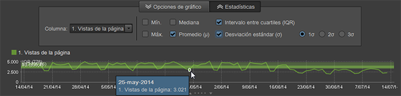

# Resumen de los informes

>[!IMPORTANT]
>
>Adobe está moviendo Ad Hoc Analysis al estado de fin de vida el 1 de marzo de 2021. [Más información...](https://adobe.ly/discoverworkspace).

Los informes estándar presentan datos de la actividad del sitio web y de los visitantes, patrones de tráfico, datos de los sitios referentes, campañas de publicidad, retención de visitantes, datos de productos, etc. Se pueden ejecutar informes y luego acceder a herramientas para configurar segmentos, métricas y comparaciones de informes.

## Resumen de los informes {#concept_41459A705F2048EEA4EFA80F6BD9FFAB}

Los informes estándar presentan datos de la actividad del sitio web y de los visitantes, patrones de tráfico, datos de los sitios referentes, campañas de publicidad, retención de visitantes, datos de productos, etc. Se pueden ejecutar informes y luego acceder a herramientas para configurar segmentos, métricas y comparaciones de informes.

Puede recopilar datos personalizados para crear informes específicos del sitio web. Por ejemplo: si en su sitio web tiene una función de búsqueda, puede rastrear los términos de búsqueda enviados y crear un informe que muestre esos términos y los resultados de las búsquedas.

El conjunto de informes estándar de cubre los temas comunes a cualquier sitio web. Estos informes incluyen (entre otros):

* Datos del sitio Web
* Datos del visitante
* Patrones de tráfico
* Datos de referencia
* Campañas de publicidad
* Retención de visitantes
* Información del producto

Si usa Reports and Analytics de marketing, los tipos de informes y menús le resultarán familiares. Ad Hoc Analysis categoriza los informes en función de los siguientes tipos:

**Informes de resumen**

Incluyen informes, como el de [!UICONTROL totales], que muestran datos que ayudan a obtener una visión general rápida. Están destinados a los ejecutivos que desean obtener una rápida visión general de los datos.

**Informes de conversión**

Los informes de conversión ofrecen un análisis completo, preciso y detallado de la actividad de los clientes. Las métricas, como por ejemplo Administración de campañas, Ciclo de ventas, Visitas de clientes en el orden previsto y Conversión de clientes, permiten medir las transacciones de comercio electrónico, las fuentes de ventas, la eficacia de la publicidad, la lealtad de los clientes y mucho más.

**Informes de tráfico**

Los informes de tráfico ofrecen una descripción detallada sobre cómo los visitantes interactúan con el sitio web.

* Analizar aspectos importantes del comportamiento de los visitantes.
* Monitorear y comprender los patrones de tráfico.
* Determinar qué contenido del sitio es el más visto.
* Segmentar a los visitantes según cualquier criterio que pueda medirse.

## Campañas {#concept_A407CDF1D4AA49BAB396A1666E67FC87}

Muestra información sobre la eficacia de los esfuerzos de publicidad. Puede ver qué tipo de publicidad le aporta mayor tráfico y qué empleado está a cargo de dicha publicidad.

<!-- 

c_reports_campaigns.xml

 -->

Estos informes normalmente se personalizan y son por tanto distintos para cada analista. See the [Admin Console help](https://helpx.adobe.com/es/enterprise/using/admin-console.html) for more information.

## Cálculos estadísticos {#concept_83FF70DB7895435E985699FE9012D585}

Puede personalizar las estadísticas predeterminadas para que se muestren en un informe de clasificación.

<!-- 

c_Statistical_Calculation_ad_hoc.xml

 -->

Se pueden añadir cálculos estadísticos predeterminados adicionales para informes de clasificación basados para mostrarse cuando ejecuta el informe, incluidos la media, la mediana, la desviación estándar y otros cálculos matemáticos evaluados entre sus datos en función de los informes específicos que necesite.

**Para abrir los cálculos estadísticos para informes de clasificación:**

1. Seleccione **[!UICONTROL Herramientas]** > **[!UICONTROL Clasificado]** del menú.

1. Seleccione **[!UICONTROL Configuración]**.
1. Seleccione **[!UICONTROL Estadísticas predeterminadas]**.

**[!UICONTROL Ignore los ceros en los cálculos estadísticos]**. Seleccione esta opción para ignorar los ceros y garantizar que añadir otra métrica no cambiará los promedios ya calculados. Todas las estadísticas se ven afectadas por esta configuración (aunque a Suma no le afecta).

| Cálculo | Descripción |
|--- |--- |
| Máximo | Identifica el valor máximo entre las filas de un conjunto de datos especificado. |
| Mínimo | Identifica el valor mínimo entre las filas de un conjunto de datos especificado. |
| Suma | Un cálculo de todos los valores de cada fila en el conjunto de datos.  Por ejemplo, la suma agrupa todas las visitas de un visitante en lugar de contar el visitante solo una vez (independientemente del número de visitas). Es un total exhaustivo de los puntos de datos recopilados. |
| Media | La media es un promedio aritmético de los valores de filas en un conjunto de datos, calculado mediante la suma dividida por el recuento (suma/recuento). La media se ve influida por los datos alejados, a diferencia de la mediana, que generalmente se utiliza para distribuciones sesgadas. |
| Desviación estándar | La desviación estándar muestra cuánta variación existe con respecto a la media esperada. Una desviación estándar baja muestra puntos de datos cercanos a la media. Una desviación estándar alta muestra que los puntos de datos se reparten entre un gran rango de valores. |
| Mediana | La mediana es el valor numérico que separa la mitad superior de la mitad inferior de los datos de las filas del conjunto de datos. A diferencia de la media, normalmente se utiliza para evitar los valores alejados. |
| Cuartiles | Un cuartil es el conjunto de valores del conjunto de datos identificado por tres puntos que dividen el conjunto de datos en cuatro grupos iguales, cada uno consta de un cuarto del conjunto de datos. El primer cuartil es el porcentaje 25 y el tercer cuartil es el porcentaje 75. (El segundo cuartil es la mediana y el cuarto cuartil es la suma). |
| Recuento | Devuelve el número de filas de un conjunto de datos. |

## Ejemplo de cálculo de media en comparación con total de métrica  {#section_7C49196503964FB0A429FA347BC92D09}

La función Media se calcula de forma similar a las columnas de datos de Microsoft Excel. En concreto, esto significa que la **Media** de una proporción o tasa (como, por ejemplo, determinar la tasa de devoluciones promedio) sería el promedio de las tasas, no la tasa de las devoluciones promedio. La tasa de las medias incluye el **Total** de la métrica de la tasa de devolución.

<table id="table_9EC56B15C6A340DA8917CB0DBCAC2355"> 
 <thead> 
  <tr> 
   <th colname="col1" align="center" class="entry"> Fecha </th> 
   <th colname="col2" align="center" class="entry"> Visitas únicas </th> 
   <th colname="col3" align="center" class="entry"> Entradas </th> 
   <th colname="col4" align="center" class="entry"> Tasa de devoluciones </th> 
   <th colname="col5" align="center" class="entry"> </th> 
  </tr>
 </thead>
 <tbody> 
  <tr valign="top"> 
   <td colname="col1"> 
junio de 2013 
 
Julio de 2013 
 
Agosto de 2013 
 </td> 
   <td colname="col2" align="center"> 
344 
 
297 
 
41 
 </td> 
   <td colname="col3" align="center"> 
1000 
 
1000 
 
1000 
 </td> 
   <td colname="col4" align="center"> 
34,4 % 
 
29,7 % 
 
41,0 % 
 </td> 
   <td colname="col5"> </td> 
  </tr> 
  <tr valign="top"> 
   <td colname="col1" align="center" valign="middle"><b>Media</b> </td> 
   <td colname="col2" valign="middle"> (344+297+41)/3 </td> 
   <td colname="col3" valign="middle"> (1000+1000+100)/3 </td> 
   <td colname="col4" valign="middle" align="right"> (34,4 + 29,7 + 41,0)/3 = <b>35,0 </b>% </td> 
   <td colname="col5" valign="middle"><b>Media de las tasas</b> </td> 
  </tr> 
  <tr valign="top"> 
   <td colname="col1" align="center" valign="middle"><b>Total de métricas</b> </td> 
   <td colname="col2" valign="middle"> 682 </td> 
   <td colname="col3" valign="middle"> 2100 </td> 
   <td colname="col4" valign="middle" align="right"> 682/2100 = <b>32,0 </b>% </td> 
   <td colname="col5" valign="middle"><b>Tasa de medias</b> </td> 
  </tr> 
 </tbody> 
</table>

## Superposiciones de cálculos estadísticos {#concept_97E1B32DAC734C7B9F8899717283CEEC}

Ad Hoc Analysis ofrece ahora visualizaciones superpuestas de cálculos estadísticos para informes que muestran datos a lo largo del tiempo (minutos, horas, días, semanas).

<!-- 

c_overlay_calculations.xml

 -->

En un informe que identifica datos a lo largo de un periodo de tiempo, el botón **[!UICONTROL Estadísticas]** le permite seleccionar cálculos que se mostrarán como superposiciones en la línea de tiempo del informe.

Además de los  [Cálculos estadísticos](/help/analyze/ad-hoc-analysis/c-overview-standard-reports.md#concept_83FF70DB7895435E985699FE9012D585) estándar, puede seleccionar la primera, la segunda y la tercera desviación estándar en las superposiciones.

## Administrador de grupos {#concept_E1433974A61144858E87334C006982B2}

En el informe de [!UICONTROL visitas en el orden previsto] y [!UICONTROL análisis del sitio], en vez de usar una sola página, puede agrupar varias páginas y usarlas como categorías de ubicación de partida, intermedia o de destino. Los grupos se pueden editar desde el menú principal o desde el informe. Las categorías creadas en los Reports and Analytics de marketing también aparecen en la lista [!UICONTROL Selector de punto de comprobación].

<!-- 

c_groups.xml

 -->

Haga clic en **[!UICONTROL Herramientas]** > **[!UICONTROL Administrador de grupos]**.
