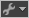

# Configurar informes ya creados

>[!IMPORTANT]
>
>Adobe está moviendo Ad Hoc Analysis al estado de fin de vida el 1 de marzo de 2021. [Más información...](https://adobe.ly/discoverworkspace).

Información sobre las diversas acciones que se pueden realizar en un informe, por ejemplo configurar gráficos, crear desgloses y extraer datos.

## Acciones de informe {#concept_26C41C0141A94B19B61D43955A908480}

Acciones que se realizan en los informes, por ejemplo: copiarlos, guardarlos, imprimirlos, cambiarles el nombre y configurar opciones de envío.

<!-- 

c_report_actions.xml

 -->

En un informe, haga clic en la lista desplegable **[!UICONTROL Acciones de informe]** . 

<table id="table_C18A0F1C9E214EB585A29801BA2400F8"> 
 <thead> 
  <tr> 
   <th colname="col1" class="entry"> 
Opción 
 </th> 
   <th colname="col2" class="entry"> 
Descripción 
 </th> 
  </tr> 
 </thead>
 <tbody> 
  <tr> 
   <td colname="col1"> 
Restaurar posiciones de informe 
 </td> 
   <td colname="col2"> 
 Cuando dentro de un espacio de trabajo se han movido (arrastrado) los informes, esta opción permite volver a colocarlos en las posiciones originales. 
 </td> 
  </tr> 
  <tr> 
   <td colname="col1"> 
Copiar o mover informe 
 </td> 
   <td colname="col2"> 
Permite copiar o mover informes a otro espacio de trabajo. 
 </td> 
  </tr> 
  <tr> 
   <td colname="col1"> 
Copiar datos de informe 
 </td> 
   <td colname="col2"> 
 Permite copiar datos del informe para pegarlos en una aplicación externa (por ejemplo, Excel). 
 </td> 
  </tr> 
  <tr> 
   <td colname="col1"> 
Guardar gráfico como 
 </td> 
   <td colname="col2"> 
 Permite guardar gráficos como archivos .jpg o .png. 
 </td> 
  </tr> 
  <tr> 
   <td colname="col1"> 
Opciones de envío 
 </td> 
   <td colname="col2"> 
 Consulte <a href="/help/analyze/ad-hoc-analysis/c-schedule.md#reference_CA49AC560258471AAE959BCA243F170C"   >Opciones de envío</a>. 
 </td> 
  </tr> 
  <tr> 
   <td colname="col1"> 
 Imprimir 
 </td> 
   <td colname="col2"> 
 Permite imprimir el informe. 
 </td> 
  </tr> 
  <tr> 
   <td colname="col1"> 
Cambiar el nombre del informe 
 </td> 
   <td colname="col2"> 
Cambia el nombre de la ficha del informe. 
 </td> 
  </tr> 
  <tr> 
   <td colname="col1"> 
Fuentes de datos 
 </td> 
   <td colname="col2"> 
Consulte la pestaña <a href="/help/analyze/ad-hoc-analysis/c-global-settings.md#reference_EADAF83466994F89BCC6B0F49A9A53DB"   >Configuración general: Definiciones</a>. 
 </td> 
  </tr> 
  <tr> 
   <td colname="col1"> 
Ver 
 </td> 
   <td colname="col2"> 
Indica si desea ver el diagrama, el gráfico o ambos a la vez. 
 </td> 
  </tr> 
 </tbody> 
</table>

## Opciones de gráfico {#concept_9934CD0383AB4AA1A7B04C9F8AD30E6F}

Opciones que se pueden configurar en un gráfico, como cambiar el tipo de gráfico, los colores y la cantidad de líneas. Las opciones de los gráficos varían según el tipo de gráfico seleccionado.

<!-- 

c_chart_options.xml

 -->

<table id="table_99EBE6BB52B84611A3E8CD94540F59A4"> 
 <thead> 
  <tr> 
   <th colname="col1" class="entry"> 
Opción 
 </th> 
   <th colname="col2" class="entry"> 
Descripción 
 </th> 
  </tr> 
 </thead>
 <tbody> 
  <tr> 
   <td colname="col1"> 
Tipo de gráfico 
 </td> 
   <td colname="col2"> 
 Permite cambiar el tipo de gráfico a: gráfico de líneas, gráfico de barras, gráfico de áreas apiladas, burbujas, etc. 
 
    <ul id="ul_98A8DBBCADA042359C5D096EA0B1104B"> 
     <li id="li_6C29218C3ADC47199DE832A2E3A105C7"> <b>Burbujas</b>: el gráfico de burbujas está disponible para cualquier informe de clasificación. Los gráficos de burbujas permiten analizar métricas con hasta cinco dimensiones por separado. Puede utilizar este gráfico como diagrama de puntos cuando no se haya aplicado ninguna métrica al diámetro de los puntos. El gráfico de burbujas cambia de forma dinámica para reflejar los cambios efectuados en los datos del informe.. </li> 
    </ul> </td> 
  </tr> 
  <tr> 
   <td colname="col1"> 
Gráfico por 
 </td> 
   <td colname="col2"> 
 Permite mostrar los valores o los valores en porcentaje en el gráfico. 
 </td> 
  </tr> 
  <tr> 
   <td colname="col1"> 
Cantidad de líneas (gráficos de barras, burbujas, etc.) 
 </td> 
   <td colname="col2"> 
 Indica la cantidad de artículos de tabla o de puntos de datos que se mostrarán en el gráfico. 
 </td> 
  </tr> 
  <tr> 
   <td colname="col1"> 
Colores 
 </td> 
   <td colname="col2"> 
 Permite elegir un color para cada artículo del gráfico. 
 </td> 
  </tr> 
  <tr> 
   <td colname="col1"> 
 Eje X 
 </td> 
   <td colname="col2"> 
Lleva los artículos graficados al eje X. 
 </td> 
  </tr> 
  <tr> 
   <td colname="col1"> 
Eje Z 
 </td> 
   <td colname="col2"> 
 Lleva los artículos graficados al eje Z. 
 </td> 
  </tr> 
  <tr> 
   <td colname="col1"> 
 Eje Y 
 </td> 
   <td colname="col2"> 
Lleva los artículos graficados al eje Y. 
 </td> 
  </tr> 
  <tr> 
   <td colname="col1"> 
Mostrar regresión lineal 
 </td> 
   <td colname="col2"> 
Para <a href="/help/analyze/ad-hoc-analysis/c-reports-configure.md#concept_07E26CC767B247A5845ADFF0C18B0986"  > gráficos de burbujas</a>. Muestra una aproximación estadística de los datos. 
 </td> 
  </tr> 
 </tbody> 
</table>

## Gráfico de burbujas {#concept_07E26CC767B247A5845ADFF0C18B0986}

<!-- 

c_reports_bubble.xml

 -->

Los gráficos de burbujas permiten analizar métricas con hasta cinco dimensiones por separado. El gráfico de burbujas cambia de forma dinámica en respuesta a cambios en los datos del informe y están disponibles en todos los informes de clasificación.

| Elemento | Descripción |
|---|---|
| [!UICONTROL Dimensiones] | Especifica la dimensión de generación de informes. |
| [!UICONTROL Puntos de datos] | Especifica la cantidad de puntos de datos que deben mostrarse en el gráfico de burbujas. |
| [!UICONTROL Mostrar regresión lineal] | Muestra una aproximación estadística de los datos. |

## Desglose de datos de tablas {#task_29BEE0AF09DA4625B9B44BAB77D7C841}

<!-- 

t_reports_breakdown_table.xml

 -->

Ciertos informes permiten desglosar los datos de la tabla para poder ver los datos subrelacionados en el informe. Cualquier dimensión se puede desglosar por cualquier otro artículo de dimensión, informe, segmento, etc.

**Para desglosar los datos de una tabla**

1. Ejecutar un informe.
1. Haga clic con el botón derecho en un artículo de línea y, a continuación, haga clic en **[!UICONTROL Desglose]** > *artículo*. 

   >[!NOTE]
   >
   >Para obtener más flexibilidad, utilice el [Generador de tablas](/help/analyze/ad-hoc-analysis/c-tablebuilder.md) para configurar un informe con desgloses. Cuando abra un informe con desgloses guardado o programado, es posible que tenga que hacer clic en **[!UICONTROL Reemplazar tabla]** para refrescar un desglose de los datos del informe dinámico. Por ejemplo, es posible que tenga que actualizar un informe programado que contenga desgloses de artículos de línea que pueden cambiar en función del intervalo de fecha o la actividad del visitante.

>[!MORELIKETHIS]
>
>* [Generador de tablas](/help/analyze/ad-hoc-analysis/c-tablebuilder.md)

## Cambio del tipo de informe en la tabla {#task_B48F97F0F6D5448A969D55238E93F2FB}

<!-- 

t_reports_changing_types.xml

 -->

En los informes de clasificación, es posible cambiar el tipo de informe conservando los segmentos, las métricas y las comparaciones configuradas en el informe original. Esto acelera el proceso de colección de datos, al eliminar la necesidad de segmentar y configurar informes sucesivos.

**Para cambiar el tipo de informe en la tabla**

1. Abra y configure un informe de clasificación.
1. En la tabla, haga clic con el botón derecho en el encabezado de columna del nombre del informe y haga clic en **[!UICONTROL Seleccionar informe]**; a continuación, busque el informe.

## Copia de datos al portapapeles {#task_357E53EF61FF49F8BE5AC8D2F419375C}

<!-- 

t_reports_clipboard.xml

 -->

1. Abra Microsoft Excel.

   Se recomienda abrir Excel antes de copiar los datos, porque Excel borra el búfer de memoria al abrirse.

1. En el nivel del informe, haga clic en **[!UICONTROL Configuración]**  y, a continuación, haga clic en **[!UICONTROL Copiar datos de informe]**.
1. En Excel, seleccione una celda y pegue los datos.

## Extraer ID de visitantes {#task_7223BE8E0389460282825E61BEDC0574}

<!-- 

t_reports_extract_ID.xml

 -->

En Reports &amp; Analytics, puede establecer un campo que contenga datos de ID del usuario. Para que la opción [!UICONTROL Extraer ID de visitantes] esté disponible, hay que configurarla. Si no habilitó esta opción en, pero decide habilitarla más tarde, no podrá extraer ID históricas de visitantes en forma retroactiva.

**Para extraer las ID de visitantes**

1. Agregue al informe un segmento de Data Warehouse.
1. Haga clic con el botón derecho en el segmento y seleccione **[!UICONTROL Extraer ID de visitantes]**.

   Se abrirá la aplicación Data Warehouse.
1. En la pestaña [!UICONTROL Solicitud del Data Warehouse], escriba el nombre de filtro.
1. Haga clic en **[!UICONTROL Solicitar este informe]**.

## Tendencias a partir de filas {#task_83C003EDCA7140C3AE9804629DD7A235}

<!-- 

t_reports_trending_row.xml

 -->

Durante la inspección de un informe de clasificación (por ejemplo, un informe de productos), se pueden ver datos de tendencia para cualquier valor que se desee. Por ejemplo, supongamos que en el informe se ve que un producto obtuvo ingresos brutos por 10.000 $ durante un período seleccionado. Si desea ver cuántos ingresos generó ese producto en cada día de ese período, puede mostrar un gráfico de tendencia del producto o abrir un informe de tendencia por separado.

**Para analizar la tendencia en una fila**

1. Ejecutar un informe de clasificación.
1. Haga clic en el icono [!UICONTROL Tendencia] . 

   Puede seleccionar varias celdas para aplicárselas a un mismo informe de tendencia.

1. Para iniciar el informe, haga clic en **[!UICONTROL Iniciar informe de tendencias]**.

## Configuración de la anchura de columna {#task_0FCF395B4A8C40508B38B44586FB5969}

<!-- 

t_column_width.xml

 -->

1. Dentro de la tabla, haga clic con el botón secundario en el encabezado de columna y, a continuación, haga clic en **[!UICONTROL Anchura de columna]**.

   Esta opción queda desactivada si la opción [!UICONTROL Ajustar a pantalla] está activada. 1. Especifique una anchura en píxeles y, a continuación, haga clic en **[!UICONTROL Aceptar]**.

>[!MORELIKETHIS]
>
>* [Generador de tablas](/help/analyze/ad-hoc-analysis/c-tablebuilder.md)

## Informes personalizados {#concept_039A45AAEEDC4828B3CDA080717B8E4F}

Los administradores pueden configurar un informe con métricas específicas y un intervalo de fechas determinado y, a continuación, guardarlo en los menús de informes para que esté disponible para todos los usuarios.

<!-- 

c_reports_custom.xml

 -->

Los informes personalizados pueden incrementar la reputación de un analista, al considerarse que por su utilidad merecen incluirse en el menú de los Reports and Analytics de marketing de todos los usuarios. Si ve informes en la interfaz que no coinciden con los informes de algún otro usuario (como, por ejemplo, Capacitación), es posible que el administrador haya configurado algunos de estos informes personalizados.

Asimismo, existe la posibilidad de guardar los informes considerados importantes. Estos informes reciben el nombre de marcadores. También puede incluir varios informes en un lienzo para ver rápidamente los informes más importantes. Reciben el nombre de tableros y también son específicos del usuario. La interfaz muestra una barra por encima del gráfico en la que se muestran los marcadores y los tableros.
