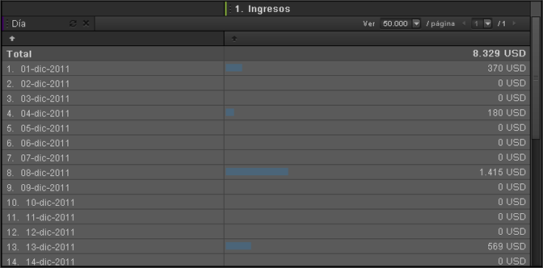

# Fecha

>[!IMPORTANT]
>
>El Adobe está llevando a Ad Hoc Analysis al final de su vida útil el 1 de marzo de 2021. [Más información](https://adobe.ly/discoverworkspace)

El tiempo es una dimensión de generación de informes útil para analizar tendencias a lo largo de horas, días, semanas e intervalos de fechas. Por ejemplo, un informe de productos muestra los ingresos obtenidos de cierto producto durante un intervalo de fechas seleccionado. Se puede agregar una dimensión Día para ver la tendencia a lo largo de cada día del período del informe. Las opciones de granularidad temporal son: hora, día, semana, mes, trimestre y año. Los ajustes predefinidos de intervalo de fechas incluyen, por ejemplo: Hoy, Ayer y Últimos 7 días.

## Fecha {#concept_CB64A0A2150C471FB0B0B42516905887}

El tiempo es una dimensión de generación de informes útil para analizar tendencias a lo largo de horas, días, semanas e intervalos de fechas. Por ejemplo, un informe de productos muestra los ingresos obtenidos de cierto producto durante un intervalo de fechas seleccionado. Se puede agregar una dimensión Día para ver la tendencia a lo largo de cada día del período del informe. Las opciones de granularidad temporal son: hora, día, semana, mes, trimestre y año. Los ajustes predefinidos de intervalo de fechas incluyen, por ejemplo: Hoy, Ayer y Últimos 7 días.

Para agregar dimensiones temporales, arrastre alguno de los intervalos de fecha desde el panel de la herramienta Tiempo a la tabla del informe o al Generador de tablas.

Este ejemplo muestra una dimensión Día con tendencia e ingresos.

## Tiempo: definiciones {#reference_6E718B78E437438E825DB9262086A987}

En el panel Tiempo, se pueden buscar intervalos de fechas y ajustes de tendencia predefinidos y arrastrarlos al [!UICONTROL Generador de tablas] o a la cuadrícula del informe.

<!-- 

r_time_panel.xml

 -->

| Campo | Definición |
|--- |--- |
| Intervalos de fechas | Permite seleccionar uno o más intervalos temporales y arrastrarlos al Generador de tablas o a la cuadrícula del informe. Los intervalos se pueden ver como desgloses en filas o como encabezados de columna. Se pueden seleccionar días, semanas, meses o intervalos de fechas personalizados. Si usa un calendario personalizado en SiteCatalyst, los grupos de informes heredarán esa configuración. |
| Tendencias | Permite analizar tendencias en los informes, a lo largo de una hora, un día, una semana, etc. Cuando se arrastran artículos desde el panel Tendencias hasta un informe, los datos que se verán dependen del intervalo de fechas indicado en el calendario. |
