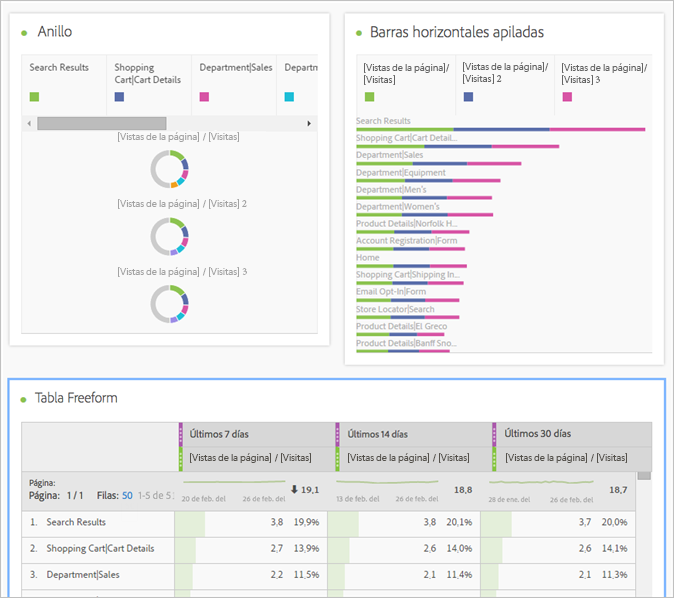
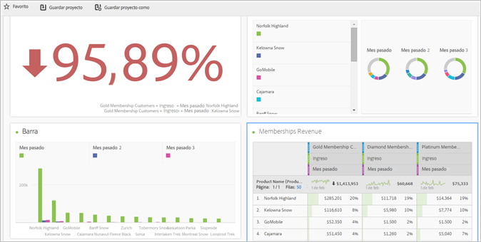
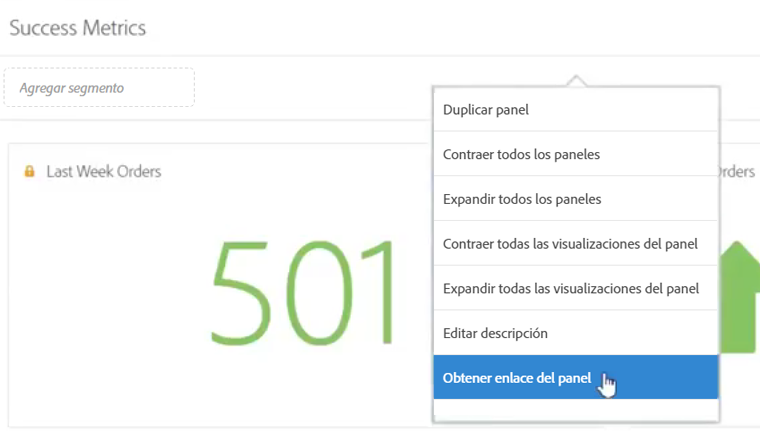
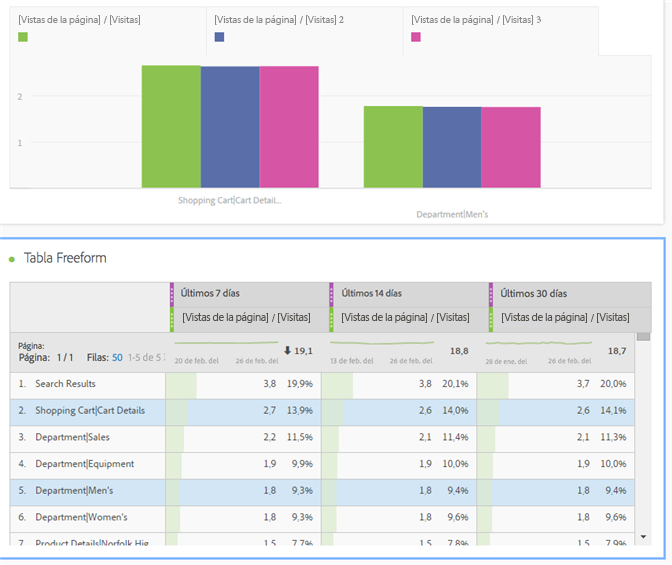
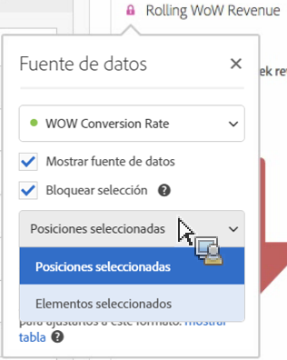
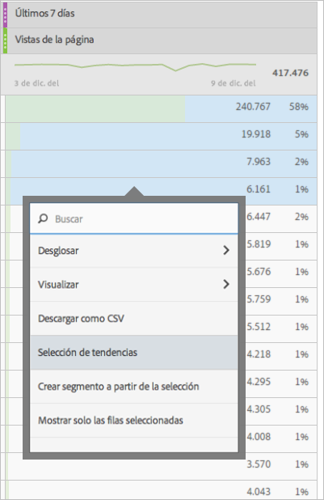
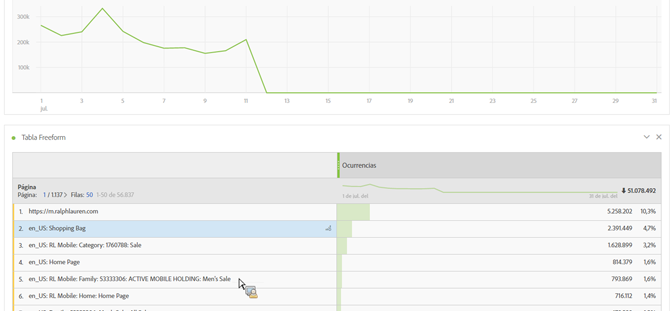
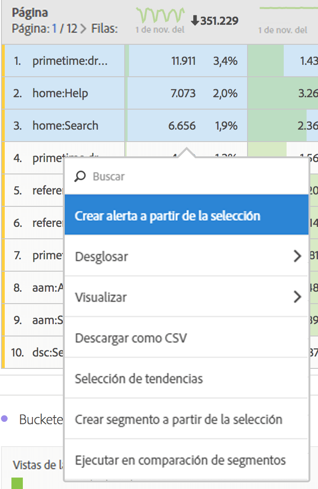
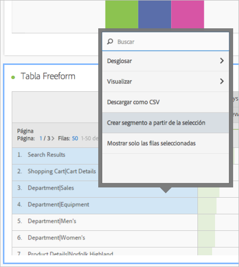
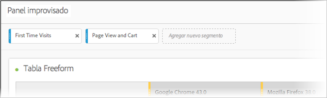

# Información general de Analysis Workspace

Analysis Workspace elimina todas las limitaciones típicas de un único informe de Analytics. Proporciona un lienzo flexible y robusto para la creación de proyectos de análisis personalizados. Arrastre y coloque cualquier número de tablas de datos, visualizaciones y componentes (dimensiones, métricas, segmentos y granularidades de tiempo) en un proyecto. Cree de forma instantánea desgloses y segmentos, cohortes para análisis y alertas, compare segmentos, realice análisis de flujo y visitas en el orden previsto, y revise y programe informes para compartir con cualquier persona de su empresa.

**[!UICONTROL Analytics]** &gt; **[!UICONTROL Workspace]**

## Vídeo introductorio {#section_B99BF8A326D94ECB91BD69C9888AD10C}

>[!VIDEO](https://www.youtube.com/watch?v=IHOy-QsvVcA)

Lista de reproducción de YouTube completa disponible [aquí](https://www.youtube.com/playlist?list=PL2tCx83mn7GuNnQdYGOtlyCu0V5mEZ8sS).

>[!NOTE]
>
>Consulte [Novedades de Analysis Workspace](/help/analyze/analysis-workspace/new-features-in-analysis-workspace.md) para estar al día de las últimas funciones.

## Control total sobre elementos y componentes de proyectos {#section_B7E3EDA3EDEE407D833F4FDB69646EEC}

Analysis Workspace proporciona libertad y flexibilidad:

* Componentes de arrastrar y colocar (dimensiones, métricas, segmentos y granularidades de tiempo)
* Varias visualizaciones de arrastrar y colocar en el proyecto
* Mueva, modifique el tamaño y apile visualizaciones en cualquier lugar que desee de un proyecto

Consulte [Crear un proyecto de Analysis Workspace](/help/analyze/analysis-workspace/build-workspace-project/t-freeform-project.md) para obtener más información.

## Varias visualizaciones en un proyecto {#section_B7670740C2D44130B21DAF0873280DA5}

Arrastre y coloque todas las visualizaciones que desee en un proyecto.

Cree un proyecto mostrando el porcentaje de cambio, con varias visualizaciones que se corresponden con celdas en una tabla improvisada de datos.

Consulte [Crear un proyecto de Analysis Workspace](/help/analyze/analysis-workspace/build-workspace-project/t-freeform-project.md) para obtener más información.

## Intravínculos a paneles y visualizaciones {#section_253EA04E067F4A29A8B54CE2B7631086}

Junto a la [edición de texto enriquecido](/help/analyze/analysis-workspace/visualizations/text.md) de Analysis Workspace, puede vincular con paneles y visualizaciones específicos de un proyecto desde un cuadro de texto, por ejemplo, para crear la tabla de contenido de un proyecto. Puede compartir estos vínculos como lo haría con el de un proyecto para llevar a un usuario hasta una visualización o panel específico de un proyecto. Se han añadido las opciones nuevas “Obtener vínculo del panel” y “Obtener vínculo de visualización”, a las que se accede con el botón derecho. Para agregar el intravínculo a un proyecto:

1. Arrastre una visualización de texto a un proyecto. Puede situarla junto a una visualización o tabla que necesite contexto.
1. Rellene el cuadro de texto con, por ejemplo, una tabla de contenido. A continuación, resalte un elemento que desee vincular a un panel o una visualización, como las métricas de éxito.

   

1. Desplácese al panel o la visualización y haga clic con el botón derecho en el encabezado del panel.
1. Desplácese hacia abajo y seleccione **[!UICONTROL Obtener vínculo del panel]** u **[!UICONTROL Obtener vínculo de visualización]**:

   

1. Copie el vínculo y agréguelo al hipervínculo de métricas de éxito de la visualización de texto. Haga clic en la marca de verificación para guardar el texto.

Si tiene paneles o visualizaciones contraídos en el proyecto y hace clic en un vínculo, se ampliará el panel o la visualización para que los usuarios puedan verlo.

> [!NOTE] También puede utilizar esta función con la opción **[!UICONTROL Editar descripción]** del menú contextual.

## Vinculación a otros proyectos {#section_AE886C367C3E4F189B65B1BD9BCDBD8C}

Puede vincular usuarios a otros proyectos que puedan resultarles de interés. Para ello, vaya a **[!UICONTROL Compartir]** &gt; **[!UICONTROL Obtener vínculo del proyecto]** e incruste este vínculo en las descripciones de los proyectos, por ejemplo.

## Visualización dinámica de celdas seleccionadas {#section_182CEC285E4547EBA4608D5F70C9D5D7}

Seleccione celdas individuales y vea el cambio dinámico de las visualizaciones. [Sincronice y bloquee](/help/analyze/analysis-workspace/analysis-workspace-features.md#section_9D66A001586F49CEB0C565581E44957C) una visualización con celdas seleccionadas.

## Bloqueo de elementos o posiciones seleccionados {#section_9D66A001586F49CEB0C565581E44957C}

Al bloquear visualizaciones, puede controlar qué fuentes de tabla improvisada de datos corresponden a las visualizaciones.

Consulte [Administración de fuentes de datos](/help/analyze/analysis-workspace/visualizations/t-sync-visualization.md).

## Visualizaciones de tendencias de celdas seleccionadas {#section_34930C967C104C2B9092BA8DCF2BF81A}

Cree una visualización a partir de celdas seleccionadas (haga clic con el botón secundario &gt; **[!UICONTROL Selección de tendencia]**.)

Ahora, las tendencias seleccionadas están **vinculadas** a la siguiente tabla, por lo que si selecciona una fila diferente de la tabla, el gráfico de tendencias reflejará dicha fila.

## Dimensiones y desgloses de elementos de dimensión {#section_1380C1F9E51E4BFB8C5D35E7A53BC70D}

Como minorista, puede profundizar más que nunca antes en sus campañas para comprender cómo involucrar mejor a los clientes. Desglose los datos ilimitadamente para sus necesidades específicas; genere consultas con métricas, dimensiones, segmentos, líneas de tiempo y otros valores de desglose de análisis relevantes.

Consulte [Dimensiones de desglose](/help/analyze/analysis-workspace/components/dimensions/t-breakdown-fa.md).

## Segmentos de selecciones de tabla {#section_73BC3688089B426D969B3D5B606DA970}

Seleccione celdas en la tabla improvisada de datos y cree un segmento a partir de la selección.

Compare varios segmentos, y luego cree y aplique segmentos instantáneamente. Puede aplicar varios segmentos para centrarse en clientes específicos según el comportamiento y la interacción, y luego comparar y contrastar.

Arrastre un segmento al panel improvisado en el nivel de proyecto para que el segmento se aplique al proyecto completo.

Consulte [Segmentos](/help/analyze/analysis-workspace/components/t-freeform-project-segment.md).

## Etiquetado de proyectos y componentes {#section_F54D688132A541F2982326D5E022B90D}

Puede aplicar etiquetas a proyectos y componentes en Analysis Workspace:

* Aplique o cree etiquetas de nivel de proyecto en el panel Información. (

* Haga clic con el botón secundario en los componentes para etiquetar (o crear etiquetas) del panel Componentes.
* Use # en el campo Buscar para localizar las etiquetas.

## Acciones de componente {#section_CBF4D0A5F63E4B0883077B8D852B800B}

Realice acciones a nivel de componente desde el menú Acciones en la parte superior del carril izquierdo del componente. Seleccione un componente y haga clic en **[!UICONTROL Acciones]** para ver las acciones.

| Acción de componente | Descripción |
|--- |--- |
| Etiqueta | Organizar o administrar componentes aplicándoles etiquetas. A continuación, el componente se muestra en el administrador de componentes pertinente, como Analytics &gt; Componentes &gt; Segmentos o Analytics &gt; Componentes &gt; Proyectos. |
| Favorito | Añadir el componente a la lista de favoritos. A continuación, se muestra en el administrador de componentes pertinente, como Analytics &gt; Componentes &gt; Segmentos o Analytics &gt; Componentes &gt; Proyectos  . |
| Aprobar | Aprobar el componente para hacerlo canónico. A continuación, el componente se muestra en el administrador de componentes pertinente, como Analytics &gt; Componentes &gt; Segmentos o Analytics &gt; Componentes &gt; Proyectos. |
| Compartir | Solo se aplica a los segmentos. |
| Eliminar | Solo se aplica a los segmentos. |

Consulte [Visualizaciones](/help/analyze/analysis-workspace/visualizations/freeform-analysis-visualizations.md) para obtener más información.

## Descripciones de funcionalidades adicionales {#section_5F06AE43C0194CFDBCA7EE0EA3C30B05}

**Lo que puede arrastrar y apilar**

Componentes

* Dimensiones
* Segmentos
* Métricas
* Intervalos de fechas
* Granularidades de tiempo (Hora, Día, Semana, etc.).

**Varias tablas improvisadas y varias visualizaciones**

No existe un límite técnico con respecto al número de tablas improvisadas y a las visualizaciones que puede agregar al panel. Además, puede ejecutar una nueva visualización (o exportar a un archivo CSV) cada tabla improvisada o filas seleccionadas de una tabla.

**Disposición, orden y copiado de columna**

* Ordene los ajustes preestablecidos de intervalos de fechas (no incluye intervalos de fechas personalizados).
* CTRL (o Comando) + clic + arrastrar una columna copia la columna, y cuando arrastra la copia, se pega en la nueva posición de la tabla.

Consulte [Teclas de acceso directo disponibles en Analysis Workspace](/help/analyze/analysis-workspace/build-workspace-project/fa-shortcut-keys.md) para obtener más información.

**Selecciones y acciones**

Puede seleccionar filas y columnas de modo similar a como puede seleccionarlas en Excel. A continuación, puede realizar acciones con esas selecciones. Por ejemplo:

* Cree visualizaciones a partir de selecciones
* Copie en el Portapapeles (CTRL o Comando + C)
* Desglose varias filas seleccionadas. Seleccione las filas, luego arrastre una dimensión en la selección. O bien, haga clic con el botón secundario en la selección y use el menú Desglose.

**Guardar automáticamente y cambios sin guardar**

Se le solicitará que guarde los cambios si intenta cerrar el explorador (o usar el botón Atrás), y el proyecto no se ha guardado. Si el sistema deja de funcionar, recibirá una alerta para restaurar al estado previo del proyecto cuando se cargue el proyecto.

Los proyectos existentes (no nuevos) solo se guardan automáticamente cuando el explorador se bloquea o en otras circunstancias en que no se le haya dado la posibilidad de guardarlos.

**Todas las visitas**

Un segmento predeterminado único de Analysis Workspace. *`All Visits`* muestra los totales de los componentes que agrega a la tabla.

**Métricas calculadas**

Use cálculos del mismo modo en que usa métricas estándar.

Consulte [Métricas calculadas](https://marketing.adobe.com/resources/help/en_US/analytics/calcmetrics/).
