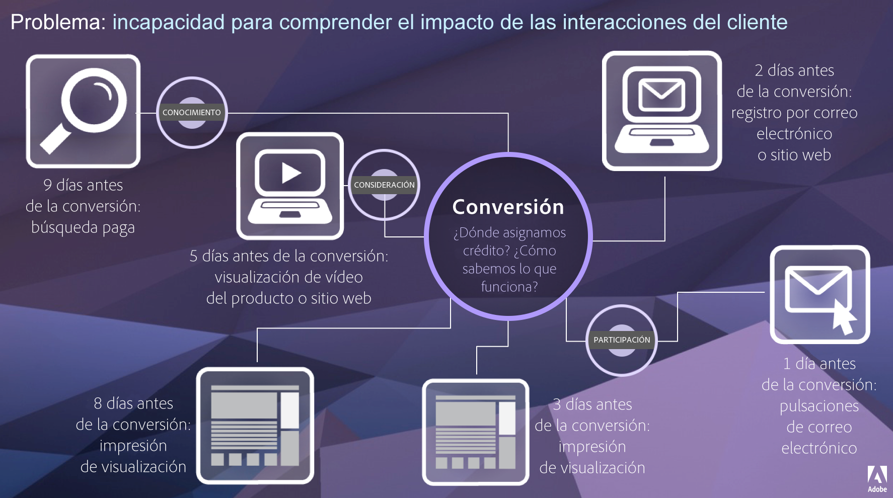

# Attribution IQ

Attribution IQ es un conjunto de funciones de Adobe Analytics que proporciona una perspectiva adicional sobre cómo los esfuerzos de marketing contribuyen a una conversión.

El recorrido del cliente no es lineal y a menudo es bastante impredecible. Cada cliente actúa sigue su propio recorrido; a menudo se duplican, se paralizan, se reinician o se involucran en otro comportamiento no lineal. Esto hace que sea difícil saber el impacto de los esfuerzos de marketing a lo largo del recorrido del cliente. También obstaculiza los esfuerzos por unir múltiples canales de datos.

Adobe Analytics Attribution IQ permite a los equipos de inteligencia moderna comprender cómo se produce las interacciones significativas a lo largo del recorrido del cliente e identificar los puntos de inflexión que generan resultados. Si se comprende este aspecto del recorrido del cliente, se optimizarán las iniciativas de marketing.

Adobe Analytics mejora la atribución al permitir lo siguiente:

* Definir la atribución más allá del contenido multimedia de pago: cualquier dimensión, métrica, canal o evento puede aplicarse a modelos (por ejemplo, búsqueda interna), no solo a campañas de marketing.
* Utilizar la comparación de modelos de atribución sin límites: compare dinámicamente todos los modelos que desee.
* Evitar cambios de implementación: con el procesamiento de tiempo de informes y las sesiones con reconocimiento de contexto, el contexto del viaje del cliente puede generarse y aplicarse en el tiempo de ejecución.
* Construir la sesión más adecuada para su situación de atribución.
* Desglosar la atribución por segmentos: compare fácilmente el rendimiento de sus canales de marketing en cualquier segmento importante (por ejemplo, clientes nuevos frente a repetidos, producto X frente a producto Y, nivel de fidelidad o CLV).
* Inspeccionar análisis de canales cruzados y de múltiples contactos mediante Diagramas de Venn e Histogramas, y resultados de atribución de tendencias.
* Analizar visualmente secuencias de marketing clave: explore las rutas que generaron una conversión visualmente con las visualizaciones de visitas en el orden previsto y flujo de varios nodos.
* Generar métricas calculadas: Utilice todos los métodos de asignación de atribuciones que desee.

## Funciones {#features}

Attribution IQ incluye las siguientes funciones:

* [Panel de Attribution:](c-panels/attribution/attribution.md)
