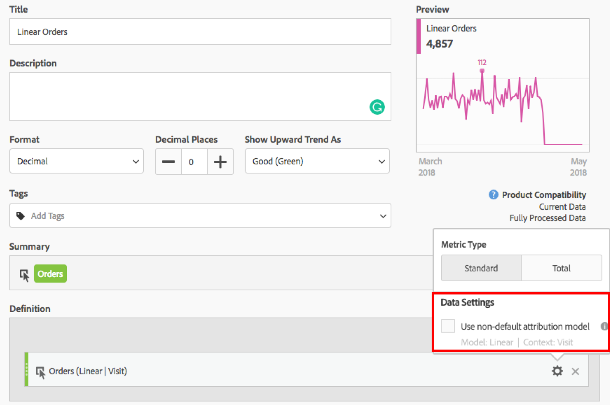

# Usar atribución en Métricas calculadas

Los modelos de atribución también están disponibles en Métricas calculadas:

Una vez seleccionado, puede elegir cualquier modelo de atribución disponible. También es posible crear métricas calculadas a partir de cualquier combinación de modelos de atribución. Por ejemplo: Pedidos de primer toque menos Pedidos de último toque le proporcionará la diferencia entre Primer toque y Último toque.

Haga clic [aquí](../../../analyze/analysis-workspace/attribution-iq/attribution.md#section_4B9E7F83AE0B451A992397E55C3F5871) para obtener más información sobre cada modelo de atribución y cómo se calcula.
