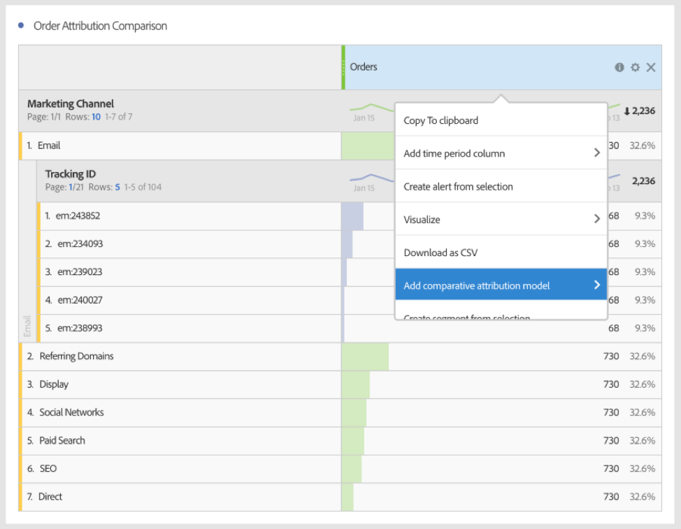

# Utilizar Attribution IQ en Analysis Workspace

Attribution IQ en Analysis Workspace permite comparar todos los modelos de atribución admitidos entre sí, visualizar las secuencias de marketing clave que generan una conversión con visitas en el orden previsto avanzadas y visualizaciones de flujo, determinar fácilmente la tendencia en cualquier canal de marketing o campaña para ver el rendimiento a lo largo del tiempo y encontrar anomalías estadísticas en el rendimiento de canal/campaña, así como recibir alertas cuando el rendimiento aumenta o disminuye.

## Use attribution in freeform tables {#section_F2F72AE840EB4EA781302A559726E6F4}

Las Tablas improvisadas de Analysis Workspace admiten modelos de atribución que pueden utilizarse en prácticamente cualquier métrica. Los modelos de atribución pueden establecerse en una métrica de columna de Tabla improvisada en la Configuración de columna:

1. Haga clic en el icono Configuración (engranaje) en una columna de Tabla improvisada.

   

1. Dentro de **[!UICONTROL Configuración de datos]**, active **[!UICONTROL Utilizar modelo de atribución no predeterminado]**. Para obtener más información sobre los diferentes modelos de atribución, consulte [Información general de Attribution IQ](../../../analyze/analysis-workspace/attribution-iq/attribution.md#section_4B9E7F83AE0B451A992397E55C3F5871).

   

## Apply attribution models to breakdowns {#section_ED1E7532CF084B5AB0942BD80B4770C9}

Cualquier desglose dentro de una Tabla improvisada también puede tener aplicado cualquier modelo de atribución que puede ser el mismo o diferente de la columna principal. Por ejemplo, puede que necesite analizar Órdenes lineales en su dimensión de Canales de marketing pero aplicar Órdenes en forma de U a los códigos de seguimiento específicos dentro de un Canal. Para editar el modelo de atribución aplicado a un desglose, simplemente sitúe el ratón encima del modelo de desglose y haga clic en “Editar”:

## Compare one attribution model to another {#section_1D74C09549CC4EC8A952A7392C76D375}

Si le gustaría comparar rápida y fácilmente un modelo de atribución con otro, haga clic con el botón derecho en una métrica y seleccione **[!UICONTROL Agregar modelo de atribución comparativa]**:

Esto permite comparar rápida y fácilmente un modelo de atribución con otro sin tener que arrastrar una métrica y configurarla dos veces.

## Attribution panel and visualizations {#section_6B02F28182F14ECC9FC5020F224726E6}

El panel Atribución es una forma sencilla de generar un análisis comparando varios modelos de atribución. Para tener acceso al panel Atribución:

1. Haga clic en el icono de panel situado en el extremo izquierdo.
1. Arrastre el panel Atribución adentro de su Proyecto de Analysis Workspace.

   

1. Agregue una métrica de éxito que desee atribuir y agregue cualquier dimensión de canal para atribuir en contra (como Canales de marketing o Promociones internas).

   

1. Seleccione los [modelos de atribución](../../../analyze/analysis-workspace/attribution-iq/attribution.md) que desee comparar y la [ventana de retrospectiva](../../../analyze/analysis-workspace/attribution-iq/attribution.md).

   El panel Atribución devolverá un conjunto rico de datos y visualizaciones para ayudar a comprender mejor cómo funcionan juntos sus Canales de marketing (u otras dimensiones):

   

   He aquí una descripción de cada visualización:

| Visualización | Descripción |
|--- |--- |
| Métrica total | El número total de conversiones ocurridas durante la ventana de tiempo de informes. Estas son las conversiones que se atribuyen a través de la dimensión seleccionada. |
| Gráfico de barras para comparación de atribución de métricas | Permite comparar visualmente las conversiones atribuidas a través de cada uno de los elementos de dimensión de su dimensión seleccionada. Cada color de barra representa un modelo de atribución definido que se ha seleccionado. |
| Tabla improvisada de atribución de métricas | Muestra los mismos datos que el gráfico de barras: si selecciona diferentes columnas o filas de esta tabla, se filtrará el gráfico de barras, así como varias de las otras visualizaciones del panel. Esta tabla actúa como cualquier otra tabla improvisada en Workspace, permitiéndole agregar métricas, segmentos, desgloses, etc. |
| Gráfico de superposición de dimensiones | Un Diagrama de Venn que muestra los tres elementos de dimensión superiores (por ejemplo: Canales) y con qué frecuencia participan en conjunto en una conversión. Por ejemplo, el tamaño de la superposición de burbujas indica con qué frecuencia ocurrieron las conversiones cuando un visitante estuvo expuesto a ambos elementos de dimensión (por ejemplo: Canales). Seleccionar otras filas en la Tabla improvisada actualizará la visualización para reflejar su selección. |
| Puntos de contacto de marketing por viaje | Un Histograma que indica el número de puntos de contacto de marketing (o cualquier dimensión) que un visitante tuvo en el rango de fechas de generación de informes. Esto resulta útil para ver qué impacto tuvo la atribución de múltiples contactos para su conjunto de datos. Si prácticamente todos los visitantes tienen un solo punto de contacto, los diferentes modelos de atribución no serán muy diferentes entre sí en cuanto a los resultados. |
| Detalle de rendimiento de canal de marketing | Permite comparar visualmente hasta tres modelos de atribución mediante un diagrama de puntos. |
| Flujo de canal de marketing | Permite ver en qué canales hay interacción con más frecuencia y en qué orden a lo largo del viaje de un visitante. |
