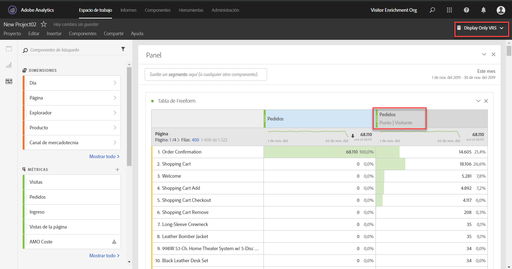

# Preguntas frecuentes

Aquí encontrará respuestas a las preguntas más frecuentes acerca de la atribución.

+++##¿Cuál es el elemento de línea **[!UICONTROL None]** al utilizar la atribución?

El elemento de línea “Ninguno” es un captador global que representa todas las conversiones que se produjeron sin ningún punto de contacto dentro de la ventana retrospectiva. Para reducir el número de conversiones atribuidas al elemento de línea &quot;Ninguno&quot;, intente utilizar una ventana retrospectiva personalizada con un período de retrospectividad más largo.

+++

+++## ¿Por qué a veces veo fechas fuera de la ventana de creación de informes al utilizar modelos de atribución?

Algunas métricas basadas en visitas, como [Entradas](/help/components/metrics/entries.md) o [Tasa de salida hacia otro sitio](/help/components/metrics/bounce-rate.md), pueden atribuir datos a un período antes del intervalo de fechas de inicio de la ventana de creación de informes. Esta situación se debe a que los modelos de atribución utilizan una ventana retrospectiva, que determina hasta qué punto la atribución retroactiva debería dar crédito por las métricas. El escenario más común es cuando las visitas se extienden más allá de la medianoche. Por ejemplo:

1. Un usuario visita su página principal a las 11:55 p.m. del 7 de septiembre.
1. Visitan varias páginas, la última de las cuales ocurrió a las 12:05 a.m. del 8 de septiembre.
1. Una semana después, se ejecuta un informe de tendencias diario con el intervalo de fechas del 8 de septiembre al 14 de septiembre.

Las métricas basadas en visitas, como [Vistas de página](/help/components/metrics/page-views.md), producirían el resultado esperado; los datos fueron tendencia todos los días del 8 de septiembre al 14 de septiembre. Sin embargo, las métricas basadas en visitas también mostrarían la visita anterior del 7 de septiembre. La entrada atribuida a la visita se produjo el 7 de septiembre y la ventana retroactiva predeterminada es del 1 de septiembre al 31 de septiembre.

La tasa de salida hacia otro sitio siempre muestra 0% el 7 de septiembre en este ejemplo. Esta métrica se define como `Bounces divided by Entries`, que es una métrica basada en visitas dividida por una métrica basada en visitas. Las salidas consisten en una sola solicitud de imagen, por lo que no pueden abarcar varios días. Cualquier salida producida el 7 de septiembre se produjo fuera de la ventana de creación de informes, lo que provoca la tasa de salida hacia otro sitio del 0% garantizada para ese día. Otras métricas basadas en visitas también mostrarían 0 para el 7 de septiembre en este informe, ya que esas visitas no se incluyen en la ventana de creación de informes.

Veamos otro ejemplo similar. La única diferencia entre el ejemplo siguiente y el ejemplo anterior son las fechas:

1. Un usuario visita su página principal a las 11:55 p.m. del 31 de agosto.
1. Visitan varias páginas, la última de las cuales ocurrió a las 12:05 a.m. del 1 de septiembre.
1. Una semana después, se ejecuta un informe de tendencias diario con el intervalo de fechas del 1 de septiembre al 7 de septiembre.

En este ejemplo, las entradas y la tasa de salida hacia otro sitio no mostraban datos del 31 de agosto. Tanto la ventana retroactiva como la ventana de creación de informes comienzan el 1 de septiembre, por lo que los datos no se pueden atribuir a partir del 31 de agosto.

+++

<!-- not relevant anymore due to introduction of separation of container and lookback window 
+++## When should I use a visit, visitor, or custom attribution lookback?

The choice of attribution lookback depends on your use case. If conversions typically take longer than a single visit, a visitor or custom lookback is recommended. For longer conversion cycles, custom lookback windows are best as they are the only type that can pull in data from prior to the reporting window.

+++
-->

+++## ¿Cómo se comparan las props y las eVars cuando se utiliza Attribution?

La atribución se vuelve a calcular durante el tiempo de ejecución del informe, por lo que no hay diferencia entre una prop o eVar (o cualquier otra dimensión) en cuanto al modelado de atribución. Las props pueden persistir con cualquier ventana retrospectiva o modelo de atribución y se omiten las opciones de asignación/caducidad de eVar.

+++

+++## ¿Están disponibles los modelos de atribución en otras funciones de Analytics, como Fuentes de datos o Data Warehouse?

No. Los modelos de atribución utilizan el procesamiento del tiempo de los informes, que solo está disponible en Analysis Workspace. Consulte [Procesamiento de tiempo de informes](/help/components/vrs/vrs-report-time-processing.md) para obtener más información.

+++

+++## ¿Los modelos de atribución solo están disponibles si utilizo un grupo de informes virtuales con el procesamiento de tiempo de informes habilitado?

Los modelos de atribución están disponibles fuera de los grupos de informes virtuales. Aunque utilizan el procesamiento de tiempo de los informes en segundo plano, los modelos de atribución están disponibles tanto para los grupos de informes estándar como para los virtuales.

+++

+++## ¿Qué dimensiones y métricas no son compatibles?

El panel de atribución admite todas las dimensiones. Las métricas no admitidas incluyen:

* Todas las métricas calculadas
* Visitantes únicos
* Visitas
* Ocurrencias
* Vistas de páginas
* Métricas de A4T
* Métricas de tiempo empleado
* Devoluciones
* Porcentaje de rebote
* Entradas
* Salidas
* Páginas no encontradas
* Búsquedas
* Visitas a una sola página
* Acceso único

+++

+++## ¿Funciona la atribución con clasificaciones?

Sí, las clasificaciones son compatibles.

+++

+++## ¿Funciona la atribución con fuentes de datos?

Sí, la mayoría de las fuentes de datos son compatibles. Attribution no es compatible con fuentes de datos de resumen porque estas fuentes de datos no están vinculadas a un identificador de visitante de Analytics. 

Las fuentes de datos del ID de transacción se tratan como cualquier otra visita. Las fuentes de datos del ID de transacción no utilizan el procesamiento especial que se suele emplear en los informes tradicionales. En otras palabras, al utilizar el procesamiento del tiempo de los informes, las visitas del ID de transacción tienen valores de eVar propagados desde visitas que se producen cerca de la marca de tiempo de la visita del ID de transacción. Los valores no se propagan desde visitas que se produjeron cerca del momento de la transacción original.

Cuando es posible, la atribución se basa en el valor de columna MID que se envía dentro de un evento en la fuente de datos, en lugar de en un valor persistente. El modelo de atribución se aplica a los valores de columna MID en la fuente de datos sobre la marcha. Por ejemplo, cuando se usa la atribución de [último contacto](models.md), el modelo se inicia a partir de cada instancia de una métrica. Y retrocede secuencialmente en las visitas individuales hasta que el modelo alcanza el último valor observado en la columna MID.

Cuando no es posible, la atribución utiliza el valor MID en el *registro anterior* del origen de datos para la evaluación. Es posible que este registro anterior no se ordene secuencialmente por marca de tiempo, dado que AA no admite datos desordenados.

Debido a que los registros no se ordenan secuencialmente, los valores esperados de aplicar persistencia pueden afectar a la cantidad de tiempo que existe entre la marca de tiempo del ID de transacción proporcionada y la transacción original.

+++

+++## ¿Se puede usar la atribución con la integración de Advertising Analytics?

Las dimensiones de metadatos, como el tipo de coincidencia y la palabra clave, se pueden usar con la atribución. Sin embargo, las métricas (como impresiones, coste, clics, posición promedio y puntuación de calidad promedio) utilizan fuentes de datos de resumen y, por lo tanto, son incompatibles.

+++

+++## ¿Cómo funciona la atribución con los canales de marketing?

Cuando se introdujeron los canales de marketing por primera vez, solo incluyeron dimensiones de primer y último contacto. Ya no se necesitan dimensiones explícitas de primer/último contacto con la versión actual de atribución. Adobe proporciona dimensiones genéricas de [!UICONTROL Canal de marketing] y [!UICONTROL Detalle del canal de marketing] para que pueda utilizarlas con el modelo de atribución que quiera. Estas dimensiones genéricas se comportan de forma idéntica a las dimensiones del [!UICONTROL Canal de último contacto], pero tienen una etiqueta diferente para evitar confusiones al usar canales de marketing con un modelo de atribución diferente.

Dado que las dimensiones del canal de marketing dependen de una definición de visita tradicional (según lo definen sus reglas de procesamiento), su definición de visita no se puede cambiar mediante grupos de informes virtuales.

+++

+++## ¿Cómo funciona la atribución con variables de varios valores, como las variables de lista?

Algunas dimensiones en Analytics pueden contener varios valores en una sola visita. Algunos ejemplos comunes son las variables de lista y la variable Products.

Cuando la atribución se aplica a visitas con varios valores, todos los valores de la misma visita obtienen el mismo crédito. Dado que muchos valores pueden recibir este crédito, el total del informe puede ser diferente a la suma de cada elemento de línea individual. El total del informe se deduplica, mientras que cada elemento de dimensión individual obtiene el crédito adecuado.

+++

+++## ¿Cómo funciona la atribución con la segmentación?

La atribución siempre se ejecuta antes de la segmentación y esta se ejecuta antes de que se apliquen los filtros de informe. Este concepto también se aplica a los grupos de informes virtuales que utilizan segmentos.

Por ejemplo, si crea un grupo de informes virtual y le aplica un segmento “Display Hits”, puede ver otros canales en una tabla utilizando algunos modelos de atribución.

>[!NOTE]
>
>Si un segmento suprime las visitas que contengan la métrica, esas instancias de métrica no se atribuirán a ninguna dimensión. Sin embargo, un filtro de informe similar simplemente ocultará algunos elementos de dimensión, sin ningún impacto en las métricas procesadas por el modelo de atribución. Como resultado, un segmento puede devolver valores más bajos que un filtro con una definición comparable.

+++
