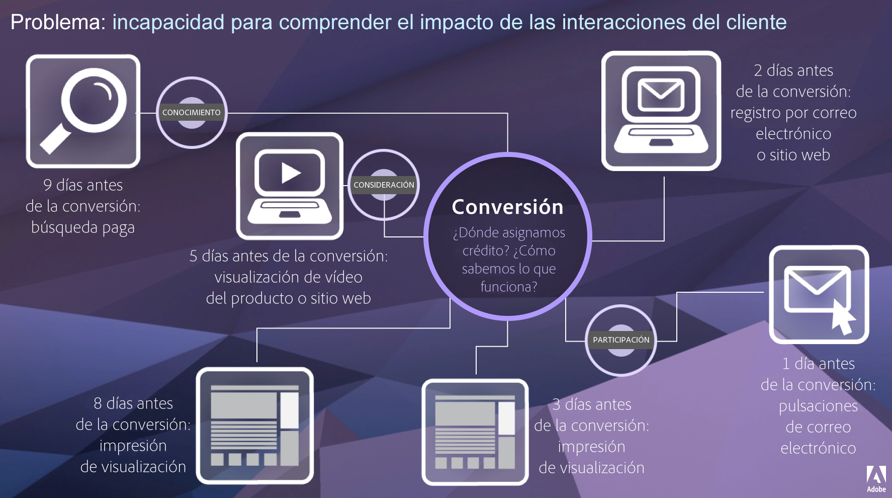

# Información general de Attribution

La atribución permite a los analistas personalizar la forma en que los elementos de dimensión obtienen crédito por los eventos de éxito. Por ejemplo:

1. Un visitante de su sitio hace clic en un vínculo de búsqueda de pago a una de las páginas de producto. Después, agrega el producto al carro de compras, pero no lo compra.
2. Al día siguiente, ve una publicación en los medios sociales de uno de sus amigos, hace clic en el vínculo y, a continuación, completa la compra.

En algunos informes, es posible que desee atribuir el pedido a la búsqueda de pago. En otros informes, es posible que desee atribuir el pedido a los medios sociales. La atribución permite controlar este aspecto del sistema de informes. Está disponible para todas las organizaciones en Adobe Analytics Ultimate, Prime, Select y Foundation. Si no está seguro de qué tipo de contrato tiene con Adobe, póngase en contacto con el administrador de cuentas de su organización.

## Valor de Attribution IQ

El recorrido del cliente no es lineal y a menudo es bastante impredecible. Cada cliente actúa sigue su propio recorrido; a menudo se duplican, se paralizan, se reinician o se involucran en otro comportamiento no lineal. Esto hace que sea difícil saber el impacto de los esfuerzos de marketing a lo largo del recorrido del cliente. También obstaculiza los esfuerzos por unir múltiples canales de datos.

Adobe Analytics mejora la atribución al permitir lo siguiente:

* Definir la atribución más allá del contenido multimedia de pago: cualquier dimensión, métrica, canal o evento puede aplicarse a modelos (por ejemplo, búsqueda interna), no solo a campañas de marketing.
* Utilizar la comparación de modelos de atribución sin límites: compare dinámicamente todos los modelos que desee.
* Evitar cambios de implementación: con el procesamiento de tiempo de informes y las sesiones con reconocimiento de contexto, el contexto del recorrido del cliente puede generarse y aplicarse en el tiempo de ejecución.
* Construir la sesión más adecuada para su situación de atribución.
* Desglosar la atribución por segmentos: compare fácilmente el rendimiento de sus canales de marketing en cualquier segmento importante (por ejemplo, clientes nuevos frente a repetidos, producto X frente a producto Y, nivel de fidelidad o CLV).
* Inspeccionar análisis de canales cruzados y de múltiples contactos mediante Diagramas de Venn e Histogramas, y resultados de atribución de tendencias.
* Analizar visualmente secuencias de marketing clave: explore las rutas que generaron una conversión visualmente con las visualizaciones de visitas en el orden previsto y flujo de varios nodos.
* Generar métricas calculadas: Utilice todos los métodos de asignación de atribuciones que desee.

## Funciones

Attribution IQ incluye las siguientes funciones:

* [Panel de atribución](../c-panels/attribution.md): Tome cualquier dimensión y métrica y compárela rápidamente con diferentes modelos de atribución.
* [Aplicar atribución a una métrica](../visualizations/freeform-table/column-row-settings/column-settings.md): Utilice una atribución no predeterminada en cualquier métrica de un proyecto.
* [Aplicar atribución a un desglose](../components/dimensions/t-breakdown-fa.md): Utilice una atribución no predeterminada en un desglose.
* [Comparar modelos de atribución](../components/apply-create-metrics.md): Vea rápidamente cómo se comparan los distintos modelos de atribución para cualquier métrica.

## Vídeos

Aquí hay un vídeo sobre el uso de diferentes modelos de Attribution IQ con segmentos en Analysis Workspace:

>[!VIDEO](https://video.tv.adobe.com/v/23743/?quality=12)
