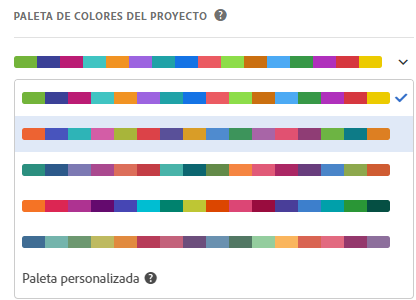

# Paleta de colores de visualización

Puede cambiar la paleta de colores de visualización que se emplea en Workspace eligiendo una paleta de color diferente o creando una paleta propia que corresponda a los colores de marca de su empresa. Esta característica afecta a la mayoría de las visualizaciones de Workspace, pero **no** afecta al Resumen del cambio, al formato condicional en tablas improvisadas ni a la Visualización de mapas.

>[!NOTE]
>
>La compatibilidad con la paleta Color no está habilitada para Internet Explorer 11.

Recuerde:

* Hay cinco paletas de color preconfiguradas entre las que elegir. La paleta predeterminada y la que se muestra a continuación se han optimizado para un contraste óptimo y ambas son más accesibles para los daltónicos.
* Las paletas de color 3, 4 y 5, situadas bajo las dos primeras, están optimizada para ofrecer la mayor armonía cromática.

## Cambiar la paleta de colores:

1. Navigate to **[!UICONTROL Workspace]** &gt; **[!UICONTROL Project]** &gt; **[!UICONTROL Project Info &amp; Settings]**.
1. En el menú desplegable **[!UICONTROL Paleta de color del proyecto]puede escoger uno de los cinco esquemas de color preconfigurados.**

   

1. Para crear su propia paleta, seleccione **[!UICONTROL Paleta personalizada]bajo las opciones preconfiguradas.**
1. Especifique hasta 16 valores hexadecimales separados por comas (por ejemplo, #00a4e4) de los colores que desee utilizar. Si, por ejemplo, desea utilizar solo cuatro valores, estos colores se repetirán automáticamente en las visualizaciones que contengan más colores.

