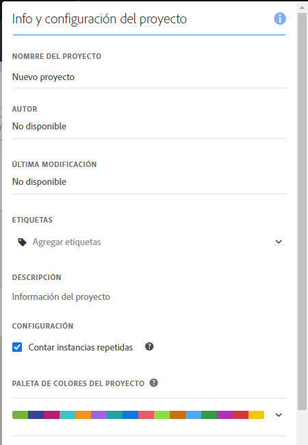

# Paleta de colores de visualización {#visualization-color-palette}

<!-- markdownlint-disable MD034 -->

>[!CONTEXTUALHELP]
>id="workspace_project_colorpalette"
>title="Paleta de colores del proyecto"
>abstract="Cambie la paleta de colores utilizada en este proyecto."

<!-- markdownlint-enable MD034 -->

Puede cambiar la paleta de colores de visualización que se utiliza en Workspace. Puede seleccionar una paleta de colores predefinida o especificar su propia paleta que coincida con los colores de la personalización de marca de su compañía. Esta característica afecta a la mayoría de las visualizaciones de Workspace, pero **no** afecta al Resumen del cambio, al formato condicional en tablas de forma libre ni a la Visualización de mapas.

>[!NOTE]
>
>La compatibilidad con paletas de color no está habilitada para Internet Explorer 11.

Recuerde:

* Hay cinco paletas de colores predefinidas para elegir. La paleta predeterminada y la segunda que aparece listada se han optimizado para lograr un mejor contraste y son más accesibles para los daltónicos.
* Las otras paletas se han optimizado para lograr la armonía de colores.

## Para cambiar la paleta de color:

1. Vaya a **[!UICONTROL Workspace]** > **[!UICONTROL Proyecto]** > **[!UICONTROL Información y configuración del proyecto]**
1. En el menú desplegable **[!UICONTROL Paleta de colores del proyecto]**, puede elegir una de las combinaciones de colores preconfiguradas.
1. Para crear su propia paleta, seleccione **[!UICONTROL Paleta personalizada]** debajo de las opciones preconfiguradas.
1. Especifique hasta 16 valores hexadecimales delimitados por comas (por ejemplo, `#00a4e4`) para crear su propia paleta de colores. Si especifica, por ejemplo, solo cuatro valores, los colores se repetirán automáticamente en las visualizaciones que contengan más colores.

<!--
# Visualization Color Palettes {#visualization-color-palettes}

>[!CONTEXTUALHELP]
>id="workspace_project_colorpalette"
>title="Project color palette"
>abstract="Change the color palette used in this project."

You can change the visualization color palette used in Workspace by choosing a different color palette or by specifying your own palette that could match your company's branding colors. This feature affects most visualizations in Workspace, but it does **not** affect [!UICONTROL Summary Change], conditional formatting in [!UICONTROL Freeform] tables, and the [!UICONTROL Map] visualization.

>[!NOTE]
>
>Color palette support is not enabled for Internet Explorer 11.

Keep in mind:

* There are five pre-set color palettes to choose from. The default palette and the one below have been optimized for optimal contrast and are both more accessible for those who are color blind.
* The third to the fifth color palettes below the top two have been optimized for color harmony.

## Change your [!UICONTROL color palette]:

>[!BEGINSHADEBOX]

See  [Using a custom color palette](https://video.tv.adobe.com/v/328103?quality=12&learn=on&captions=spa){target="_blank"} for a demo video.

>[!ENDSHADEBOX]

1. Navigate to **[!UICONTROL Workspace]** > **[!UICONTROL Project]** > **[!UICONTROL Project Info & Settings]**.
1. From the **[!UICONTROL Project Color Palette]** drop-down list, you can pick one of five pre-set color schemes.

   

1. To specify your own palette, select **[!UICONTROL Custom Palette]** below the pre-set options.
1. Specify up to 16 comma-separated hexadecimal values (for example, #00a4e4) for the colors you intend to use. If, for example, you want to use only four values, these colors will automatically be repeated in visualizations that contain more colors.
-->