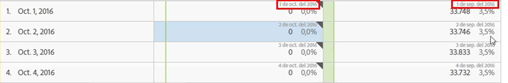

# Ajustes de fila

La configuración de filas varía en función del componente que haya arrastrado a la tabla.

También puede utilizar [acciones del botón secundario en una tabla](../../../../analyze/analysis-workspace/visualizations/freeform-table.md#concept_0D2E24FCCBAF4194AA941448860E422F) para administrar las filas seleccionadas.

Para obtener acceso a la configuración de fila de tabla, haga clic en el icono Configuración junto a una dimensión, segmento, métrica, periodo de tiempo o desglose dentro de cada uno de estos elementos:

<table id="table_7ACE6413DB1F40349ED2860020F92E55"> 
 <thead> 
  <tr> 
   <th colname="col1" class="entry"> Configuración de fila </th> 
   <th colname="col2" class="entry"> Descripción </th> 
  </tr>
 </thead>
 <tbody> 
  <tr> 
   <td colname="col1"> 
<a href="../../../../analyze/analysis-workspace/components/calendar-date-ranges/time-comparison.md#concept_93BCAD81B7A54ABBBA5CD9E419F6F764" format="dita" scope="local"> Comparaciones de fechas</a> 
 </td> 
   <td colname="col2"> 
<b>Alinee fechas de cada columna con todas a partir de la misma fila. </b> 
 
Cuando elija alinear las fechas, por ejemplo en una comparación mes tras mes entre octubre y septiembre de 2016, la columna izquierda comenzará el 1 de octubre y la de la derecha comenzará el 1 de septiembre: 
 
 
 
Deshabilitado de forma predeterminada. 
 </td> 
  </tr> 
  <tr> 
   <td colname="col1"> 
Porcentajes 
 </td> 
   <td colname="col2"> 
<b>Calcular porcentajes por fila</b> 
 
Obliga a la tabla improvisada a calcular los porcentajes de las celdas en la fila en lugar de en la columna. Esto es muy útil en porcentajes de tendencia. Se activa de forma predeterminada al usar el icono Visualizar. 
 </td> 
  </tr> 
  <tr> 
   <td colname="col1"> 
Totales de columna 
 </td> 
   <td colname="col2"> 
Esta configuración solo se muestra con las <a href="../../../../analyze/analysis-workspace/build-workspace-project/column-row-settings/manual-vs-dynamic-rows.md#concept_C50E7DFBC0504C72A973123192F487D8" format="dita" scope="local"> filas manuales (estáticas)</a> (cuando ha seleccionado un conjunto finito de elementos), no con las filas dinámicas (cuando suelta una dimensión que muestra todos los elementos). 
Nota: Para las filas manuales de <i>métricas</i>, la configuración está deshabilitada porque no tiene sentido sumar métricas aparte de las filas actuales de una tabla. 
 
 
<b>Calcular los totales sumando los valores actuales de cada columna (habilitado de forma predeterminada):</b> 
 
Esta opción solo calcula las filas actuales de la tabla (cálculo del lado del cliente). 
 
<b>Calcular los totales basados en todas las filas para cada métrica (deshabilitado de forma predeterminada):</b> 
 
Esta opción incluye todos los elementos de dimensión para dicha dimensión, incluso los que no aparecen en la lista (cálculo del lado del servidor). 
 </td> 
  </tr> 
  <tr> 
   <td colname="col1"> 
Desgloses 
 </td> 
   <td colname="col2"> 
<b>Desglose por posición:</b> 
 
Puede realizar desgloses según una ubicación fija en una tabla de forma libre. Por ejemplo, puede especificar que se desglosen siempre las primeras siete filas. 
 
(Anteriormente, la lista de valores en el desglose estaba “bloqueada”. Esto llevaba a una situación en la que, por ejemplo, si se desglosaba  Fecha  por  Página , se obtenía una lista de las primeras 50 páginas para el intervalo de fechas seleccionado. Si se guardaba ese informe y se ejecutaba un mes después, era probable que las 50 primeras páginas hubieran cambiado. No obstante, Analysis Workspace utilizaría los resultados del desglose original y devolvería las mismas páginas, pero con el mes en curso como intervalo de fechas.) 
 
Para realizar desgloses basados en una ubicación fija: 
 
    <ol id="ol_A396A11566AA4F52BC3ABBC373CEF477"> 
     <li id="li_BDAB1E9A48D44944A4F7C31F1182B923">Desglose algunas de las filas de su tabla. </li> 
     <li id="li_C5610437D3714CCEB9F3C771864B4336">Haga clic en el icono de configuración (engranaje) junto a la fila que quiere en una posición fija. </li> 
     <li id="li_675E429DC3B94201978166F9408D30B1">Active la casilla junto a Desglose por posición. </li> 
     <li id="li_E8A417D0D6D1438CAE825843BA0A7060">Cambie el criterio de ordenación o el intervalo de fechas y vea que ahora los desgloses están vinculados a la posición de la fila, no a las filas en sí. </li> 
    </ol> 
Deshabilitado de forma predeterminada. 
 </td> 
  </tr> 
 </tbody> 
</table>

