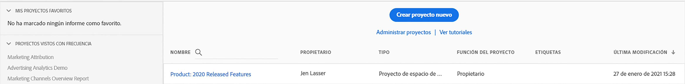

# Crear proyecto: información general

**[!UICONTROL Analytics]** &gt; **[!UICONTROL Espacio de trabajo]**

Puede crear un proyecto de Analytics robusto basado en cualquier combinación de visualizaciones, componentes de informe y tablas de datos. Incorpora muchas de las características del generador de tablas de Ad Hoc Analysis en Analytics.

En Analysis Workspace, puede comparar y diseccionar datos de formas en las que anteriormente no era posible. Por ejemplo, configurar informes de clasificación y realizar cambios reiterados en las consultas de datos y, a continuación, acceder y manipular los valores en el nivel de informe.

La consulta va directamente al motor de búsqueda (puede realizar cambios en línea sin abrir otros informes para crear el análisis). Los resultados se devuelven de forma inmediata sin que se actualice el explorador.

## Página de lista de proyectos de Workspace {#section_39AA007D7C384F4E869F842F1C7B11F8}

When you first go to **[!UICONTROL Analytics]** &gt; **[!UICONTROL Workspace]**, the page lists all the projects you own or have been granted access to. You can set this page to be your Adobe Analytics landing page by clicking **[!UICONTROL Set as Landing Page]**. (si no ve esta opción, como en la captura de pantalla que aparece a continuación, significa que ya es su página de aterrizaje).

La lista de proyectos de Workspace contiene la siguiente información:

| Elemento | Descripción |
|---|---|
| Proyecto  [Plantillas](../../../analyze/analysis-workspace/build-workspace-project/starter-projects.md#concept_49B9A327C5004DB0A4BE6291435625C5) | Puede utilizar estas plantillas de proyecto rellenadas previamente tal cual, o puede adaptarlas a sus necesidades (mediante la adición o sustitución de métricas o visualizaciones, por ejemplo) y guardarlas con un nuevo nombre. |
| [Crear nuevo proyecto](../../../analyze/analysis-workspace/build-workspace-project/t-freeform-project.md#task_C2C698ACC7954062A28E4784911E6CF2) | Haga clic en este vínculo para iniciar un proyecto nuevo desde cero. |
| Administrar proyectos | Clicking this link takes you to the Projects Component Manager ( **[!UICONTROL Analytics]** &gt; **[!UICONTROL Components]** &gt; **[!UICONTROL Projects]**), which lists all your projects and lets you tag, share, delete, rename, approve, copy, and export projects to CSV. |
| Ver tutoriales | Le permite acceder a los [vídeos en YouTube de Analysis Workspace](https://www.youtube.com/playlist?list=PL2tCx83mn7GuNnQdYGOtlyCu0V5mEZ8sS). |
| Nombre | Nombre del proyecto de Workspace. |
| Creado por | Persona que ha creado el proyecto (usted mismo o alguien que haya compartido su proyecto). |
| Etiquetas | Tags that were applied to the project, either in the Projects Component Manager or under **[!UICONTROL Workspace]** &gt; **[!UICONTROL Project]** &gt; **[!UICONTROL Project Info &amp; Settings]**. |
| Última modificación | Fecha y hora de última modificación del proyecto. |

## Info y configuración del proyecto {#section_63773D0B9E4543E88068ECECB9EEB4C6}

**[!UICONTROL Espacio de trabajo]** &gt; **[!UICONTROL Proyecto]** &gt; **[!UICONTROL Info y configuración del proyecto]**

**[!UICONTROL Info y configuración del proyecto]** proporciona información a nivel del proyecto en el proyecto activo actualmente.

| Configuración | Descripción |
|---|---|
| Nombre del proyecto | Nombre proporcionado al proyecto. Puede hacer doble clic en el nombre para editarlo. |
| Creado por | Nombre del propietario del proyecto. |
| Última modificación | Fecha de la última modificación del proyecto. |
| Etiquetas | Enumera cualquier etiqueta aplicada a un proyecto para una ordenación por categorías más sencilla. También puede etiquetar proyectos mientras los guarda. Puede ver las etiquetas de un proyecto en la página de aterrizaje de Workspace, en la columna [!UICONTROL Etiquetas]. |
| Descripción | Una descripción es útil para aclarar el propósito de un proyecto. Puede hacer doble clic en la descripción para editarla. |
| Contar instancias repetidas en el proyecto | Especifica si las instancias repetidas se cuentan en los informes. Si hay varios valores secuenciales para una misma variable, puede contarlos como una o como varias instancias de la variable. |
| Esquema de colores de visualización | Puede cambiar el esquema de colores que se utiliza en Workspace eligiendo una opción de una paleta de colores distinta o creando una paleta propia. Esta función afecta a muchos elementos de Workspace, incluidas la mayoría de las visualizaciones. |
| Densidad de visualización | Le permite ver más datos en la pantalla al reducir el margen vertical del carril izquierdo, las tablas de forma libre y las tablas de cohorte. |

## Menú Proyectos {#section_850CDFCB86A64EB0A0AD5B9E0FCB7013}

El menú Proyectos principal tiene esta apariencia:

Los submenús contienen las siguientes opciones.

>[!NOTE]
>
>Options marked by an asterisk (*) display only with **saved** projects.

| Proyecto | Editar | Insertar | Componentes | Compartir | Ayuda |
|---|---|---|---|---|---|
| Nuevo | Deshacer | Nuevo panel | Nuevo segmento | Compartir proyecto | Vídeos |
| Abrir | Borrar | Nuevo panel improvisado | Nueva métrica | Obtener vínculo del proyecto* | Teclas de acceso directo |
| Guardar | Borrar todo | Nuevo panel de comparación de segmentos | Nuevo intervalo de fechas | Enviar archivo ahora* | Foro de ayuda |
| Guardar como* |  | Nueva tabla improvisada | Nueva alerta | Enviar archivo según lo programado* |  |
| Establecer como página de aterrizaje* |  | Nueva línea | Actualizar componentes | Depurar datos de proyectos |  |
| Actualizar proyecto |  | Nueva barra |  |  |  |
| Descargar CSV |  |  |  |  |  |
| Descargar PDF* |  |  |  |  |  |
| Info y configuración del proyecto |  |  |  |  |  |

## Carril izquierdo {#section_271295C26EC840ABB2A8E7EC0498B60E}

The left rail has 3 icons, allowing you access to Panels, [Visualizations](../../../analyze/analysis-workspace/visualizations/freeform-analysis-visualizations.md#concept_09242627629147A88A68F1506954C276), and [Components](../../../analyze/analysis-workspace/components/analysis-workspace-components.md#concept_BEBE3A75E072495D9E2F895567BBD462)(Dimensions, Metrics, Segments, Data Ranges) with one click:

  

Se ha añadido un **[!UICONTROL Panel en blanco]a la lista de paneles accesibles desde el carril izquierdo.** Para crear un **Panel de cohorte nuevo**, arrastre un Panel en blanco y una visualización de una Tabla de cohorte.
