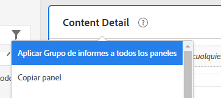
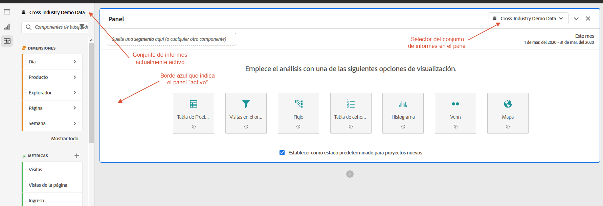
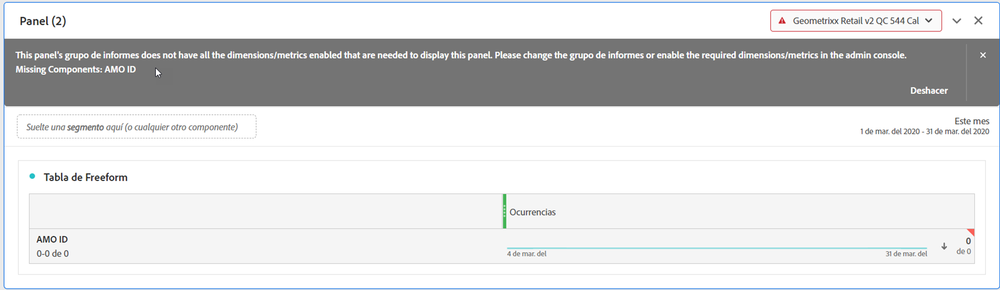

# Varios grupos de informes

Ahora puede crear proyectos en Analysis Workspace con datos de más de un grupo de informes. Los grupos de informes ahora se eligen en el panel, por lo que puede elegir un grupo de informes diferente para cada panel dentro del mismo proyecto de Workspace.

Esta capacidad es útil si desea, por ejemplo,

* Comparar datos de dos regiones diferentes y los datos están en dos grupos de informes diferentes. Puede generar tablas y visualizaciones para comparar los datos en paralelo.

* Cree un tablero de métricas y visualizaciones para informar a otras organizaciones. Ahora puede incluir datos de varios grupos de informes en el mismo proyecto.

## Aplicar grupo de informes a todos los paneles

Puede aplicar un grupo de informes a todos los paneles a la vez haciendo clic con el botón derecho en el encabezado de cualquier panel y seleccionando **[!UICONTROL Aplicar grupo de informes a todos los paneles]**.

## Panel activo

Con esta función, presentamos el concepto de &quot;panel activo&quot; frente a &quot;panel inactivo&quot;. Puede reconocer el panel activo por el borde celeste que lo rodea. Al hacer clic dentro de un panel, este se convierte en el panel activo.

>[!IMPORTANT]
>Puede arrastrar y soltar en cualquier panel que esté en el mismo grupo de informes del panel activo. Al arrastrarlo a un panel inactivo del mismo grupo de informes, el panel se activará.

| Tarea | Panel activo | Panel inactivo |
|---|---|---|
| Cambiar grupo de informes | Sí | No |
| Arrastrar y soltar componentes | Sí | Sí, para cualquier panel que esté en el mismo grupo de informes que el panel activo. |
| Arrastrar y soltar visualizaciones | Sí | Sí, para cualquier panel que esté en el mismo grupo de informes que el panel activo. |

## Trabajar con varios grupos de informes

1. Crear un nuevo proyecto con 2 o más paneles en Workspace.

1. Arrastre y suelte componentes (métricas, dimensiones, segmentos e intervalos de fechas) en el panel. Asegúrese de que los paneles tengan datos y visualizaciones específicos de su grupo de informes.

   >[!NOTE]
   >En ocasiones, aparece un banner al cargar un proyecto (o al cambiar a un grupo de informes) en el que no todos los componentes del proyecto están incluidos en el grupo de informes. Se enumerarán los componentes que faltan. Siga [estas instrucciones](/help/admin/admin-console/permissions/product-profile.md) y establezca permisos para las métricas y dimensiones requeridas.

   

   Tiene 3 opciones para hacer frente a esta incompatibilidad:
   * Habilitar las dimensiones o métricas requeridas.
   * Cambiar el grupo de informes.
   * Continuar con algunos componentes faltantes. Esto implica que no habrá datos para esos componentes ni para visualizaciones en blanco.

1. Cambie el panel a otro grupo de informes y observe cómo se actualizan la etiqueta del componente (grupo de informes activo actualmente) y los componentes enumerados en función del nuevo grupo de informes.

1. Use un acceso directo del teclado (`shift` mientras arrastra) para convertir un panel inactivo en un panel activo.

1. (Opcional) También puede dirigirse a otros creadores de componentes de Analytics y comprobar que ahora muestren una etiqueta de grupo de informes que indique

   * Dónde se creará un segmento: [Generador de segmentos](https://docs.adobe.com/content/help/es-ES/analytics/components/segmentation/segmentation-workflow/seg-build.html).
   * Dónde se creará una métrica calculada: [Creador de métricas calculadas](https://docs.adobe.com/content/help/es-ES/analytics/components/calculated-metrics/calcmetric-workflow/cm-build-metrics.html).
   * Dónde se generará una alerta: [Generador de alertas](https://docs.adobe.com/content/help/es-ES/analytics/components/alerts/alert-builder.html).