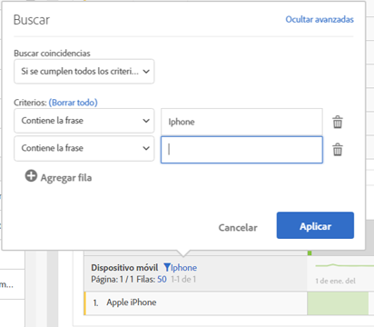

# Paginación, filtrado y ordenación de tablas

Vea este vídeo en YouTube para obtener una descripción general:

[Paginación, filtrado y ordenación de tablas en Analysis Workspace](https://www.youtube.com/watch?v=2zxpRPCGspg)

## Advanced filtering options {#section_36E92E31442B4EBCB052073590C1F025}

Al hacer clic en el icono de filtro y en Mostrar avanzado junto a la dimensión en una tabla Freeform, puede filtrar con los criterios siguientes:

* Contiene
* No contiene
* Contiene todos los términos
* Contiene cualquier término
* Contiene la frase
* No contiene ningún término
* No contiene la frase
* Es igual a
* No es igual a
* Comienza con
* Finaliza con

