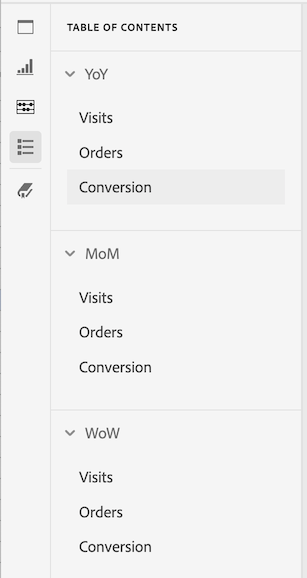

# Tabla de contenido

Puede ver una tabla de contenido de un proyecto en Analysis Workspace, lo que le permite moverse rápidamente entre cualquier panel y visualización que exista en el proyecto. La tabla de contenido es especialmente útil cuando se ven proyectos de mayor tamaño que contienen muchos paneles y visualizaciones.

>[!BEGINSHADEBOX]

Consulte  [Crear y editar una tabla de contenido](https://experienceleague.adobe.com/es/docs/analytics-learn/tutorials/analysis-workspace/navigating-workspace-projects/create-a-toc-in-analysis-workspace){target="_blank"} para ver un vídeo de demostración.

>[!ENDSHADEBOX]

>[!TIP]
>
>Puede utilizar la visualización del encabezado de sección para identificar y articular una sección dentro de un panel que contenga muchas visualizaciones. Estos encabezados de sección también se muestran como entradas en la tabla de contenido.
>

Para ver la tabla de contenido de un proyecto:

1. En Analysis Workspace, vaya al proyecto en el que desea ver la tabla de contenido.

1. En el panel de botones, seleccione  **[!UICONTROL Tabla de contenido]**. Consulte [Información general de Analysis Workspace](/help/analyze/analysis-workspace/home.md) para obtener más información. 

   Se muestra la **[!UICONTROL tabla de contenido]** del proyecto y de manera predeterminada se expande cada panel.

1. En la **[!UICONTROL tabla de contenido]**, seleccione una visualización. 

   La visualización seleccionada se desplaza automáticamente y se resalta brevemente.

   

>[!MORELIKETHIS]
>
>* [Simplificar la navegación del panel de control con la nueva función de tabla de contenido en Adobe Analytics](https://experienceleaguecommunities.adobe.com/t5/adobe-analytics-blogs/simplify-dashboard-navigation-with-the-new-table-of-contents/ba-p/731284?profile.language=es)

<!--
# Project table of contents

You can view a table of contents within each project in Analysis Workspace, allowing you to quickly move between any panels and visualizations that exist in the project. This is especially useful when viewing larger projects that contain many panels and visualizations.

>[!BEGINSHADEBOX]

See  [Table of contents](https://experienceleague.adobe.com/es/docs/analytics-learn/tutorials/analysis-workspace/navigating-workspace-projects/create-a-toc-in-analysis-workspace){target="_blank"} for a demo video.

>[!ENDSHADEBOX]

To view the table of contents on a project:

1. In Analysis Workspace, go to the project where you want to view the table of contents.

1. In the left nav, select the table of contents icon . 

   The table of contents for the project is displayed, and each panel is expanded by default.

   

1. In the table of contents, select a visualization to go to it within the project.
-->