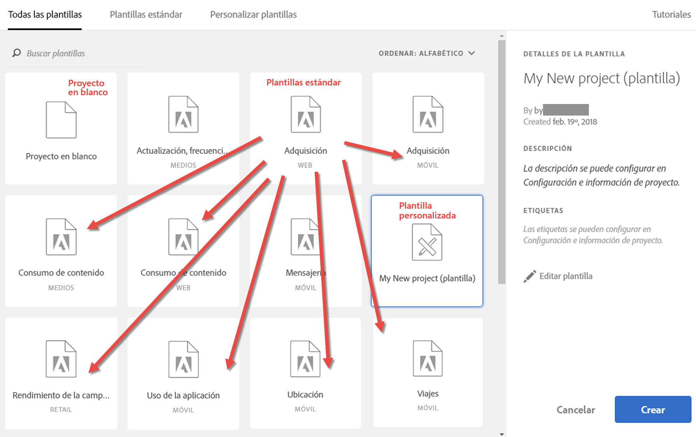
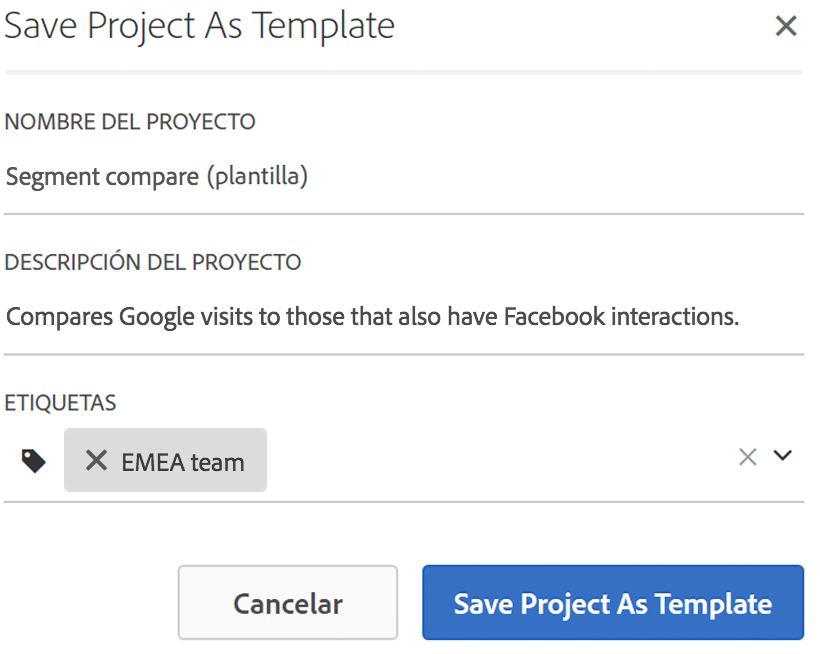
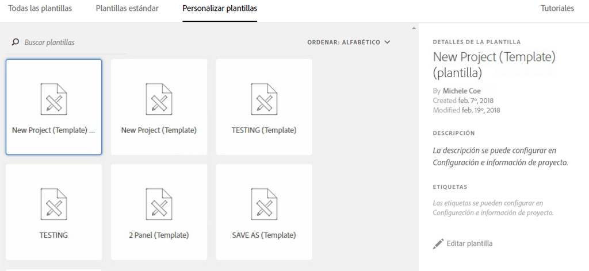

# Plantillas

## Plantillas {#topic_40932F09E18A467983AFBB29908E1CB8}

Puede elegir entre crear un proyecto a partir de:

* Un proyecto en blanco (opción predeterminada). Para obtener instrucciones, consulte [Creación de un proyecto](/help/analyze/analysis-workspace/build-workspace-project/t-freeform-project.md)de Analysis Workspace.
* Una plantilla estándar. Adobe se encarga de crear estas plantillas, que están listas para usarse.
* Una plantilla personalizada. Estas plantillas las pueden crear usuarios con derechos de administrador o usuarios que no sean administradores, siempre que se les haya concedido el permiso "Guardar como plantilla". (See [Manage product permissions](https://helpx.adobe.com/enterprise/using/manage-permissions-and-roles.html) in the Admin Console documentation for more information.

* [Creación de una plantilla personalizada](/help/analyze/analysis-workspace/build-workspace-project/starter-projects.md)
* [Plantillas estándar](/help/analyze/analysis-workspace/build-workspace-project/starter-projects.md)

## Creación de una plantilla personalizada {#create-custom-template}

Los usuarios que tengan derechos de administrador pueden convertir cualquier proyecto que creen en una plantilla personalizada. A continuación se muestra cómo:

1. Abra el proyecto.
1. Go to **[!UICONTROL Project]** &gt; **[!UICONTROL Save As Template]**.

   

   El proyecto se guardará con el nombre del proyecto actual, seguido de la palabra “plantilla” entre paréntesis. Los administradores pueden cambiar este nombre editando la plantilla.

   >[!NOTE]
   >
   >De forma predeterminada, las plantillas de proyecto son visibles para todos los miembros de la organización. Puede ordenarlas mediante etiquetas. (Go to **[!UICONTROL Project]** &gt; **[!UICONTROL Project Info &amp; Settings]** to edit tags and descriptions.)

### Acciones que se pueden llevar a cabo en las plantillas personalizadas

<table id="table_D7C7B0CA1EE64E108484C03426800EBC"> 
 <thead> 
  <tr> 
   <th colname="col1" class="entry"> Acción </th> 
   <th colname="col2" class="entry"> Descripción </th> 
  </tr>
 </thead>
 <tbody> 
  <tr> 
   <td colname="col1"> 
Editar  plantilla 
 </td> 
   <td colname="col2"> 
Permite que el administrador edite la plantilla cambiando la fuente de datos, los componentes, las visualizaciones, los intervalos de fechas, etc. 
 
Para editar una plantilla personalizada, puede: 
 
    <ul id="ul_2B3A371F83334E14806385753A360903"> 
     <li id="li_EE75E0281B764BA9B56FF1DB1B12D2CC">Buscar la lista de plantillas personalizadas en Analysis Workspace, seleccionar una y hacer clic en Editar plantilla. </li> 
     <li id="li_4934DAAA46204990A295E22A97F81EDA">En Analytics, ir a Componentes &gt; Proyectos y filtrar por Plantillas. Acto seguido, puede hacer clic en el nombre de la plantilla que quiera editar. </li> 
    </ul> 
 
 
Nota: Tras editar una plantilla, y según la situación, tiene dos opciones: Guardar o Guardar como. A continuación se indican las diferencias entre ambas opciones. 
     <ul id="ul_87E2842C8AA442399585B1C6189F5E16"> 
      <li id="li_AB7B189729E14E40A0141ECE2A24C113"><b>Guardar</b>: actualiza la plantilla personalizada para todos los usuarios. Cuando otra persona cree un proyecto a partir de esta plantilla personalizada, verá los cambios que ha hecho usted. </li> 
      <li id="li_C85B0B9873A3404D8B443BBD30B37CEB"><b>Guardar como</b>: crea una copia de la plantilla personalizada con sus cambios. </li> 
     </ul> 
 
(Sabrá que está en el modo de edición cuando el elemento de menú Compartir &gt; Compartir proyecto esté desactivado). 
 </td> 
  </tr> 
  <tr> 
   <td colname="col1"> 
Buscar en plantillas 
 </td> 
   <td colname="col2"> 
En el cuadro de diálogo Plantillas personalizadas, haga clic en Buscar plantillas. 
 </td> 
  </tr> 
  <tr> 
   <td colname="col1"> 
Ordenar plantillas 
 </td> 
   <td colname="col2"> 
Puede ordenar las plantillas alfabéticamente, por su relevancia o por la fecha de creación. 
 
En el cuadro de diálogo Plantillas personalizadas, haga clic en Ordenar:. 
 </td> 
  </tr> 
  <tr> 
   <td colname="col1"> 
Aplicar etiquetas a una plantilla 
 </td> 
   <td colname="col2"> 
Abra la plantilla y vaya a Proyecto &gt; Información y configuración del proyecto. Haga clic en Añadir etiquetas. 
 </td> 
  </tr> 
  <tr> 
   <td colname="col1"> 
Modificar la descripción de la plantilla 
 </td> 
   <td colname="col2"> 
Abra la plantilla y vaya a Proyecto &gt; Información y configuración del proyecto. Haga doble clic en la descripción y edítela. 
 </td> 
  </tr> 
 </tbody> 
</table>

## Standard templates {#concept_4FE900FEEC894E849CB6C6A0E0ADA524}

Al abrir un espacio de trabajo por primera vez, las plantillas están disponibles en el carril izquierdo. Las plantillas de Analysis Workspace cubren casos de uso comunes. Están agrupadas por la vertical a la que pertenecen y se rellenan con distintas dimensiones, segmentos, métricas y visualizaciones, según el grupo de informes que haya seleccionado.

Puede utilizar estas plantillas rellenadas previamente tal cual, o puede adaptarlas a sus necesidades (mediante la adición o sustitución de métricas o visualizaciones, por ejemplo) y guardarlas con un nuevo nombre.

[Plantillas estándar en Analysis Workspace en YouTube](https://www.youtube.com/watch?v=aRgYwPneVXg&list=PL2tCx83mn7GuNnQdYGOtlyCu0V5mEZ8sS&index=6) (2:46)

Estas son las plantillas disponibles y las preguntas que cada plantilla ayuda a responder:

### Publicidad

>[!IMPORTANT]
>
>Las plantillas de publicidad solo están disponibles si el grupo de informes está habilitado para Advertising Cloud.

* **Motores** de búsqueda: Esta plantilla desglosa las tendencias publicitarias, las plataformas de publicidad, las palabras clave, las cuentas, las campañas y mucho más.

### Comercio

* **Magento: Marketing y comercio**: Esta plantilla desglosa la conversión del comercio electrónico según la atribución del canal de mercadotecnia, así como también proporciona perspectivas por palabra clave de búsqueda, página de aterrizaje, ubicación geográfica y mucho más. Para ver un vídeo general, consulte &gt;[!VIDEO](https://www.youtube.com/watch?v=AQOViVLEMHw)

### Medios

* **Consumo** de audio: ¿Qué contenido se consume más y atrae a los usuarios?
* **Actualización - Frecuencia - Lealtad**: ¿Quiénes son mis leales lectores?

### Mobile

>[!IMPORTANT]
>
>Las plantillas móviles solo están disponibles si el grupo de informes está habilitado para móvil.

* **** Mensajería: Se centra en el rendimiento de la mensajería en la aplicación y push.
* **** Ubicación: Incluye un mapa que muestra los datos de ubicación.
* **** Métricas clave: Mantenga un pulso sobre las métricas clave de la aplicación.
* **** Uso de la aplicación: ¿Cuántos usuarios de la aplicación, inicios y primeros inicios tuvo la aplicación y cuál fue la duración media de la sesión?
* **** Adquisición: Ver el rendimiento de los vínculos de adquisición móvil.
* **** Rendimiento: ¿Cómo funciona la aplicación y dónde tienen problemas los usuarios?
* **** Retención: ¿Quiénes son mis fieles usuarios y qué hacen?
* **** Viajes: ¿Cuáles son los patrones de uso más destacados de mi aplicación?

### Comercial

* **** Rendimiento de la campaña: ¿Qué campañas generan la mayor cantidad de ingresos?
* **** Productos: ¿Qué productos tienen el mejor rendimiento?

### Web

* **** Adquisición: ¿Cuáles son los principales impulsores de tráfico de mi sitio web?
* **** Consumo de contenido: ¿Cuáles son los lugares más visitados por la gente en mi sitio?
* **** Retención: ¿Qué tipos de usuarios pueden ser usuarios leales al sitio?
* **** Tecnología: ¿Qué tecnología utilizan las personas para acceder al sitio?

### People

> [!NOTE] La plantilla Personas y su métrica asociada Personas solo están disponibles para su uso como parte de la cooperación entre dispositivos de [Adobe Experience Cloud](https://marketing.adobe.com/resources/help/en_US/mcdc/mcdc-people.html).

La plantilla está basada en la métrica Personas, que es una versión deduplicada de la métrica Visitantes únicos. La métrica Personas proporciona una medida de la frecuencia con la que los consumidores que usan varios dispositivos interactúan con la marca. Esta plantilla le permite hacer lo siguiente:

* Segmentar sus datos para EE. UU./Canadá frente al resto del mundo. En estos momentos, la funcionalidad de cooperación entre dispositivos solo está disponible en Norteamérica.
* Comparar en paralelo las métricas Personas y Visitantes únicos.
* Consultar la “tasa de compresión”, una métrica calculada que analiza en qué medida la métrica Personas es inferior como porcentaje de Visitantes únicos.
* Comparar los totales por tipo de dispositivo que utilizan sus clientes.
* Consultar cuántos dispositivos se utilizan de media por persona.
* Aprender a utilizar la función para apilas segmentos con la métrica Personas.
* Descubra cómo mejorar la eficacia de la métrica Personas con el uso del Experience Cloud ID en su entorno.

