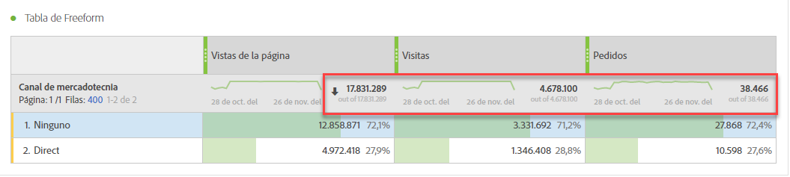
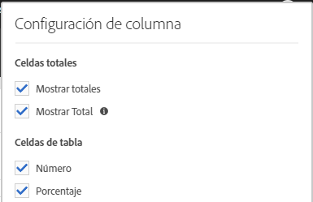
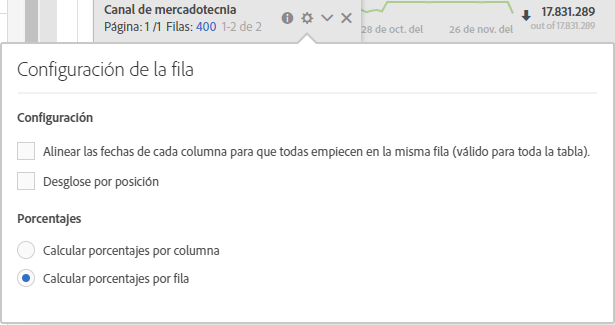

# Totales de Workspace

En las tablas de forma libre, aparece una fila total en cada nivel de desglose y puede mostrar dos totales:

* **[!UICONTROL Grand Total]** (número &#39;sin&#39; gris): este total representa todas las visitas recopiladas, a veces denominadas &#39;total del grupo de informes&#39;. Cuando se aplica un segmento en el nivel de panel o en la tabla improvisada, este total se ajusta para reflejar todas las visitas que coinciden con los criterios del segmento.
* **[!UICONTROL Table Total]** (número negro): este total suele ser igual o un subconjunto del [!UICONTROL Grand Total]. It reflects any table filters applied within the freeform table, including the [!UICONTROL Include None] option.

## Mostrar configuración total

En **[!UICONTROL Column Settings]**, hay opciones para **[!UICONTROL Show Totals]** y **[!UICONTROL Show Grand Total]**. Si esta configuración no está marcada, los totales se eliminarán de la tabla. Esto puede ser útil en casos en los que los totales no tengan sentido, por ejemplo, en ciertos [casos de métricas calculadas](https://docs.adobe.com/content/help/es-ES/analytics/components/calculated-metrics/calcmetrics-reference/cm-totals.html).

## Configuración total de fila estática

[Los totales de filas](https://docs.adobe.com/content/help/es-ES/analytics/analyze/analysis-workspace/build-workspace-project/column-row-settings/manual-vs-dynamic-rows.html) estáticas se comportan de forma diferente y se controlan con **[!UICONTROL Row Settings]**.

* **[!UICONTROL Show sum of current rows as the total]** - esto muestra una suma del lado del cliente de las filas de la tabla, lo que significa que el total **no eliminará** las métricas de duplicado, como visitas o visitantes.
* **[!UICONTROL Show Grand Total]** - esto muestra una suma del lado del servidor, lo que significa que el total anulará el duplicado de las métricas como visitas o visitantes.

## Preguntas frecuentes

| Preguntas | Respuesta |
|---|---|
| ¿En qué “total” se basan los porcentajes de la columna gris? | Esto depende de la **[!UICONTROL Percentages]** opción de configuración en **[!UICONTROL Row Settings]**:<ul><li>Calcular porcentajes por columna: Esta es la configuración predeterminada. Los porcentajes se basarán en el total de la tabla.</li><li>Calcular porcentajes por fila: los porcentajes se basarán en el total general.</li></ul> |
| ¿Cómo afecta la configuración **[!UICONTROL Include Unspecified (None)]** al total? | If the **[!UICONTROL Include Unspecified (None)]** setting is unchecked, the None/Unspecified row will be removed from the table, the Table Total, and will carry through to any calculated metrics that use [&#39;Total&#39; metric types](https://docs.adobe.com/content/help/es-ES/analytics/components/calculated-metrics/calcmetric-workflow/m-metric-type-alloc.html) |
| Cuando se aplican filtros de tabla personalizados a una tabla de forma libre, ¿tienen en cuenta todas mis métricas calculadas y el formato condicional para el filtro? | Actualmente no. **[!UICONTROL Include Unspecified (None)]** se contabilizarán, pero los filtros de tabla personalizados no afectarán a lo siguiente:<ul><li>El rango máximo/mínimo de columna que utiliza el formato condicional comprobará todos los datos.</li><li>Métricas calculadas que aprovechan los tipos **[!UICONTROL Grand Total]** de métricas.</li><li>Métricas calculadas con funciones que calculan en filas de una tabla improvisada, por ejemplo: Suma de columna, Máximo de columna, Mínimo de columna, Recuento, Media, Mediana, Percentil, Cuartil, Recuento de filas, Desviación estándar, Variación, Acumulativo, Promedio Acumulado, Variantes de regresión, Puntuación T, Prueba T, Puntuación Z, Prueba Z.</li></ul> |
| In Calculated Metrics, what does the **[!UICONTROL Grand Total]** metric type reflect? | **[!UICONTROL Grand Total]** continúa haciendo referencia a la tabla **[!UICONTROL Grand Total]**, y no refleja los filtros aplicados a una tabla o a la **[!UICONTROL Table Total]**. |
| ¿Qué total se muestra cuando los datos se copian y pegan desde una tabla improvisada o se descargan mediante CSV? | La fila total reflejará la **[!UICONTROL Table Total]** única y respetará la configuración de la columna **[!UICONTROL Show Totals]** . |

