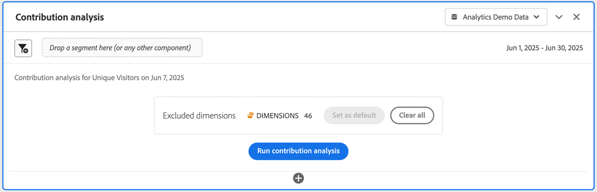

# Ejecutar análisis de contribución

[El análisis de contribución es un proceso de aprendizaje automatizado intensivo diseñado para descubrir qué contribuye a una anomalía observada en Adobe Analytics. ](/help/analyze/analysis-workspace/c-anomaly-detection/anomaly-detection.md#contribution-analysis) El propósito es ayudar al usuario a descubrir las áreas de interés u oportunidades para un análisis adicional de forma más rápida de lo que sería posible de otro modo.

>[!NOTE]
>
>El análisis de contribución solo es compatible con datos con granularidad diaria.

Los pasos para ejecutar el análisis de contribución son los siguientes:

1. Invocar el análisis de contribución en un proyecto.

   

   1. En una visualización de Línea, basada en una tabla de forma libre con granularidad diaria, seleccione un punto de datos de anomalía. En la ventana emergente, seleccione **[!UICONTROL Analizar]**.
   1. En una tabla de forma libre con granularidad diaria, en el menú contextual de cualquier fila, seleccione **[!UICONTROL Ejecutar análisis de contribución]**. Incluso puede ejecutar el análisis en filas que no muestren ninguna anomalía.
   1. En una tabla de forma libre con granularidad diaria, en una fila que indica una anomalía:
      1. Seleccione el indicador ◥.
      1. En el cuadro de diálogo  **[!UICONTROL Anomalía detectada]**, seleccione **[!UICONTROL Abrir análisis de contribución]**.

1. (Opcional) Puede reducir (y así acelerar) el ámbito del análisis [excluyendo dimensiones](#exclude-dimensions).

   

1. Seleccione **[!UICONTROL Ejecutar análisis de contribución]**.

1. Espere mientras se procesa el análisis de contribución. El procesamiento puede llevar una cantidad de tiempo considerable, según el tamaño del grupo de informes y el número de dimensiones. El análisis de contribución realiza análisis en 50 000 elementos por dimensión. También se le notificará el número de [tokens de análisis de contribución](anomaly-detection.md#contribution-analysis-tokens) que le quedan.

   

1. Analysis Workspace carga un nuevo panel de **[!UICONTROL análisis de contribución]** directamente en este proyecto.

   

   * Una visualización de [número de resumen](/help/analyze/analysis-workspace/visualizations/summary-number-change.md).
   * Una visualización mensual de [líneas](/help/analyze/analysis-workspace/visualizations/line.md) de tendencias.
   * **[!UICONTROL Elementos principales]** [tabla de forma libre](/help/analyze/analysis-workspace/visualizations/freeform-table/freeform-table.md) que muestra qué elementos principales contribuyen a esta anomalía, ordenados por [puntuación de contribución](/help/analyze/analysis-workspace/c-anomaly-detection/anomaly-detection.md#contribution-analysis). Las columnas adicionales muestran la métrica en cuestión y una métrica de **[!UICONTROL visitantes únicos]** para proporcionar contexto.

   * Los **[!UICONTROL segmentos generados (grupos de elementos principales)]** [tabla de forma libre](/help/analyze/analysis-workspace/visualizations/freeform-table/freeform-table.md) identifican asociaciones de elementos principales en función de la puntuación de contribución, ocurrencias de anomalías y el porcentaje de contribución general a la métrica anómala. Esta asociación se captura como segmento de audiencia (segmento de contribución 1, segmento de contribución 2, etc.). Seleccione  para mostrar la definición del segmento, incluidos los elementos principales de los que se componen los segmentos:

1. Dado que el análisis de contribución ahora forma parte de Analysis Workspace, puede aprovechar algunas de sus funciones desde un menú contextual de tabla de forma libre para que su análisis sea aún más significativo, como por ejemplo:

   * [Desglose cada elemento de dimensión por otra dimensión](/help/analyze/analysis-workspace/components/dimensions/t-breakdown-fa.md)
   * [Realizar la tendencia de una o más filas](/help/analyze/analysis-workspace/home.md#section_34930C967C104C2B9092BA8DCF2BF81A)
   * [Agregar nuevas visualizaciones](/help/analyze/analysis-workspace/visualizations/freeform-analysis-visualizations.md)
   * [Crear alertas](/help/components/alerts/alerts-overview.md)
   * [Crear o comparar segmentos.](/help/analyze/analysis-workspace/c-panels/c-segment-comparison/segment-comparison.md)

>[!NOTE]
>
>La anomalía analizada se resalta con un punto azul dentro del análisis de contribución y en los proyectos de alerta inteligente vinculados con ella. Este resaltado proporciona una indicación más clara de la anomalía que se está analizando.

## Excluir dimensiones

Es posible que desee excluir algunas dimensiones del análisis de contribución. Por ejemplo, es posible que no le importen las dimensiones relacionadas con el navegador o el hardware, y desea acelerar el análisis eliminándolas.

Para administrar la dimensión excluida:

* Arrastre las dimensiones no deseadas al panel **[!UICONTROL Dimensiones excluidas]** y, a continuación, guarde la lista haciendo clic en **[!UICONTROL Establecer como predeterminado]**.

* Seleccione **[!UICONTROL Borrar todo]** para volver a empezar.

* Seleccione  para mostrar un menú contextual y use  para quitar cualquier dimensión excluida seleccionada de la lista.

  

Una vez que haya modificado las dimensiones que desea excluir, vuelva a seleccionar **[!UICONTROL Ejecutar análisis de contribución]**.

