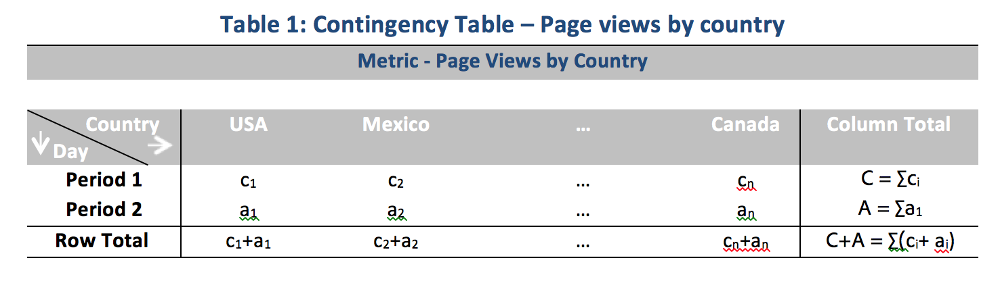

# Técnicas estadísticas

La detección de anomalías de Analysis Workspace utiliza una serie de técnicas estadísticas avanzadas para determinar si una observación debe considerarse como anómala o no.

En función de la granularidad de fecha utilizada en el informe, se utilizan 3 técnicas estadísticas distintas: específicamente para la detección de anomalías horarias, diarias, semanales/mensuales. Cada técnica estadística se enumera a continuación.

## Detección de anomalías para la granularidad diaria

Para los informes de granularidad diaria, el algoritmo considera distintos factores importantes para ofrecer los resultados más precisos posibles. En primer lugar, el algoritmo determina qué tipo de modelo se aplica en función de los datos disponibles que el algoritmo selecciona entre una de las dos clases: un modelo basado en series temporales o un modelo de detección de externos (llamado filtrado funcional).

La selección del modelo de serie temporal se basa en las siguientes combinaciones para el tipo de error, tendencia y estacionalidad (ETS), tal como lo describe [Hyndman y cols. (2008)](https://link.springer.com/book/10.1007/978-3-540-71918-2). Específicamente, el algoritmo intenta las siguientes combinaciones:

1. ANA (error aditivo, sin tendencia, estacionalidad aditiva)
1. AAA (error aditivo, tendencia aditiva, estacionalidad aditiva)
1. MNM (error multiplicativo, sin tendencia, estacionalidad multiplicativa)
1. ENM (error multiplicativo, sin tendencia, estacionalidad aditiva)
1. AAN (error aditivo, tendencia aditiva, sin estacionalidad)

El algoritmo prueba la idoneidad de cada una de las combinaciones seleccionando la que presenta el mejor porcentaje absoluto medio de error (MAPE). Sin embargo, si el MAPE del mejor modelo de serie temporal es mayor del 15 %, se aplica un filtrado funcional. Normalmente, los datos con un alto grado de repetición (por ejemplo, semana tras semana o mes tras mes) son los que mejor se ajustan a un modelo de serie temporal.

Después de la selección del modelo, el algoritmo ajusta los resultados en función de los festivos y la estacionalidad año tras año. En el caso de los festivos, el algoritmo comprueba si alguno de los siguientes festivos está presente en el intervalo de fechas de la creación de informes:

* Día de los Caídos
* Julio de 4
* Acción de Gracias
* Black Friday
* Cyber Monday
* Del 24 al 26 de diciembre
* Enero de 1
* Diciembre de 31

Estos festivos se han seleccionado en base a un análisis estadístico exhaustivo de muchos puntos de datos de clientes para identificar los festivos más relevantes en el mayor número de tendencias de clientes. Aunque la lista no es completa para todos los ciclos de cliente o de negocio, la aplicación de estos festivos mejora significativamente el rendimiento del algoritmo en general para casi todos los conjuntos de datos de clientes.

Una vez se ha seleccionado el modelo y se han identificado los festivos en el rango de fechas de generación de informes, el algoritmo se ejecuta de la siguiente manera:

1. Construya el periodo de referencia de la anomalía. Este periodo incluye hasta 35 días antes del intervalo de fechas del sistema de informes y un intervalo de fechas equivalente 1 año antes. Y contabiliza los días bisiestos cuando se requiere e incluye cualquier festivo aplicable que pueda haber ocurrido en un día del calendario diferente el año anterior.
1. Comprueba si los festivos en el periodo actual (excluido el año anterior) son anómalos en función de los datos más recientes.
1. Si el festivo en el rango de fechas actual es anómalo, se ajusta el valor esperado y el intervalo de confianza del festivo actual teniendo en cuenta el festivo del año anterior (se tienen en cuenta 2 días antes y después). La corrección del festivo actual se basa en el error de porcentaje absoluto medio más bajo de:

   1. Efectos aditivos
   1. Efectos multiplicativos
   1. Diferencia interanual

Observe la drástica mejora en el rendimiento en el día de Navidad y en el día de Año Nuevo en el ejemplo siguiente:

## Detección de anomalías para la granularidad horaria

Los datos horarios dependen del mismo método de algoritmo de serie temporal que el algoritmo de granularidad diaria. Sin embargo, se basa en gran medida en dos patrones de tendencia: el ciclo de 24 horas, así como el ciclo de fin de semana / día de la semana. Para capturar estos dos efectos estacionales, el algoritmo por hora crea dos modelos separados para un fin de semana y un día entre semana utilizando el mismo enfoque descrito anteriormente.

Los períodos de prueba para las tendencias horarias se basan en una ventana retrospectiva de 336 horas.

## Detección de anomalías para granularidades semanales y mensuales

Las tendencias semanales y mensuales no muestran las mismas tendencias semanales o diarias encontradas en las granularidades diarias o por hora, por lo que se utiliza un algoritmo independiente. Para la detección semanal y mensual, un enfoque de detección de casos atípicos de dos pasos se conoce como la prueba de Desviación Estudiantil Extrema Generalizada (GESD, por sus siglas en inglés). Esta prueba considera el número máximo de anomalías esperadas combinadas con el método de diagramas de cajas ajustado (un método no paramétrico para la detección de casos aparte) para determinar el número máximo de periféricos. Los dos pasos son:

1. Función de trazado de cajas ajustada: Esta función determina el número máximo de anomalías dados los datos de entrada.
1. Función GESD: Se aplica a los datos de entrada con la salida del paso 1.

A continuación, el paso de detección de anomalías por temporadas año a año y de festivos resta los datos del año anterior de los datos de este año. Y luego itera en los datos de nuevo usando el proceso de dos pasos anterior para verificar que las anomalías son adecuadas para la temporada. Cada una de estas granularidades utiliza un periodo de 15 de inclusión retrospectiva de la fecha del rango de generación de informes seleccionada (tanto 15 meses como 15 semanas) y un rango de fechas correspondiente 1 año anterior para aprendizaje.

## Técnicas estadísticas utilizadas en los análisis de contribución

El análisis de contribución es un proceso de aprendizaje automatizado intensivo diseñado para descubrir qué contribuye a una anomalía observada en Adobe Analytics. El propósito es ayudar al usuario a descubrir las áreas de interés u oportunidades para un análisis adicional de forma más rápida de lo que sería posible de otro modo.

Análisis de contribución realiza un algoritmo en dos partes en cada elemento de dimensión disponible para el informe de análisis de contribución del usuario. El algoritmo opera en este orden:

1. Para cada dimensión, calcula la estadística de prueba V de Cramer. En el siguiente ejemplo, observe una tabla de contingencia con vistas de página por países en dos periodos de tiempo:

   

   En la Tabla 1, se puede utilizar la V de Cramer para medir la asociación entre las vistas de página por países para el periodo 1 (por ejemplo, histórico) y el periodo 2 (por ejemplo, el día en que se produce la anomalía). Un valor de V de Cramer bajo implica un bajo nivel de asociación. La V de Cramer va desde 0 (sin asociación) a 1 (asociación completa). La estadística de V de Cramer puede calcularse:

   

1. Para cada elemento de dimensión, se utiliza la residual de Pearson (PR) para medir la asociación entre la métrica anómala y cada elemento de dimensión. PR sigue una distribución normal estándar, que permite al algoritmo comparar las PR de dos variables aleatorias incluso si las desviaciones no son comparables. En la práctica, el error no se conoce y se estima usando una corrección de muestra finita.

   En el ejemplo anterior del cuadro 1, la PR, con corrección de muestra finita para el país i y el período de tiempo 2, viene dada por

   

   dónde

   

   (Se puede obtener una fórmula similar para el período de tiempo 1).

   Para los resultados finales, la puntuación de cada elemento de dimensión se pondera mediante la medición de V de Cramer y se modifica la escala a un número entre 0 y 1 para proporcionar su puntuación de contribución.
