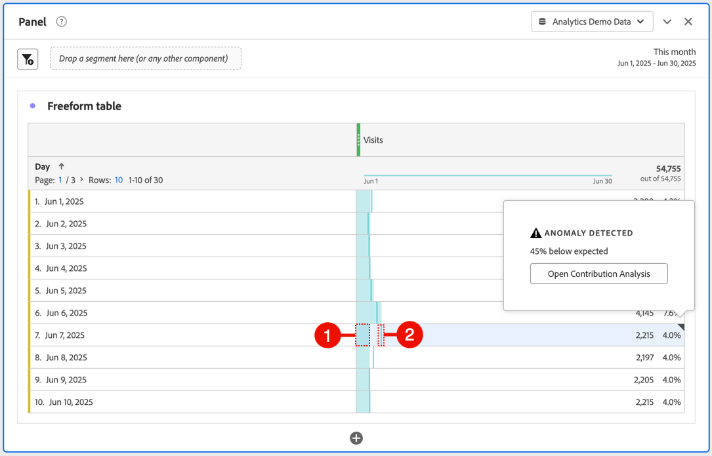

# Ver anomalías

Puede ver anomalías en Analysis Workspace en una tabla o en un gráfico de líneas.

## Ver las anomalías en una tabla {#section_869A87B92B574A38B017A980ED8A29C5}

Puede ver anomalías en una tabla de forma libre de serie temporal.

1. Seleccione  en el encabezado de la columna y asegúrese de que la opción **[!UICONTROL Anomalías]** esté seleccionada en la lista de opciones. Para obtener más información, consulte [Configuración de columna](/help/analyze/analysis-workspace/visualizations/freeform-table/column-row-settings/column-settings.md).

1. Las anomalías se muestran en la tabla de la siguiente manera:

   

   Aparece un(a) ◥ en la esquina superior derecha de cada fila donde se detecta una anomalía de datos.

   La **línea vertical de color** en cada fila ➋ indica el valor esperado. El **área sombreada de color** en cada fila ➊ indica el valor real. El modo en que la línea (valor esperado) se compara con el área sombreada (valor real) determina si hay una anomalía. (Una observación se considera anómala según las técnicas estadísticas avanzadas descritas en [Técnicas estadísticas utilizadas en la detección de anomalías](/help/analyze/analysis-workspace/c-anomaly-detection/statistics-anomaly-detection.md)).

1. Seleccione ◥ en la esquina superior derecha de una fila para ver detalles sobre la anomalía. Esto muestra el grado (como porcentaje) en que el valor real difiere por encima o por debajo del valor esperado.
1. Seleccione [Abrir análisis de contribución](run-contribution-analysis.md) para iniciar el análisis de contribución.

## Ver anomalías en un gráfico de líneas

Los gráficos de líneas son la única visualización que permite ver anomalías.

Para ver anomalías en un gráfico de líneas:

1. Seleccione  en el encabezado de la visualización y, a continuación, asegúrese de que la opción [!UICONTROL **Show anomalies**] esté seleccionada en la lista de opciones. Para obtener más información, consulte [Línea](/help/analyze/analysis-workspace/visualizations/line.md).

1. (Opcional) Para permitir que el intervalo de confianza escale el gráfico, seleccione  en el encabezado de visualización y, a continuación, seleccione la opción **[!UICONTROL Permitir que las anomalías escalen el eje Y]**.

   Esta opción no está seleccionada de forma predeterminada porque a veces puede hacer que el gráfico sea menos legible.

   Las anomalías se muestran en el gráfico de líneas de la siguiente manera:

   

   Aparece un **punto blanco** en la línea donde se detecta una anomalía de datos. (Una observación se considera anómala según las técnicas estadísticas avanzadas descritas en [Técnicas estadísticas utilizadas en la detección de anomalías](/help/analyze/analysis-workspace/c-anomaly-detection/statistics-anomaly-detection.md)).

   **Área sombreada clara** es la banda de confianza, o intervalo esperado, donde deben producirse valores. Cualquier valor que quede fuera de este intervalo esperado es una anomalía.

   Si cuenta con múltiples métricas en el gráfico de líneas, solo se muestran las anomalías y debe pasar el puntero por encima de cada una de ellas para ver la banda de confianza de dicha métrica.

   La **línea de puntos** es el valor esperado exacto.

1. Seleccione una anomalía (punto blanco) para ver la siguiente información:

   * La fecha en la que se produjo la anomalía.

   * El valor sin procesar de la anomalía.

   * El valor de porcentaje por encima o por debajo del valor esperado, que se representa por la línea verde sólida.

   * El vínculo **[!UICONTROL Analizar]** para iniciar el análisis de contribución

