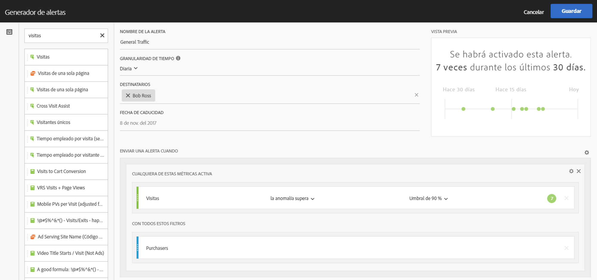
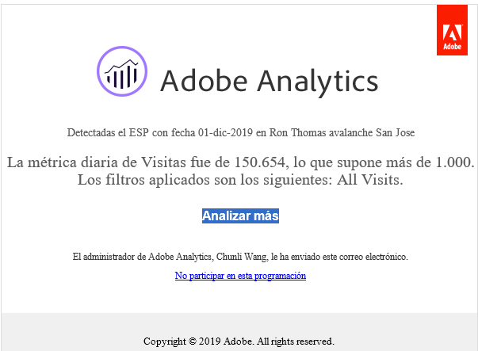
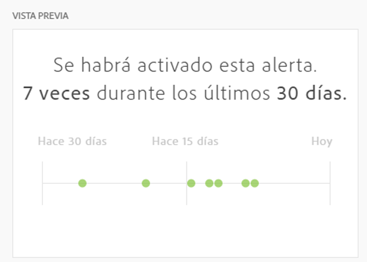

# Generador de alertas

>[!IMPORTANT]
>
>Las alertas inteligentes están disponibles solo para los clientes de Adobe Analytics Prime y Adobe Analytics Ultimate.

## Acceso al Generador de alertas

Acceda al Generador de alertas de una de las cuatro formas disponibles:

* Mediante el acceso directo siguiente en Analysis Workspace:

   `ctrl (or cmd) + shift + a`
* En **[!UICONTROL Workspace]** > **[!UICONTROL Componentes]** > **[!UICONTROL Alerta nueva]**.
* Seleccione uno o más elementos de línea de la tabla improvisada, haga clic con el botón secundario y elija **[!UICONTROL Crear alerta a partir de la selección]**.
* Desde un informe de Reports &amp; Analytics, vaya a **[!UICONTROL Más]** > **[!UICONTROL Agregar alerta]**.

## Generar alertas

La interfaz del Generador de alertas resulta familiar a quienes hayan creado segmentos o calculado métricas en Analytics:

<!--Meike, I edited this table for validation -->

**Nombre de la alerta**

Especifique un nombre para la alerta. El nombre de la alerta puede contener el nombre del umbral de informe o de métricas.

**Granularidad de tiempo**

Especifique cuándo desea que se compruebe la métrica: cada hora, cada día, semanalmente o mensualmente.

>[!NOTE]
>
>La granularidad mensual no es compatible con los grupos de informes con un calendario personalizado en el Generador de alertas.

**Destinatarios**

Especifique hacia dónde se puede enviar la alerta. Se puede enviar una alerta a un usuario de Analytics, un grupo de Analytics o a una dirección de correo electrónico sin procesar o a un número de teléfono.

>[!IMPORTANT]
>
>El número de teléfono debe estar precedido por “+” y un [código de país](https://countrycode.org/).

El correo electrónico que el usuario recibe una vez que se activa una alerta tiene un aspecto similar al siguiente:

**Fecha de caducidad**

Establezca la fecha de caducidad de la alerta.

**Enviar una alerta cuando...**

*... se active cualquiera de estas métricas*

* Arrastre y suelte las métricas en el lienzo para añadir activadores.

   Si alguno de los componentes (métricas, dimensiones o segmentos) de la alerta no es compatible con el grupo de informes seleccionado, aparecerá un mensaje **“componentes no compatibles”**.
* Determine el umbral que debe superar la métrica para que se establezca la alerta. Puede ajustar este valor a un umbral y, a continuación, a una de las condiciones siguientes:

   * existe anomalía
   * anomalía por encima de lo esperado
   * anomalía por debajo de lo esperado
   * mayor o igual que
   * menor o igual que
   * cambia por un
   * Puede establecer el umbral en 90 %, 95 %, 99 %, 99,75 % y 99,9 %.

   Tenga en cuenta que también puede utilizar las métricas calculadas.

*... con estos filtros*

* Arrastre y suelte los segmentos o dimensiones para añadir filtros. Por ejemplo, si añade un segmento “Solo dispositivos móviles” significará que la regla solamente se activará para los dispositivos móviles.
* Se añadirán filtros adicionales mediante una declaración AND.

**Agregar una regla**

Puede añadir las reglas AND u OR si hace clic en el icono de engranaje.

## Vista previa de alertas {#section_10D75BA7B77E4C5FAF58A719C082E070}

La vista previa de alertas interactiva le muestra con qué frecuencia, aproximada, se activará una alerta en función de las experiencias pasadas.

Por ejemplo, si establece la granularidad de tiempo a diario, en la vista previa podrá ver cuántas veces se habrá activado una alerta para una métrica en particular durante los últimos 30 o 31 días.

Si observa que se habían activado demasiadas alertas, puede ajustar el umbral en el [Administrador de alertas](/help/components/c-alerts/alert-manager.md).

