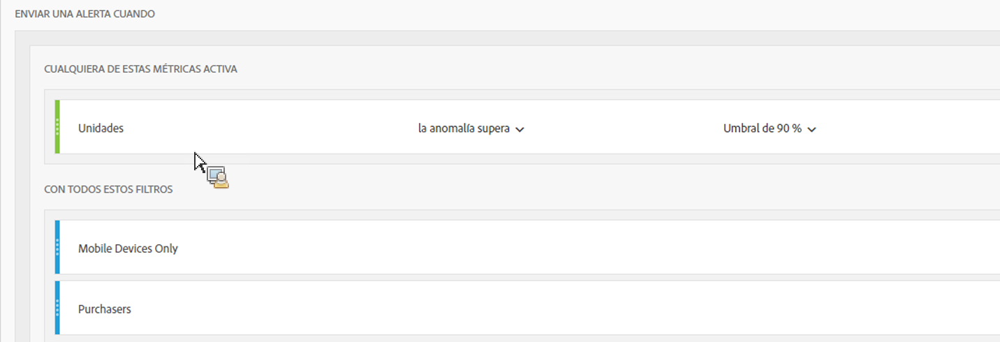
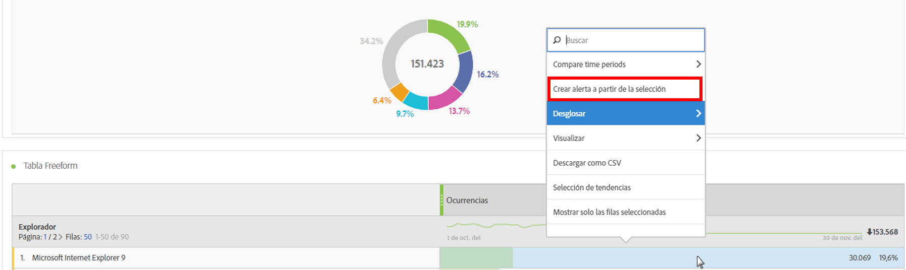
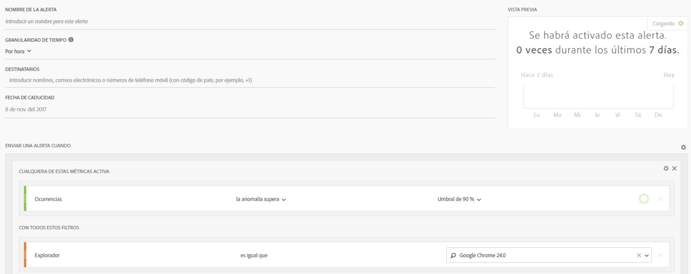
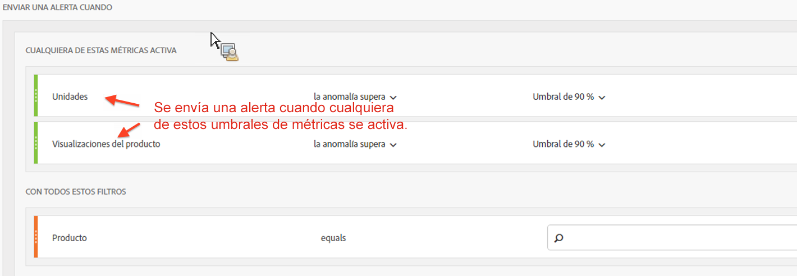

# Alertas inteligentes: Casos de uso

## Crear una alerta simple filtrada mediante dos segmentos {#section_2E96FFFA93D44F7D8DBCEC97203204AA}

<!-- 

Update screenshots for better readability.

 -->

## Crear una alerta a partir de una selección de tabla {#section_AE6D42E1255D498D908A2FA60370A419}

En las tablas improvisadas, ahora puede crear alertas en contexto si hace clic con el botón derecho en una fila de la tabla y selecciona **[!UICONTROL Crear alerta a partir de la selección]**.

De este modo, se rellena instantáneamente el Generador de alertas para crear una alerta con las métricas y los filtros correctos:

## Consolidar las alertas (apilar) en lugar de crear múltiples alertas {#section_B27B0856BA104B9FB6D0BBB317633F18}

El apilado de alertas garantiza que las alertas se combinen y que no obtenga diversas alertas independientes.

