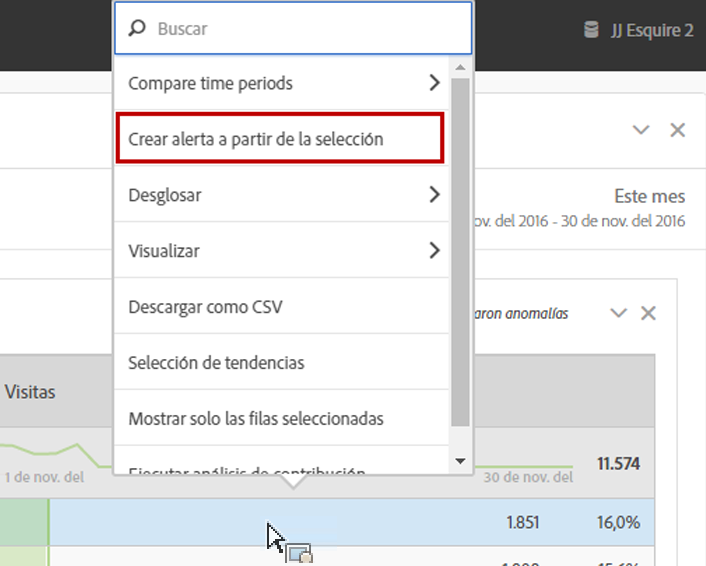
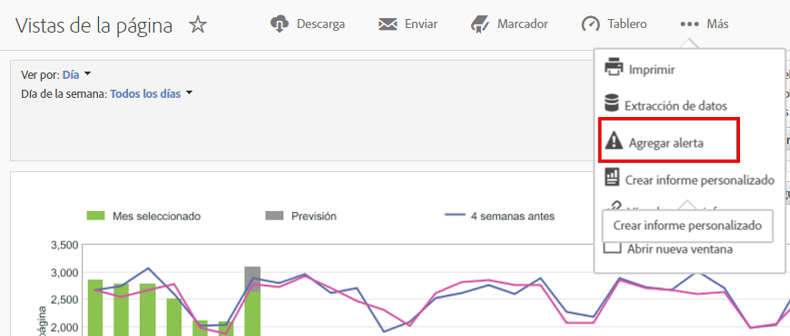

# Resumen de las alertas inteligentes

El sistema Alertas inteligentes permite un control más granular sobre las alertas e integra la detección de anomalías en el sistema de alerta.

Este es un tutorial en vídeo sobre [Alertas inteligentes](https://docs.adobe.com/content/help/es-ES/analytics-learn/tutorials/data-science/intelligent-alerts.html) (5:34)

## Información general

El nuevo Generador de alertas y el Administrador de alertas en Analysis Workspace sustituyen la funcionalidad de alertas existente en Reports &amp; Analytics. Las alertas inteligentes le permiten:

* Generar alertas en función de anomalías (umbrales del 90 %, 95 %, 99 %, 99,75 % y 99,9 %; cambio de %; por encima/por debajo)
* Obtener una vista previa de la frecuencia con la que se activará una alerta
* Enviar alertas por correo electrónico o SMS con vínculos a proyectos de Analysis Workspace autogenerados
* Crear alertas “apiladas” que capturan varias métricas en una sola alerta

Hay cuatro formas en las que puede acceder al Generador de alertas:

* Ir directamente al Generador de alertas: **[!UICONTROL Componentes]** > **[!UICONTROL Alertas]**
* Usar el acceso directo de teclado en Workspace: `Ctrl + Shift + A` (Windows) o `Cmd + Shift + A` (Mac)
* Seleccionar uno o más elementos de línea de la tabla improvisada, hacer clic con el botón secundario y seleccionar **[!UICONTROL Crear alerta a partir de la selección]**. Se abre el Generador de alertas y se rellenan previamente las métricas y los filtros adecuados aplicados desde la tabla. A continuación, puede editar la alerta si fuera necesario.

   

* Desde un informe de Reports &amp; Analytics, vaya a **[!UICONTROL Más]** > **[!UICONTROL Agregar alerta]**. Esto abre el Generador de alertas y rellena previamente las métricas y filtros adecuados aplicados desde el informe. A continuación, puede editar la alerta si fuera necesario.

   

Los porcentajes de umbral son desviaciones estándar. Por ejemplo, 95 % = 2 desviaciones estándar y 99 % = 3 desviaciones estándar. En función de la granularidad de tiempo que seleccione, se emplean [distintos modelos](../virtual-analyst/c-anomaly-detection/statistics-anomaly-detection.md) para calcular cuánto se aleja (cuántas desviaciones estándar tiene) cada punto de datos respecto a la norma. Si establece un umbral más bajo (por ejemplo, 90%), obtendrá más anomalías que con otro más alto (99,75%).

>[!IMPORTANT]
>
>El uso de datos con fecha y hora para crear alertas puede hacer que se activen incorrectamente. Adobe recomienda utilizar datos sin marca de hora para las alertas inteligentes.

## Retrospectiva de anomalías para alertas

Si una alerta utiliza la detección de anomalías, el periodo de prueba varía según la granularidad seleccionada para la alerta.

* Granularidad mensual: 15 meses + el mismo intervalo del año anterior
* Granularidad semanal: 15 semanas + el mismo intervalo del año anterior
* Granularidad diaria: 35 días + el mismo intervalo del año anterior
* Granularidad horaria: 336 horas

Consulte [Técnicas estadísticas utilizadas en la detección de anomalías](../virtual-analyst/c-anomaly-detection/statistics-anomaly-detection.md) para obtener más información.
