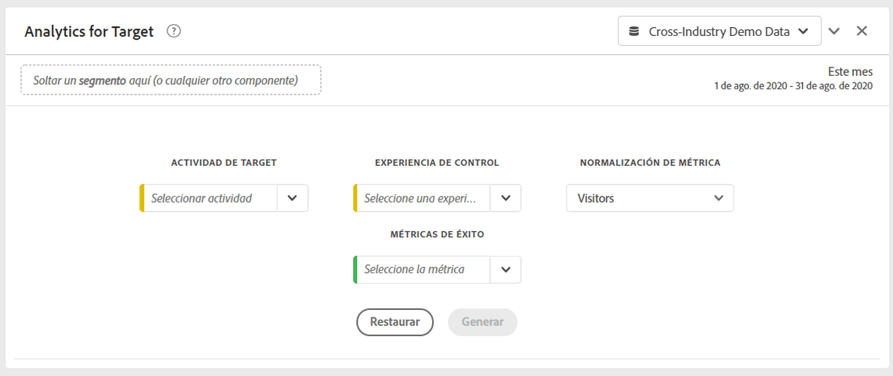
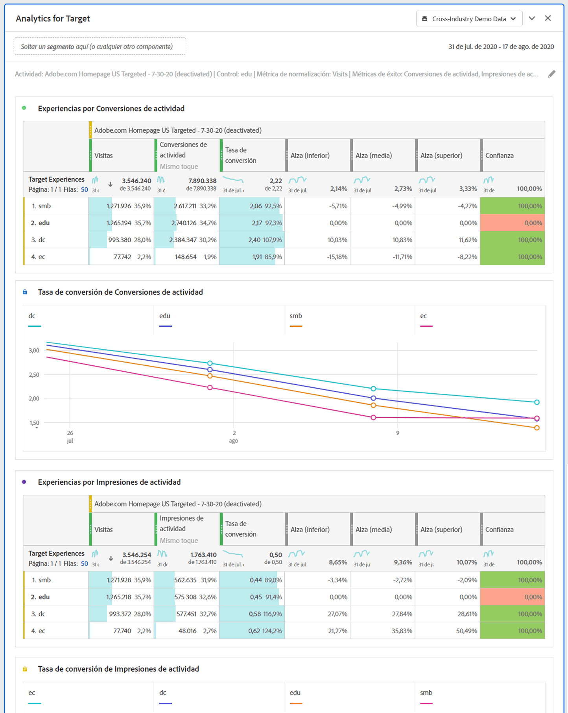

# Panel de Analytics for Target (A4T)

El panel Analytics for Target (A4T) le permite analizar las actividades y experiencias de Adobe Target en Analysis Workspace. También le permite ver el alza y la confianza hasta en 3 métricas de éxito. Para acceder al panel de A4T, vaya a un grupo de informes con componentes de A4T activados. A continuación, haga clic en el icono del panel situado en el extremo izquierdo y arrastre el panel Analytics for Target a su proyecto de Analysis Workspace.

## Entradas de panel {#Input}

Puede configurar el panel de A4T con esta configuración de entrada:

| Configuración | Descripción |
|---|---|
| Actividad de Target | Seleccione una lista de Actividades de Target o arrastre y suelte una actividad desde el carril izquierdo. Nota: La lista se rellena con los últimos 6 meses de actividades que han tenido al menos 1 visita. Si no ve una actividad en la lista, puede haberse producido hace más de 6 meses. Todavía se puede añadir desde el carril izquierdo, que tiene un periodo retrospectivo que incluye hasta 18 meses. |
| Experiencia de control | Seleccione la experiencia de control. Puede cambiarla, si es necesario, desde la lista desplegable. |
| Métrica de normalización | Elija entre Visitantes únicos, Visitas o Impresiones de actividad. Se recomiendan visitantes únicos para la mayoría de los casos de uso de análisis. Esta métrica (también denominada metodología de contabilización) se convierte en el denominador del cálculo del alza. También afecta a la manera en que se agregan los datos antes de que se calcule la confianza. |
| Métricas de éxito | Seleccione hasta 3 eventos de éxito estándar (no calculados) en la lista desplegable o arrastre y suelte las métricas desde el carril izquierdo. Cada métrica tendrá una tabla y una visualización dedicadas en el panel procesado. |
| Intervalo de fechas del calendario | Esto se rellenará automáticamente en función del intervalo de fechas de Actividad de Adobe Target. Puede cambiarlo si es necesario. |

## Salida de panel {#Output}

El panel de Analytics for Target devuelve un conjunto completo de datos y visualizaciones para ayudarle a comprender mejor el rendimiento de la actividad y las experiencias de Adobe Target. En la parte superior del panel, se proporciona una línea de resumen para recordarle la configuración del panel seleccionada. En cualquier momento, puede editar el panel haciendo clic en el lápiz de edición en la parte superior derecha.

Para cada métrica de éxito seleccionada, se mostrará una tabla improvisada y una tendencia de tasa de conversión:

Cada tabla improvisada muestra las siguientes columnas de métricas:

| Métrica | Descripción |
|---|---|
| Métricas de normalización | Visitantes únicos, Visitas o Impresiones de actividad. |
| Métrica de éxito | La métrica seleccionada en el generador |
| Tasa de conversión | Métrica de éxito/métrica de normalización |
| Alza | Compara la tasa de conversión de cada experiencia con la experiencia de control. Nota: El alza es una “métrica bloqueada” de las experiencias de Target, no se puede desglosar ni utilizar con otras dimensiones. |
| Alza (inferior) | Representa la peor elevación que una experiencia de variante podría tener sobre el control con un intervalo de confianza del 95 %. Cálculo: (x/y ± 1,96 std_err(x,y)) / (x_control/y_control ∓ 1,96 std_err(x_control,y_control)). Aquí, std_err(x,y) es sqrt(xx/y - (x/y)^2), donde xx indica la suma de cuadrados. |
| Alza (media) | Representa la elevación media que una experiencia de variante podría tener sobre el control con un intervalo de confianza del 95 %. Esto es “Alza” en Reports &amp; Analytics. Cálculo: (x/y)/(x_control/y_control) – 1 |
| Alza (superior) | Representa la mejor elevación que una experiencia de variante podría tener sobre el control con un intervalo de confianza del 95 %. Cálculo: consulte Elevación (inferior). |
| Confianza | La prueba T-test para estudiantes calcula el nivel de confianza, que indica la probabilidad de que los resultados se dupliquen si se vuelve a ejecutar la prueba. Se ha aplicado a la métrica un rango de formato condicional fijo del 75%/85%/95%. Este formato se puede personalizar, si es necesario, desde Configuración de columna. Nota: La confianza es una “métrica bloqueada” para las experiencias de Target; no se puede desglosar ni utilizar con otras dimensiones. Cálculo: aplique una prueba T de 2 colas con y+y_control-2 grados de libertad para encontrar el valor p si x/y es igual a x_control/y_control. Calcule el valor t, donde stderr es sqrt( (xx/y-(x/y)^2)/y + (xx_control/y_control-(x_control/y_control)^2)/y_control). Devuelva 1-p como la confianza de que son diferentes. |

Como con cualquier panel de Analysis Workspace, puede continuar con el análisis agregando tablas y [visualizaciones](https://docs.adobe.com/content/help/es-ES/analytics/analyze/analysis-workspace/visualizations/freeform-analysis-visualizations.html) adicionales que le ayudarán a analizar sus actividades de Adobe Target. También puede aplicar un segmento en el nivel de panel o en la tabla improvisada. Tenga en cuenta que si lo agrega dentro de la tabla improvisada, debe superponerlo en toda la tabla para conservar los cálculos de elevación y confianza. Los segmentos de nivel de columna no son compatibles en este momento.

## Preguntas frecuentes {#FAQ}

| Pregunta | Respuesta |
|---|---|
| ¿Qué tipos de actividad se admiten en A4T? | [Obtenga más información](https://docs.adobe.com/content/help/es-ES/target/using/integrate/a4t/a4t-faq/a4t-faq-activity-setup.html) sobre los tipos de actividad admitidos. |
| ¿Se admiten las métricas calculadas en los cálculos de alza y confianza? | No. [Obtenga más información](https://docs.adobe.com/content/help/es-ES/target/using/integrate/a4t/a4t-faq/a4t-faq-lift-and-confidence.html) sobre por qué las métricas calculadas no son compatibles con el alza y la confianza. Sin embargo, las métricas calculadas pueden utilizarse en sistemas de informes de A4T fuera de estas métricas. |
| ¿Por qué los visitantes únicos varían entre Target y Analytics? | [Obtenga más información](https://docs.adobe.com/content/help/es-ES/target/using/integrate/a4t/a4t-faq/a4t-faq-viewing-reports.html) sobre las variaciones de visitantes únicos entre productos. |
| Cuando se aplica un segmento de visita para una actividad de Target específica en mi análisis, ¿por qué se devuelven experiencias no relacionadas? | La dimensión de A4T es una variable de lista, lo que significa que puede contener muchas actividades (y experiencias) a la vez. [Más información](https://docs.adobe.com/content/help/en/target/using/integrate/a4t/a4t-faq/a4t-faq-viewing-reports.html) |
| ¿La métrica de confianza representa los pedidos extremos o aplica una corrección de Bonferroni para varias ofertas? | No. [Obtenga más información](https://docs.adobe.com/content/help/en/target/using/integrate/a4t/a4t-faq/a4t-faq-lift-and-confidence.html) sobre cómo Analytics calcula la confianza. |
| ¿Pueden utilizarse métricas de alza y confianza con otras dimensiones o desgloses? | El alza y la confianza son “métricas bloqueadas” a la dimensión de experiencias de Target, porque requieren un control y una variante para calcularlas. De este modo, no pueden desglosarse ni utilizarse con otras dimensiones. |
| ¿Cuándo se vuelven a calcular el alza y la confianza? | La elevación y la confianza se vuelven a calcular cada vez que se ejecuta (o se vuelve a ejecutar) el panel, su intervalo de fechas cambia o se aplica un segmento al panel o la tabla. Al aplicar un filtro de segmento a la tabla improvisada, debe aplicarse en todas las columnas, o la elevación y la confianza no se actualizarán correctamente. Los segmentos de nivel de columna no son compatibles en este momento. |

Para obtener más información sobre la creación de informes en Analytics for Target, consulte [Creación de informes de A4T](https://docs.adobe.com/content/help/es-ES/target/using/integrate/a4t/reporting.html)
