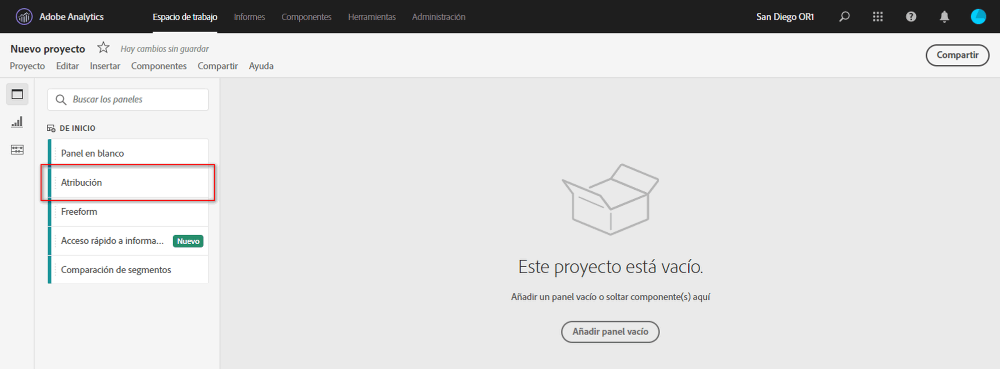
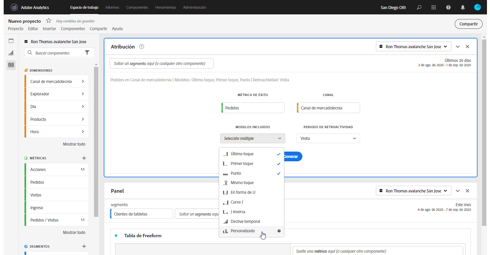
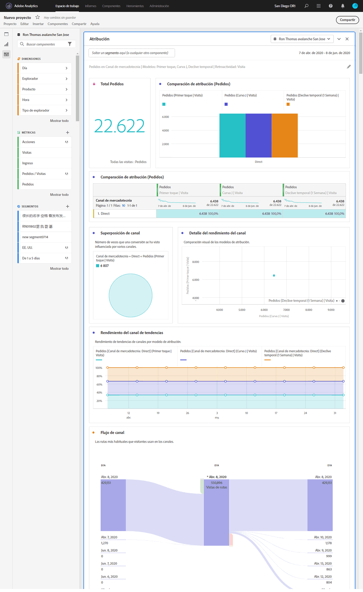

# Panel de Attribution

El panel [!UICONTROL Atribución] es una forma sencilla de generar un análisis comparando varios modelos de atribución. Es una funcionalidad de [Attribution IQ](../attribution/overview.md) que le proporciona un espacio de trabajo dedicado para usar y comparar modelos de atribución.

## Creación de un panel de atribución

1. Haga clic en el icono de panel situado en la izquierdo.
1. Arrastre el panel [!UICONTROL Atribución] a su Proyecto de Analysis Workspace.

   

1. Añada una métrica a la que desee atribuir y agregue cualquier dimensión para atribuirla. Algunos ejemplos son Canales de marketing o dimensiones personalizadas, como las promociones internas.

   

1. Seleccione los modelos de [atribución y la ventana retrospectiva](../attribution/models.md) que desee comparar.

1. El panel Atribución devuelve un conjunto completo de datos y visualizaciones que comparan la atribución para la dimensión y métrica seleccionadas.

   

## Visualizaciones de atribución

* **Métrica total**: El número total de conversiones que tienen lugar durante el periodo establecido por la ventana de creación de informes. Estas son las conversiones que se atribuyen a través de la dimensión seleccionada.
* **Barra comparativa de la atribución**: Compara visualmente las conversiones atribuidas en cada uno de los elementos de dimensión de la dimensión seleccionada. Cada color de barra representa un modelo de atribución distinto.
* **Tabla comparativa de la atribución**: Muestra los mismos datos que el gráfico de barras, representados como una tabla. Al seleccionar distintas columnas o filas en esta tabla, se filtra el gráfico de barras, así como varias de las demás visualizaciones del panel. Esta tabla actúa de forma similar a cualquier otra tabla improvisada en Workspace, lo que le permite agregar componentes como métricas, segmentos o desgloses.
* **Diagrama de superposición**: Un diagrama de Venn que muestra los tres elementos de dimensión principales y la frecuencia con la que participan conjuntamente en una conversión. Por ejemplo, el tamaño de la superposición de burbujas indica con qué frecuencia ocurrieron las conversiones cuando un visitante estuvo expuesto a ambos elementos de dimensión. Si se seleccionan otras filas en la Tabla improvisada, se actualizará la visualización para reflejar su selección.
* **Detalles de rendimiento**: Permite comparar visualmente hasta tres modelos de atribución mediante un diagrama de puntos.
* **Rendimiento** de tendencias: De forma predeterminada, muestra la tendencia del rendimiento de conversión por modelo de atribución para la primera dimensión enumerada en la tabla improvisada adyacente. Puede seleccionar diferentes filas de dimensión en la tabla improvisada para mostrar la tendencia de las dimensiones seleccionadas (como Ingresos totales para cada modelo de atribución de Campañas sociales y Búsqueda paga). Como alternativa, puede seleccionar celdas en las columnas para cualquier combinación de métrica y tipo de atribución en la tabla improvisada para ver el rendimiento de tendencias por valor de dimensión para los modelos de atribución especificados (como Ingresos totales por canal de marketing mediante la atribución Último toque y Primer toque).
* **Flujo**: Permite ver en qué canales hay interacción con más frecuencia y en qué orden a lo largo del recorrido de un visitante.
