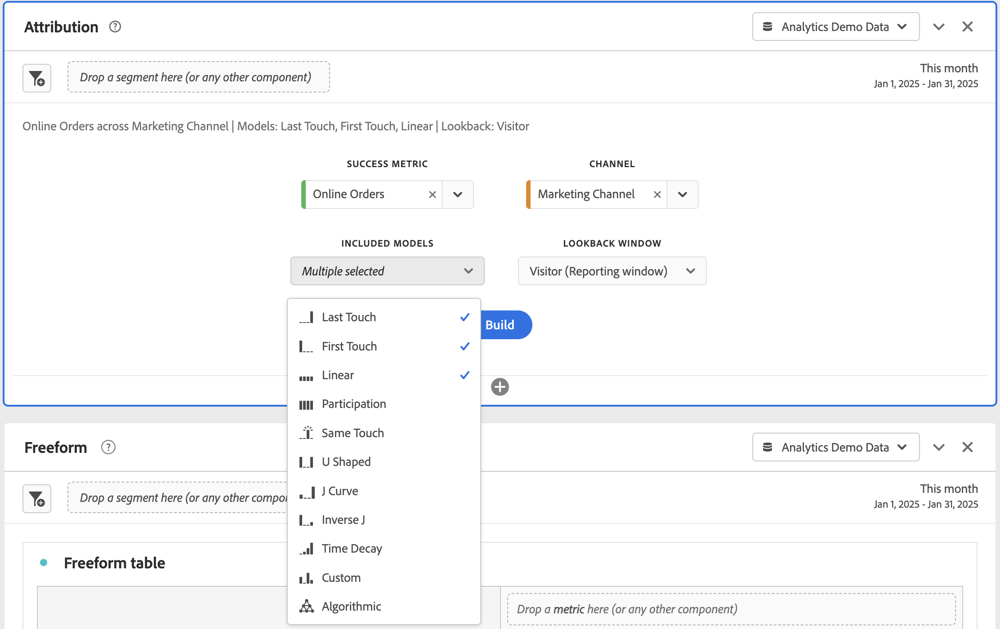
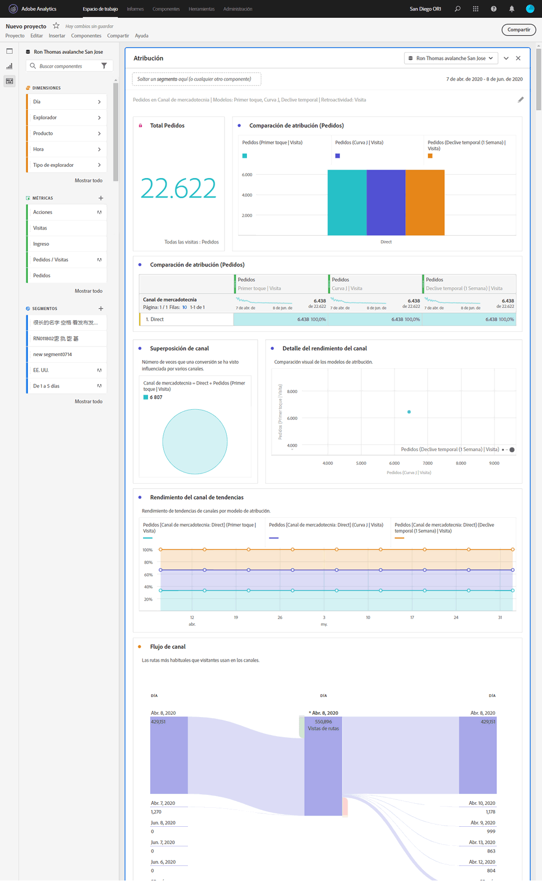
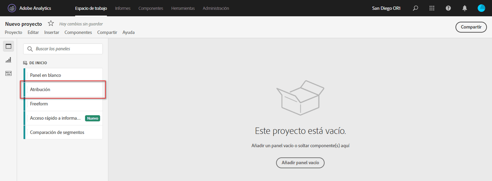
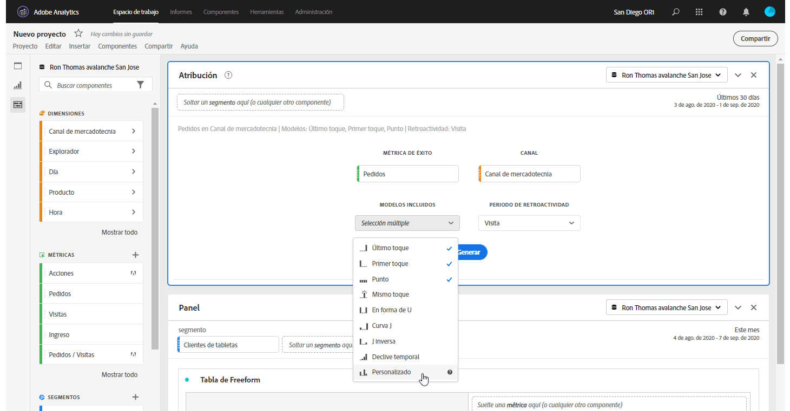

# Panel de atribución {#attribution-panel}

<!-- markdownlint-disable MD034 -->

>[!CONTEXTUALHELP]
>id="workspace_attribution_button"
>title="Atribución"
>abstract="Compare y visualice rápidamente los modelos de atribución utilizando cualquier dimensión y métrica de conversión"
>additional-url="https://www.youtube.com/watch?v=Yu0hy2klzA0" text="Panel de Attribution IQ"

>[!CONTEXTUALHELP]
>id="workspace_attribution_panel"
>title="Panel de atribución"
>abstract="Compare y visualice rápidamente cualquier número de modelos de atribución utilizando cualquier dimensión y métrica de conversión.  **Parámetros &#x200B;** **Canal**  La dimensión contra la que atribuir. Esta dimensión puede ser canales de marketing, campañas o cualquier otra dimensión. **Modelos**  El modelo determina cómo se asigna crédito a los puntos de contacto. **Ventana retroactiva**  Este ajuste determina la ventana de atribución de datos que se aplica a cada conversión."
>additional-url="https://www.youtube.com/watch?v=Yu0hy2klzA0" text="Panel de Attribution IQ"

<!-- markdownlint-enable MD034 -->

>[!BEGINSHADEBOX]

_Este artículo documenta el panel Atribución en_  _&#x200B;**Adobe Analytics**._ _Vea [Panel de atribución](https://experienceleague.adobe.com/es/docs/analytics-platform/using/cja-workspace/panels/attribution) para la_  _&#x200B;**Customer Journey Analytics** versión de este artículo._

>[!ENDSHADEBOX]

El panel **[!UICONTROL Atribución]** es una forma sencilla de generar un análisis comparando varios modelos de atribución. El panel le proporciona un espacio de trabajo dedicado para utilizar y comparar modelos de atribución.

Adobe Analytics mejora la atribución al permitir lo siguiente:

* Definir la atribución más allá del contenido multimedia de pago: cualquier dimensión, métrica, canal o evento puede aplicarse a modelos (por ejemplo, búsqueda interna), no solo campañas de marketing.
* Utilizar la comparación de modelos de atribución sin límites: compare dinámicamente todos los modelos que desee.
* Evitar cambios de implementación: con el procesamiento de tiempo de los informes y las sesiones según el contexto, el contexto del recorrido del cliente puede incorporarse y aplicarse en tiempo de ejecución.
* Construir la sesión más adecuada para su escenario de atribución.
* Desglosar la atribución por segmentos: compare fácilmente el rendimiento de sus canales de marketing en cualquier segmento importante (por ejemplo, clientes nuevos frente a repetidos, producto X frente a producto Y, nivel de lealtad o CLV).
* Inspeccionar análisis de canales cruzados y de múltiples contactos mediante Diagramas de Venn e Histogramas, y resultados de atribución de tendencias.
* Analizar visualmente secuencias de marketing clave: explore las rutas que generaron una conversión visualmente con las visualizaciones de visitas en el orden previsto y flujo de varios nodos.
* Generar métricas calculadas: Utilice todos los métodos de asignación de atribuciones que desee.

## Utiliza

Para usar un panel **[!UICONTROL Atribución]**:

1. Cree un panel **[!UICONTROL Atribución]**. Para obtener información sobre cómo crear un panel, consulta [Crear un panel](panels.md#create-a-panel).

1. Especifica la [entrada](#panel-input) para el panel.

1. Observa la [salida](#panel-output) del panel.

### Entrada de panel

Puede configurar el panel Atribución con esta configuración de entrada:

1. Añada una **[!UICONTROL métrica de éxito]** y una dimensión del **[!UICONTROL canal]** que desee atribuir. Algunos ejemplos son Canales de marketing o dimensiones personalizadas, como las promociones internas.

   

1. Seleccione uno o más [modelos de atribución](#attribution-models) de **[!UICONTROL modelos incluidos]**, el [contenedor](#container) de **[!UICONTROL Contenedor]** y una [ventana retrospectiva](#lookback-window) de **[!UICONTROL ventana retrospectiva]** que desee usar para la comparación.

1. Seleccione **[!UICONTROL Generar]** para generar las visualizaciones en el panel.

### Salida del panel

El panel **[!UICONTROL Atribución]** devuelve un conjunto completo de datos y visualizaciones que comparan la atribución para la dimensión y la métrica seleccionadas.

### Visualizaciones de atribución

La siguiente visualización forma parte de la salida del panel.

* **Métrica total**: El número total de conversiones que ocurrieron durante la ventana de tiempo de creación de informes y que se atribuyen a la dimensión seleccionada.
* **Barra comparativa de la atribución**: Compara visualmente las conversiones atribuidas en cada uno de los elementos de dimensión de la dimensión seleccionada. Cada color de barra representa un modelo de atribución distinto.
* **Tabla comparativa de la atribución**: Muestra los mismos datos que el gráfico de barras, representados como una tabla. Al seleccionar distintas columnas o filas en esta tabla, se filtra el gráfico de barras, así como varias de las demás visualizaciones del panel. Esta tabla actúa de manera similar a cualquier otra tabla de forma libre en Workspace, lo que le permite añadir componentes como métricas, segmentos o desgloses.
* **Diagrama de superposición**: Un diagrama de Venn que muestra los tres elementos de dimensión principales y la frecuencia con la que participan conjuntamente en una conversión. Por ejemplo, el tamaño del solapamiento de burbujas indica con qué frecuencia ocurrieron las conversiones cuando una persona estuvo expuesta a ambos elementos de dimensión. Si se seleccionan otras filas en la Tabla de forma libre adyacente, se actualizará la visualización para reflejar su selección.
* **Detalles de rendimiento**: una visualización de puntos para comparar visualmente hasta tres modelos de atribución.
* **Rendimiento de tendencias**: Muestra la tendencia de las conversiones atribuidas para el elemento de dimensión principal. Si se seleccionan otras filas en la Tabla de forma libre adyacente, se actualizará la visualización para reflejar su selección.
* **Flujo**: le permite ver con qué canales se interactúa con más frecuencia y en qué orden a lo largo del recorrido de una persona.

## Modelo de atribución

{{attribution-models-details}}

## Contenedor

{{attribution-container}}

## Ventana de retroactividad

{{attribution-lookback-window}}

## Ejemplo

{{attribution-example}}

>[!MORELIKETHIS]
>
> [Crear un panel](/help/analyze/analysis-workspace/c-panels/panels.md#create-a-panel)
>

<!--
# Attribution panel

The [!UICONTROL Attribution] panel is an easy way to build an analysis comparing various attribution models. It is a feature in [Attribution](/help/analyze/analysis-workspace/attribution/overview.md) that gives you a dedicated workspace to use and compare attribution models.

>[!VIDEO](https://experienceleague.adobe.com/en/docs/analytics-learn/tutorials/analysis-workspace/attribution-iq/using-the-attribution-iq-panel)

## Create an attribution panel

1. Click the panel icon on the left.
1. Drag the [!UICONTROL Attribution] panel into your Analysis Workspace Project.

   

1. Add a metric that you want to attribute and add any dimension to attribute against. Examples include Marketing Channels or custom dimensions, such as internal promotions.

   

1. Select the [attribution models and lookback window](../attribution/models.md) you want to compare.

1. The Attribution panel returns a rich set of data and visualizations that compare attribution for the selected dimension and metric.

   

## Attribution visualizations

* **Total metric**: The total number of conversions that occurred over the reporting time window. These are the conversions that are attributed across the dimension that you selected.
* **Attribution Comparison Bar**: Visually compares the attributed conversions across each of the dimension items from your selected dimension. Each bar color represents a distinct attribution model.
* **Attribution Comparison Table**: Shows the same data as the bar chart, represented as a table. Selecting different columns or rows in this table filters the bar chart as well as several of the other visualizations in the panel. This table acts similar to any other Freeform Table in Workspace - allowing you to add components such as metrics, segments, or breakdowns.
* **Overlap Diagram**: A Venn Diagram showing the top three dimension items and how often they participate jointly in a conversion. For example, the size of the bubble overlap indicates how often conversions occurred when a visitor was exposed to both dimension items. Selecting other rows in the adjacent Freeform table updates the visualization to reflect your selection.
* **Performance Detail**: Lets you to compare up to three attribution models visually using a scatter plot.
* **Trended Performance**: By default, shows the conversion performance trend by attribution model for the first dimension listed in the adjacent Freeform table. You can select different dimension rows in the Freeform table to show the trend for the selected dimensions (such as Total Revenue for each attribution model for Social Campaigns and Paid Search). Alternately, you can select cells in the columns for any metric and attribution type combinations in the Freeform table to see the trended performance by dimension value for the specified attribution models (such as Total Revenue by Marketing Channel using Last Touch and First Touch attribution).
* **Flow**: Lets you see which channels are interacted with most commonly, and in what order across a visitor's journey.

-->