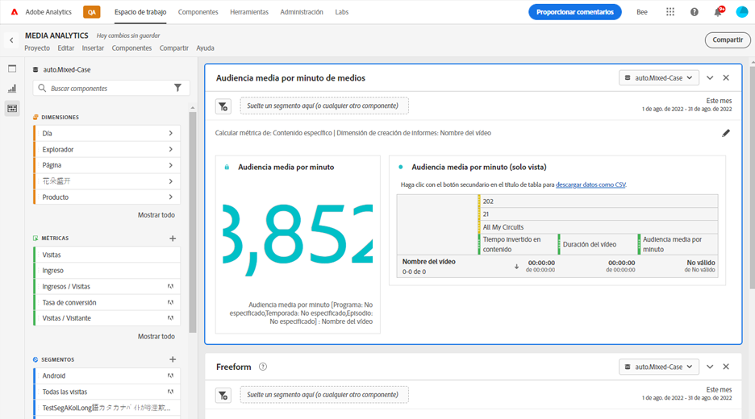
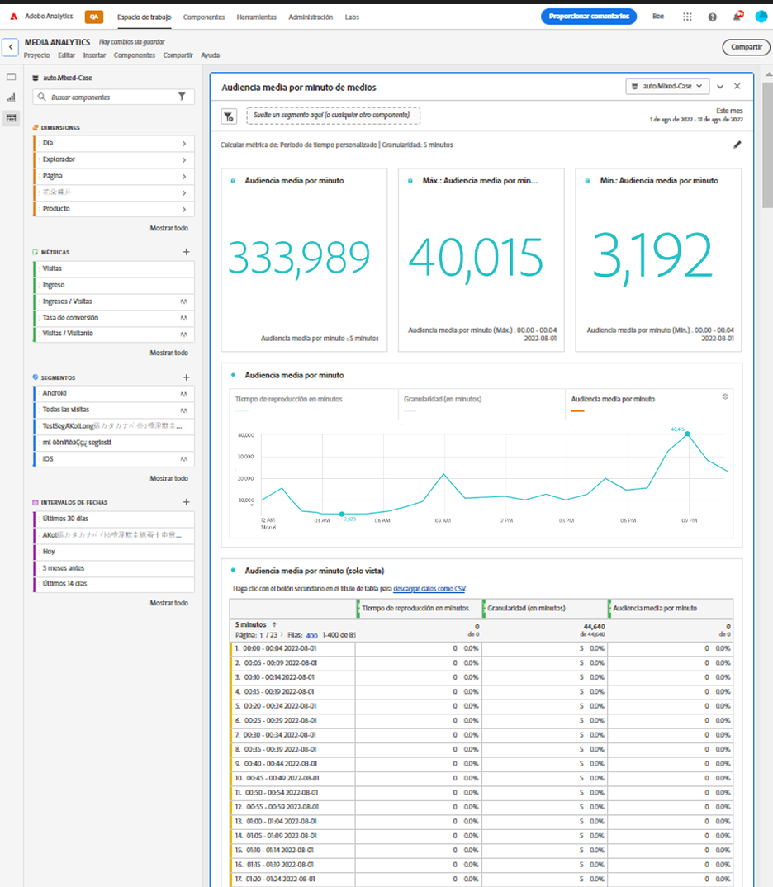

# Panel Público medio por minuto de medios {#media-average-minute-audience-panel}

<!-- markdownlint-disable MD034 -->

>[!CONTEXTUALHELP]
>id="workspace_mediaminuteaverageaudience_button"
>title="Público medio por minuto de medios"
>abstract="Cree un panel para analizar el público medio por minuto de contenido específico o durante un período de tiempo específico."

<!-- markdownlint-enable MD034 -->

<!-- markdownlint-disable MD034 -->

>[!CONTEXTUALHELP]
>id="workspace_mediaaverageminuteaudience_panel"
>title="Público medio por minuto de medios"
>abstract="Muestra el rendimiento de contenido de medios específicos o durante un período de tiempo personalizado.  **Parámetros generales &#x200B;** **Calcular métrica para**: seleccione la métrica que se usará en el panel. Seleccione **Contenido específico** para analizar el público medio por minuto de contenido o evento específico en función de la duración del contenido. **Seleccione Período de tiempo personalizado** para analizar cómo cambia el público medio por minuto durante un período de tiempo personalizado seleccionado. **Dimensión de creación de informes**: seleccione para informar por **Nombre de vídeo** de la dimensión **ID de contenido**. Solo está disponible cuando ha seleccionado Contenido específico como métrica. **Granularidad**: seleccione la granularidad para la creación de informes. Solo está disponible cuando ha seleccionado Período de tiempo personalizado como métrica. **Filtrar contenido por (opcional)**: seleccione un programa, temporada, episodio o una dimensión personalizada para filtrar el contenido.  **Ajustes avanzados &#x200B;** **Configuración de tabla**: seleccione si desea mostrar valores de cálculo en la tabla. **Métrica de tiempo empleado**: seleccione la métrica de tiempo empleado que desee usar para el cálculo de contenido específico. Solo está disponible cuando ha seleccionado Contenido específico como métrica."

<!-- markdownlint-enable MD034 -->

>[!BEGINSHADEBOX]

_Este artículo documenta el panel Audiencia media por minuto de medios en_  _&#x200B;**Adobe Analytics**&#x200B;_. _Consulte el panel [Audiencia media por minuto de medios](https://experienceleague.adobe.com/es/docs/analytics-platform/using/cja-workspace/panels/average-minute-audience-panel) para la_ versión de  _&#x200B;**Customer Journey Analytics** de este artículo._

>[!ENDSHADEBOX]

>[!NOTE]
>
>El panel **[!UICONTROL Audiencia media por minuto de medios]** solo está disponible para los clientes que hayan comprado el complemento de Adobe Analytics para medios de streaming.
>
>Póngase en contacto con su representante de ventas de Adobe o con el equipo de cuentas de Adobe para obtener más información.
>

En Analysis Workspace, el público medio por minuto puede proporcionar información sobre

* el tiempo empleado en ver un flujo de medios específico dividido por la duración del contenido o
* el tiempo empleado de visionado durante un período de tiempo personalizado con la granularidad seleccionada.

El panel Público medio por minuto de medios le permite conocer el consumo promedio del contenido comparando programas de cualquier longitud o género. Por ejemplo, puede conocer el consumo medio comparando una comedia de 30 minutos con un evento deportivo de 3 horas.

Además, puede usar el panel Público medio por minuto de medios para comparar o añadir este público media por minuto digital a las métricas medias por minuto de la televisión lineal.

El panel Público medio por minuto de medios proporciona las siguientes ventajas sobre la métrica Público medio por minuto:

* Admite periodos de tiempo personalizados

* Permite actualizar la clasificación de la duración después de procesar las vistas (si la clasificación de la duración no estaba presente o debe corregirse)

  Si realiza esta actualización al utilizar la métrica, la clasificación de la duración no existe (si la clasificación no estaba presente). O la clasificación de la duración está desactualizada (si la clasificación estaba presente pero era incorrecta).

## Utiliza

Para utilizar un panel **[!UICONTROL Público medio por minuto de medios]**:

1. Cree un panel **[!UICONTROL Público medio por minuto de medios]**. Para obtener información sobre cómo crear un panel, consulta [Crear un panel](panels.md#create-a-panel).

1. Asegúrese de seleccionar una vista de datos para el panel que tenga componentes configurados del complemento de Adobe Analytics para medios de streaming.

1. Especifica la [entrada](#panel-input) para el panel.

1. Observa la [salida](#panel-output) del panel.

### Entrada de panel

Utilice la configuración de entrada que se describe en esta sección para configurar el panel Público medio por minuto de medios.

1. Realice la siguiente configuración de entrada:

   | Configuración | Descripción |
   |---------|------------|
   | **Intervalo de fechas del panel** | El intervalo de fechas predeterminado del panel es [!UICONTROL **Este mes**] Puede editarlo para verlo un solo día o varios meses a la vez.    Esta visualización está limitada a 1440 filas de datos (por ejemplo, 24 horas con una granularidad por minuto). Si la combinación de intervalo de fechas y granularidad genera más de 1440 filas, la granularidad se actualiza automáticamente para dar cabida al intervalo de fechas completo. |
   | [!UICONTROL **Soltar un segmento aquí (o cualquier otro componente)**]. | Al igual que otros paneles, esta configuración filtra las selecciones en función de los segmentos que haya creado. Esta configuración es una buena manera de examinar plataformas específicas, emisiones en directo u otros segmentos de medios comunes. |
   | [!UICONTROL **Calcular métrica para**] | Elija si desea ver el público medio por minuto de [**[!UICONTROL contenido específico]**](#specific-content). O si desea ver el público medio por minuto de un [**[!UICONTROL período de tiempo personalizado]**](#custom-time-period).  Seleccione [!UICONTROL **Período de tiempo personalizado**]: <ul><li>Si la duración no está disponible, o </li><li>si desea ver el público medio por minuto de una serie temporal con varios fragmentos de contenido, o</li><li>para el contenido sin una duración asignada específica (como durante una emisión o un evento en directo)</li></ul></li></li></ul> 
Esta configuración cambia el flujo de trabajo y el resultado del informe.
 |

1. Continúe con [Contenido específico](#specific-content) o [Período de tiempo personalizado](#custom-time-period), según la opción que haya elegido en la lista desplegable [!UICONTROL **Calcular métrica para**].

#### Contenido específico

1. Si seleccionó [!UICONTROL **Contenido específico**] en el menú desplegable [!UICONTROL **Calcular métrica para**] al [configurar las entradas del panel](#panel-inputs), especifique las siguientes opciones de configuración:

   | Configuración | Descripción |
   |---------|------------|
   | [!UICONTROL **Dimensión de los informes**] | Cuando selecciona contenido específico, puede seleccionar que la salida del informe utilice los campos de nombre de vídeo o ID de contenido para mostrar el contenido y su público medio por minuto asociada. |
   | [!UICONTROL **Filtrar contenido por (opcional)**] | Puede filtrar el contenido específico según la vista que desee o la forma en que se estructuran los datos. <ul>[!UICONTROL **Mostrar temporada, episodio**]: muestra los programas disponibles en la lista desplegable, que puede filtrar mediante una búsqueda (o arrastrando y soltando el nombre del programa desde la columna izquierda). Puede terminar su selección allí para ver todas las temporadas del programa, o puede filtrar por temporadas individuales y luego por episodios individuales. Esta configuración muestra los datos de los programas, las temporadas o los episodios del período de tiempo seleccionado.</li><li>[!UICONTROL **Dimensión personalizada**]: si el nombre del programa se encuentra en una dimensión personalizada, puede encontrarla buscando en la lista desplegable de dimensiones (opcional) o utilizando la búsqueda de la columna izquierda. El elemento de dimensión se rellena automáticamente en función de esa selección y se trata como un episodio.</li><li>[!UICONTROL **Ninguno**]: muestra todos los nombres de vídeo que tengan datos de público medio por minuto para la selección que haya elegido. (Esta opción está seleccionada de manera predeterminada).</li></ul> |

1. Continúe con [Configuración avanzada de contenido específico](#specific-content-advanced-settings) para establecer la configuración avanzada.

#### Configuración avanzada de contenido específico

1. Con el [!UICONTROL **Contenido específico**] seleccionado en el menú desplegable [!UICONTROL **Calcular métrica para**], seleccione [!UICONTROL **Mostrar configuración avanzada**] y luego especifique las siguientes opciones de configuración:

   | Opciones | Descripción |
   |---------|------------|
   | **[!UICONTROL Configuración de la tabla]** | La configuración predeterminada **[!UICONTROL Mostrar valores de cálculo de la tabla]**, que muestran el numerador y el denominador del público medio por minuto como las columnas anteriores de la tabla. Al anular la selección de esta opción, se eliminan esas dos columnas. La columna de público medio por minuto permanece en la tabla junto al nombre del vídeo o el ID de contenido. |
   | **[!UICONTROL Métrica de tiempo empleado]** | Puede elegir la opción predeterminada **[!UICONTROL Tiempo invertido en contenido]**, que solo incluye el tiempo de contenido. O puede optar por utilizar **[!UICONTROL Tiempo medio empleado]**, que incluye conjuntamente el contenido y el tiempo de publicidad como cálculo del numerador para el público medio por minuto. |

1. Seleccione [!UICONTROL **Generar**] para terminar de crear el panel Público medio por minuto de medios.

1. Continúe con [Salida del panel](#panel-output) para obtener información sobre cómo usar el panel Público medio por minuto de medios.

#### Período de tiempo personalizado

1. Si seleccionó [!UICONTROL **Período de tiempo personalizado**] en el menú desplegable [!UICONTROL **Calcular métrica para**] al [configurar las entradas del panel](#panel-inputs), especifique las siguientes opciones de configuración:

   | Opciones | Descripción |
   |---------|------------|
   | **[!UICONTROL Granularidad]** | La granularidad predeterminada es de [!UICONTROL **5 minutos**], pero puede elegir cualquiera de las granularidades que se utilizan como denominador para la serie temporal dentro del período de tiempo seleccionado. Por ejemplo, si se selecciona de 12:00 pm a 12:30 pm con una granularidad de 5 minutos, la audiencia media por minuto devolverá la media de media hora, así como seis filas con la audiencia media por minuto para cada período de 5 minutos. Estas filas se utilizan como puntos de datos para el gráfico de serie temporal. |
   | [!UICONTROL **Filtrar contenido por (opcional)**] | Puede filtrar el contenido específico según la vista que desee o la forma en que se estructuran los datos. <ul>[!UICONTROL **Mostrar temporada, episodio**]: muestra los programas disponibles en la lista desplegable, que puede filtrar mediante una búsqueda (o arrastrando y soltando el nombre del programa desde la columna izquierda). Puede terminar su selección allí para ver todas las temporadas del programa, o puede filtrar por temporadas individuales y luego por episodios individuales. Esta configuración muestra los datos de los programas, las temporadas o los episodios del período de tiempo seleccionado.</li><li>[!UICONTROL **Dimensión personalizada**]: si el nombre del programa se encuentra en una dimensión personalizada, puede encontrarla buscando en la lista desplegable de dimensiones (opcional) o utilizando la búsqueda de la columna izquierda. El elemento de dimensión se rellena automáticamente en función de esa selección y se trata como un episodio.</li><li>[!UICONTROL **Ninguno**]: muestra todos los nombres de vídeo que tengan datos de público medio por minuto para la selección que haya elegido. (Esta opción está seleccionada de manera predeterminada).</li></ul> |

1. Continúe con [Configuración avanzada del período de tiempo personalizado](#custom-time-period-advanced-settings) para establecer la configuración avanzada.

#### Configuración avanzada de período de tiempo personalizado

1. Con el [!UICONTROL **Contenido específico**] seleccionado en el menú desplegable [!UICONTROL **Calcular métrica para**], seleccione [!UICONTROL **Mostrar configuración avanzada**] y luego especifique las siguientes opciones de configuración:

   | Opción | Descripción |
   |---------|------------|
   | **[!UICONTROL Configuración de la tabla]** | La configuración predeterminada muestra los valores de cálculo de la tabla, que muestra el numerador y el denominador del público medio por minuto como las columnas anteriores de la tabla. Al anular la selección de esta opción, se eliminan esas dos columnas, por lo que queda solo el público promedio por minuto junto al período de tiempo. |

1. Seleccione [!UICONTROL **Generar**] para terminar de crear el panel Público medio por minuto de medios.

1. Continúe con [Salida del panel](#panel-output) para obtener información sobre cómo usar el panel Público medio por minuto de medios.

### Salida del panel

La salida del panel varía en función de si ha elegido [!UICONTROL **Contenido específico**] o [!UICONTROL **Período de tiempo personalizado**] en el menú desplegable [!UICONTROL **Calcular métrica para**] al [configurar las entradas del panel](#panel-inputs).

#### Contenido específico

El panel Público medio por minuto de medios devuelve lo siguiente:

* Público medio total por minuto de toda la selección
* Filtros y público medio por minuto de los vídeos individuales mostrados en una tabla
* Tiempo invertido en contenido y duración del vídeo si se seleccionó esa configuración avanzada

Para editar y reconstruir el panel en cualquier momento, seleccione  en la parte superior derecha.

#### Fuente de datos de contenido específico

El panel Público medio por minuto de medios solo utiliza la métrica Público medio por minuto de medios para recopilar datos. Los desgloses u otras métricas no se pueden usar en el panel.

| Métrica | Descripción |
|--------|-------------|
| **[!UICONTROL Público medio por minuto]** | El tiempo empleado en ver el flujo de medios dividido por la duración del vídeo proporcionada mediante clasificaciones. |

#### Período de tiempo personalizado {#custom-time-period-output}

El panel Público medio por minuto de medios devuelve lo siguiente:

* El público medio total por minuto de toda la selección

* El público medio por minuto máxima y mínima

* Gráfico de series lineales que muestra el público medio por minuto de toda la selección.

* Una tabla muestra los filtros y el público medio por minuto de las granularidades, así como el tiempo empleado en contenido y la granularidad de cada período de tiempo

  Esta tabla solo se muestra si está seleccionada la opción de configuración avanzada denominada [!UICONTROL **Mostrar valores de cálculo de la tabla**].

Para editar y reconstruir el panel en cualquier momento, seleccione  en la parte superior derecha.

#### Fuente de datos del período de tiempo personalizado

El panel Público medio por minuto de medios solo utiliza la métrica Público medio por minuto de medios para recopilar datos. Los desgloses u otras métricas no se pueden usar en el panel.

| Métrica | Descripción |
|---|---|
| **[!UICONTROL Promedio de público por minuto]** | El tiempo empleado en ver el flujo de medios dividido por la selección total o la granularidad seleccionada en minutos. |

>[!MORELIKETHIS]
>
> [Crear un panel](/help/analyze/analysis-workspace/c-panels/panels.md#create-a-panel)
> &#x200B;> [Panel Visualizadores simultáneos de medios](media-concurrent-viewers.md)
> &#x200B;> [Panel Tiempo invertido en la reproducción de medios](media-playback-time-spent.md)
>

<!--

# Media average minute audience panel

>[!NOTE]
>
>The Media average minute audience panel is available only to customers who have purchased the Streaming Media Collection Add-on. 
>
>Contact your Adobe Sales Representative or Adobe Account Team to purchase the Streaming Media Collection Add-on. 

In Analysis Workspace, average minute audience is the time spent viewing your media stream divided by the duration of the content or the total selection of the period and selected granularity.

The Media average minute audience panel enables you to better understand average consumption of your content by comparing programs of any length or genre. For example, you can understand average consumption when comparing a 30-minute sitcom with a 3-hour sporting event.

In addition, you can use the Media average minute audience panel to compare or append this digital average minute audience to linear TV average minute metrics. 

The Media average minute audience panel provides the following benefits over the Average Minute Audience metric:

* Supports custom time periods

* Allows for updating the duration classification after views are processed (if it was not present or if it needs to be corrected)

  If you did this when using the metric, it either won't exist (if the classification wasn't present) or it will be out of date (if the classification was present but incorrect).

## Access the Media average minute audience panel

1. In Analysis Workspace, go to a report suite that has streaming media components enabled. 

1. In the left nav, select the **Panels** icon.

   

1. Drag the [!UICONTROL **Media average minute audience**] panel onto the canvas in Analysis Workspace.

1. To configure the panel, continue with [Panel inputs](#panel-inputs).

## Panel inputs {#Input}

Use the input settings described in this section to configure the Media average minute audience panel.

1. Begin creating a Media average minute audience panel, as described in [Access the Media average minute audience panel](#access-the-media-average-minute-audience-panel).

1. Configure the following input settings:

   | Setting | Description |
   |---------|------------|
   | **Panel date range** | The panel date range default is [!UICONTROL **This month**]. You can edit it to view a single day or many months at a time.    This visualization is limited to 1440 rows of data (for example, 24-hours at minute-level granularity). If a date range and granularity combination results in more than 1440 rows, the granularity is automatically updated to accommodate the full date range. |
   | [!UICONTROL **Drop a segment here (or any other component)**] | Like other panels, this setting filters your selections based on segments you've created. This is a great way to look at specific platforms, live streams, or other common media segments. |
   | [!UICONTROL **Calculate metric for**] | Choose whether you want to see the average minute audience for a specific piece of content, or if you want to see the average minute audience for a custom period of time:<ul><li>**Specific content:** This is available only if the duration has been updated using Classifications. If the duration is unavailable, or if you want to view the average minute audience for a time series with multiple pieces of content or content without a specific assigned duration (like during a live stream or event), then you should select [!UICONTROL **Custom time period**]. (Durations can be set using Classifications either before or after processing time.)</li><li>**Custom time period:** This is available regardless of whether the durations is made available using Classifications.</li></ul> 
This setting changes the workflow and report output.
  |

1. Continue with [Specific content](#specific-content) or [Custom time period](#custom-time-period), depending on the option you chose in the [!UICONTROL **Calculate metric for**] drop-down menu.

### Specific content

1. If you selected [!UICONTROL **Specific content**] in the [!UICONTROL **Calculate metric for**] drop-down menu when [configuring panel inputs](#panel-inputs), specify the following configuration options:

   | Setting | Description |
   |---------|------------|
   | [!UICONTROL **Reporting dimension**] | When you choose specific content, you can select the report output to use either the video name or content ID fields to show the content and its associated average minute audience for the time period selected. |
   | [!UICONTROL **Filter content by (optional)**] | Choose how to filter the specific content, depending on the view you want or the way your data is structured. <ul>[!UICONTROL **Show, season, episode**]: Displays your available shows in the drop-down, which you can filter using a search (or by dragging and dropping the show name from the left column). You can end your selection there to see all the seasons of your show, or you can filter by individual seasons and then by individual episodes. This setting shows the data for those shows, seasons, or episodes for the selected time period.</li><li>[!UICONTROL **Custom dimension**]: If your show name is under a custom dimension, you can find it either by searching in the dimension (optional) drop down or by using the left column search. The dimension item automatically populates based on that selection and is treated as an episode.</li><li>[!UICONTROL **None**]: Shows all the video names that have average minute audience data for the selection you've chosen. (This options is selected by default.)</li></ul>  |

1. Continue with [Specific content advanced settings](#specific-content-advanced-settings) to configure advanced settings. 

### Specific content advanced settings

1. With [!UICONTROL **Specific content**] selected in the [!UICONTROL **Calculate metric for**] drop-down menu, select [!UICONTROL **Show advanced settings**], then specify the following configuration options:

   | Setting | Description |
   |---------|------------|
   | Table settings | The default setting shows the calculation values in the table, which shows the numerator and denominator of the average minute audience as the preceding columns in the table. Deselecting this option removes those two columns, leaving only the average minute audience next to the video name or content ID. |
   | Time spent metric | You can choose the default content time spent, which includes only content time, or you can choose to use the media time spent, which includes content and ad time together as the numerator calculation for the average minute audience. |

1. Select [!UICONTROL **Build**] to finish creating the Media average minute audience panel.

1. Continue with [Panel output](#panel-output) for information about how to use the Media average minute audience panel.

### Custom time period

1. If you selected [!UICONTROL **Custom time period**] in the [!UICONTROL **Calculate metric for**] drop-down menu when [configuring panel inputs](#panel-inputs), specify the following configuration options:

   | Setting | Description |
   |---------|------------|
   | Granularity | The default granularity is [!UICONTROL **5-Minute**], but you can choose any of the granularities that are used as the denominator for the time series within your overall time period selection made in the calendar selection. For example, selecting 12:00 pm to 12:30 pm with a 5-minute granularity returns the average minute audience over the full half hour as well as six rows with the average minute audience for each 5-minute period. These rows are used as the datapoints for the time series chart. |
   | [!UICONTROL **Filter content by (optional)**] | Choose how to filter the specific content, depending on the view you want or the way your data is structured. <ul>[!UICONTROL **Show, season, episode**]: Displays your available shows in the drop-down, which you can filter using a search (or by dragging and dropping the show name from the left column). You can end your selection there to see all the seasons of your show, or you can filter by individual seasons and then by individual episodes. This setting shows the data for those shows, seasons, or episodes for the selected time period.</li><li>[!UICONTROL **Custom dimension**]: If your show name is under a custom dimension, you can find it either by searching in the dimension (optional) drop down or by using the left column search. The dimension item automatically populates based on that selection and is treated as an episode.</li><li>[!UICONTROL **None**]: Shows all the video names that have average minute audience data for the selection you've chosen. (This options is selected by default.)</li></ul>  |

1. Continue with [Custom time period advanced settings](#custom-time-period-advanced-settings) to configure advanced settings. 

### Custom time period advanced settings

1. With [!UICONTROL **Custom time period**] selected in the [!UICONTROL **Calculate metric for**] drop-down menu, select [!UICONTROL **Show advanced settings**], then specify the following configuration option:

   | Setting | Description |
   |---------|------------|
   | Table settings | The default setting displays the calculation values in the table, which displays the numerator and denominator of the average minute audience as the preceding columns in the table. Deselecting this option removes those two columns leaving only the average minute audience next to the time period. |

1. Select [!UICONTROL **Build**] to finish creating the Media average minute audience panel.

1. Continue with [Panel output](#panel-output) for information about how to use the Media average minute audience panel.

## Panel output

The panel output differs depending on whether you chose [!UICONTROL **Specific content**] or [!UICONTROL **Custom time period**] in the [!UICONTROL **Calculate metric for**] drop-down menu when [configuring panel inputs](#panel-inputs).

### Specific content

The Media average minute audience panel returns the following:

* Total average minute audience for your entire selection
* Filters and average minute audience for the individual videos displayed in a table 
* Content time spent and video length (duration) if that advanced setting was selected

To edit and rebuild the panel at any time, select the Edit (pencil) icon in the top right.

### Specific content data source

The Media average minute audience panel uses only the Average Minute Audience metric to gather data. Breakdowns or other metrics cannot be used in the panel.

| Metric | Description |
|--------|-------------|
| Average Minute Audience | The time spent viewing your media stream divided by the video length (duration) supplied via Classifications. |

### Custom time period {#custom-time-period-output}

The Media average minute audience panel returns the following:

* The total average minute audience for your entire selection

* The maximum and minimum average minute audience

* The line series graph showing the average minute audience over the entire selection.

* A table that shows the filters and average minute audience for the granularities, as well as the content time spent and granularity for each time period 

  This table displays only if the option under advanced settings called [!UICONTROL **Show calculation values in table**] is selected.

To edit and rebuild the panel at any time, select the Edit (pencil) icon in the top right.

### Custom time period data source

The Media average minute audience panel uses only the Average Minute Audience metric to gather data. Breakdowns or other metrics cannot be used in the panel.

|Metric|Description|
|---|---|
|Average Minute Audience| The time spent viewing your media stream divided by the total selection or selected granularity in minutes.|

-->